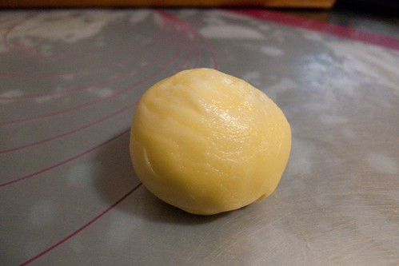

這回中秋節的開賣 算是順利且圓滿的進入尾聲了(除了同事的單被挪到秋節後尚未執行) 六個工作天 每次七小時的連續上工 的確讓身體感到有些疲累 但心裡卻也益發享受於這樣的勞動 專注及踏實 尤其看到朋友們不吝於給我肯定 還在FB上大大分享 我的心被填的好滿... 自己其實才是最幸福的那個人阿~有些朋友問 有做鳳梨酥嗎 老實講 我個人不怎麼喜歡鳳梨酥  因為覺得就只是吃進一堆糖跟油(當然好的鳳梨餡很棒) 雖然芋頭酥 蛋黃酥這類的酥餅 含油含糖量也高的不輸鳳梨酥 但我喜歡這類酥餅的層次感  讓每個入口豐富又幸福!

這回也發現大部分人對於酥餅了解甚少 第二次製作時 我拿起相機拍下幾個重要步驟 作為紀錄與介紹 讓大家對於這類中式點心多些了解 或許就也跟我一樣越來越喜歡這類的酥餅 step1: 製作餡料 只有原色冰糖與奶油添加的自做芋泥餡 果然讓每個人都喜歡的不得了 只是這一兩個小時的製作過程也是每次上工最費勁的時候  沒有餘力再自己做的烏豆沙餡 是烘培店買的但品質還不錯 包上剛剛好的半顆烤鹹蛋黃 是蛋黃酥的要角  Step2: 攪拌所需的油酥 油皮兩種麵團 兩個麵糰各自的配方以及酥與皮的比例 是影響一顆蛋黃酥口感的最關鍵  雖然標榜純手工 但適切的機器幫助還是需要滴... 前面的攪芋泥以及麵糰的製作  我第一次把攪拌缸所有的器具都用上場了 (想我五年前買這機器還被徹爸笑 家裡這輩子買的麵包錢都不用這麼多)  Step 3: 麵團醒置30分鐘以上 進行分割 因為只是大約比例的切割 所以每一個成品重量都不一樣而口感也會因此而不全然相同 所以每一顆都是獨一無二 無法再複製的  Step4: 每個油皮包油酥  Step5: 包好的油酥油皮麵糰 第一次的桿捲  Step6: 第二次的桿捲 (每個步驟中間都要間隔15分鐘以上)  Step7: 最後的桿平包餡  蛋黃酥的表面是光滑的 而芋頭酥則是一層一層如玫瑰岩般 差別就只在於整型方式的不同   但裡子是一模一樣的 (本來有拍芋頭酥包的模樣 可惜我的照相技術太差被徹爸刪掉了)  到此 一顆顆蛋黃酥成形了~  其實中式點心真的是很好操作的烘培 不若餅乾/蛋糕那樣容易不小心就失敗 但中式點心卻也是完全無法偷工減料 得一步一步按部就班才能獲得成果 而製作者的心意也在這一道道的桿捲包過程中 一層一層注入著 累加著  以後吃蛋黃酥(芋頭酥) 建議大家可以拿個小盤子 將餅對切或成四等份 觀賞一下餅皮的層次感後 再一份一口的送入嘴  感受餅在嘴裡的化開 真的!  每一口都好豐富 好幸福阿~ 也謝謝大家這次這樣喜歡我做的餅~~~

下面是朋友們在FB的圖文分享與鼓勵 玟姿: 最新鮮的, 怎麼忍得了 只是大小顆真的差太多，不敢把整盒的照片放上來呀！ 

淑惠: (順道感謝玟姿幫我送貨到台中) 這真是太犯規的芋泥酥, 一個個比大還露餡, 好吃的沒話說啊, 謝謝徹媽體貼我這個芋泥控, 週日下午製做, 當晚就送到我手上, 好感動~~~  晉任: 這是今年吃過最好吃的月餅了！同學自己全手工製作，不添加色素與人工香精  秋穎:有沒有看過這麼用心又漂亮的月餅！ 好好吃喔 不會太甜 口味清新 也不會膩 一口接一口 世界上怎麼會有這麼好吃的月餅阿~~ 怎麼辦~~我好怕再也吃不到啦~~ 所以 ~~下次還要訂!!!  陳翔:剛從徹媽手上接過的芋頭酥，在回程的路上，因為太好吃，跟大小姐一人完食一顆，真的好好吃喔!  謝謝所有20多位朋友的訂購 而且不吝於告訴我 我的餅多麼令人驚艷與好吃 這樣的肯定是最大的收穫與鼓勵~ 我 會永遠記得的... 
