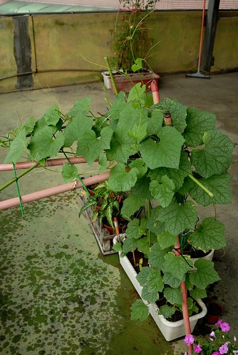
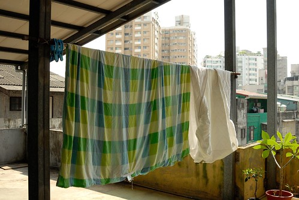
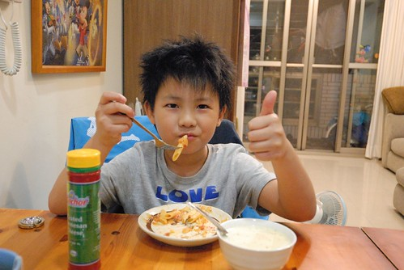
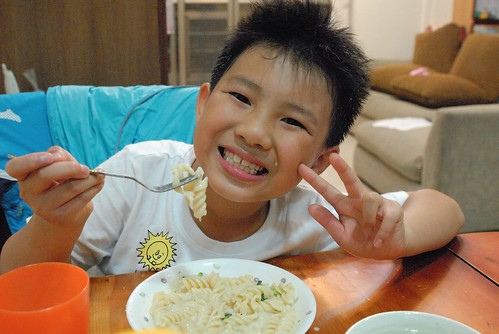
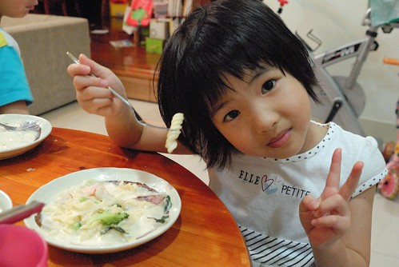

今年的100年 徹家似乎特別的有活力有熱情 做了不少往年我們不會做的事... 而家裡的花花草草也似乎感受到我們的活力 今年也長的特別旺 不像往年總被我嘲笑的無生氣樣 天氣開始熱了後 徹爸實驗性質種的絲瓜種子一顆顆的發起芽 幾株強壯的甚至正以驚人的速度每日快速盤藤著 雖然我一直嘀咕土太少營養恐不夠 而徹爸總回應我"今年是實驗性質 又沒要長瓜" 但我好期待有一天家裡餐桌也能出現一盤產自我們家頂樓的絲瓜喔!! 呵呵  

 上面照片 絲瓜後頭是進入結果階段 逐漸枯萎的幾株番茄 今年的番茄長的特高 但結的果並沒有比較多 前後收成10多顆而已 雖然完全是種好玩的 但看著果子一顆顆生出來 由綠漸漸變紅很讓一家人興奮 (尤其又都是徹爸照顧 我只是在一旁喊燒...) 希望今年的好生機 可以讓徹爸明年野心勃勃的擴大"土域" 讓我們家的頂樓或許有一天真的變成小菜園.... (話說我們的番茄還真曾經引來過白鳳蝶喔)

我跟徹爸很喜歡現在的亮亮屋 當中一個很重要的原因就是因為這頂樓 這頂樓除了是徹愛學腳踏車 練腳踏車 玩紅綠燈 木頭人 跳格子...的小空地 還是我們家曬床單的好地方... 雖然因為有屋頂 不能讓太陽直直地曬在被子上 但有陽光 有風 就讓住在台北叢林的我們好滿足了 尤其在徹愛戒尿布 尿床的日子裡 有這頂樓真的超級好! 

去年看完作家林黛羚寫的蓋字然的家屋後我曾經有感而發的寫了篇讀書心得([blog.yam.com/hmchen1975/article/29505037](http://blog.yam.com/hmchen1975/article/29505037)) 且在之後陸續買了作者之前寫的改造老房子與蓋綠色的房子兩本書 很是欣賞作者在書中所分享/傳達的對於環境 對於家屋的態度 前天在大樓(我工作的地方)看到海報上醫圖邀請作者來演講時 我好開心... 因此昨天中午去聽了一場兩小時 愉快又舒服的演講 雖然現場的聽眾實在很出乎意外的少(約莫50人左右而已吧) 而且聽眾的平均年齡可能都上50歲以上 就像作者開場時笑說的 聽眾看起來果然都像是要過自然人的人 但對我來講 衷心的覺得這又是老天爺賜給我的意外好禮物 好契機阿(真是前天熊熊看到海報) 更是感動與欣賞作者所要傳達的訊息... 作者最後的結語"舒服的家不在於建材 而在於居住者的態度!" 真的! 就像徹爸常跟阿徹說的"態度決定一切"    凡事真的都是這樣!

這兩天又上網看了些作者相關的文章與訪談  把一些話記錄如下: - 家屋只是一個角色 屋主本身的生活觀點與哲學才是它的主角 - 不是要大家去深山買地蓋屋子 而是傳遞每個屋主的生活精神  快樂 充滿生命力 吃的很健康 過很健康的日子才是正常人 - 一個自然的房子 大環境跟天 地的連結是非常重要 跟太陽有關係 跟風有關係 跟環境有關係 跟四季變化有關係 這就是自然的風水  風水其實就在我們的生活中

最近塑化劑的問題吵的沸沸揚揚 雖然真的有攸關我們的健康 我們的下一代 但我們有點難以理解 其實環境荷爾蒙的問題一直存在且爭議很久 怎麼大家突然一夕之間這麼的在乎起來 飲料不敢買 養樂多也不敢喝了... 可是除了不敢喝飲料外 大家是不是更該趁機好好檢視自己的生活方式 飲食習慣 抽菸 喝酒 熬夜 不吃早餐 三餐不定時  超時工作 不運動  夜市裡到處可見的大陸製廉價玩具... 這些東西或行為模式不是也有害健康 如果再加上 買一袋魯味或一片雞排當一餐 或是高油高糖高鹹...的飲食習慣... 避免塑化劑 人就會健康了嗎? 我想這一切現象就是台灣的"民粹"造成的吧 前天同事們聊起這個話題 提到台灣年輕乳癌發生率高就是跟環境荷爾蒙有關 我說 可是乳癌算是治癒率 存活率很高的癌症 如果像西方那樣高大腸癌 高攝護腺癌發生率 那會不會活更不久阿 同事笑說 那現在就是選要怎麼死就對的是嗎?! 要死於乳癌 還是大腸癌 還是糖尿病  請選擇!!! 哈哈! 以上純屬我們這些做癌症研究小助理的玩笑話!

不過真的啦! 吃的健康 過的健康 人才會真的健康! 即使人的一生無法避免完全沒病 但起碼也更能有健康的態度面對病痛!  而父母的生活態度也無時無刻 一直在傳達且累積在小孩身上 下一代的健康 紮紮實實的掌握在做父母的我們手上 就像小樹小時後長的正 以後才會長的直挺挺且枝葉茂盛  所以我勤勞的(當然不勉強還是最高原則)努力在家手做中 看到徹爸 徹愛對我說 "媽媽 你做的真好吃" 我就好開心好開心  即使每天粗茶淡飯 即使住在快40年的老房子裡 但這是最喜歡的媽媽味道 我們最喜歡的家 ...
