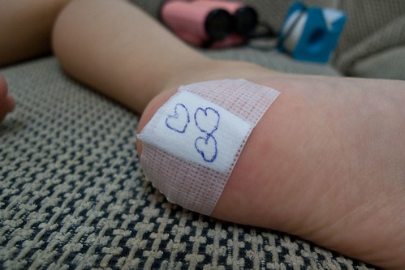
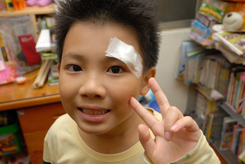
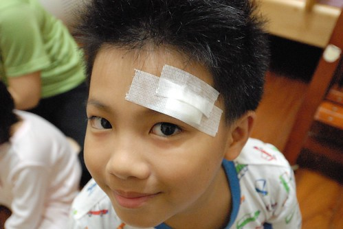
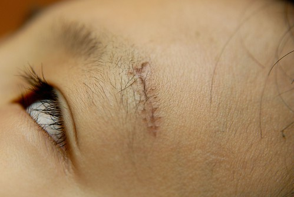
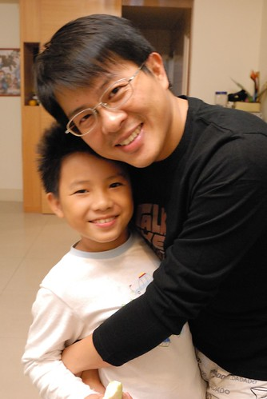

話說我們家常讓外界認為是"嚴父慈母"的父母組合 但事實上我真覺得其實徹爸對小孩比較好  只不過徹爸對小孩的好與不好很明顯 好的時後又親又抱再加上一堆甜言蜜語 而不好的時後翻臉如翻書 碰不得 我常笑說徹爸與小孩的關係很像時下年輕人的愛情 很"轟轟烈烈" 也就是愛到濃時化也化不開 但愛不成時... 小心那個報復可是超級恐怖的

前一陣子愛愛的腳被扎了一小丁  秀皮的她可憐又可笑的要爸爸幫她處理 後來我看到愛愛傷口被處理的模樣 笑著大喊"爸爸 你真是夠了喔!" 而一旁的徹爸當然是不以為意的傻笑著....(還三顆心代表我愛你 昏~)  講半天 其實這篇的主題是要說我們家的阿徹帶疤了....  超級難以想像的天外飛來一筆的意外 所幸徹爸秉持著對愛愛那樣的"愛" 同等照顧著阿徹!

阿徹這個意外真的是超級的意外!  而且難以想像到大家都不會也不忍苛責他 話說11月中的某週四在安親班  愛愛跟阿徹都收拾好也揹好書包可以回家了 因為得等來家裡的那小男生上完才藝課 於是阿徹跟愛愛兩人各自揹著書包 在我視線內的在幼稚園門口附近兜阿兜 突然間原本在游戲區門口蹲著看人家上舞蹈課的阿徹慌慌張張的跑來跟我說"媽媽 我跌倒了" 我數落著阿徹"下雨天地板滑 不要跑" 可是阿徹說"我沒有跑 我要起來的時後就不知道怎樣就撞到地板了" (真的! 每個聽到阿徹受傷原因的人都難以想像  這傷到底是怎麼跌出來的) 同時間我看到阿徹左眼角一片血跡  當媽的我第一次嚇很大 直覺這傷口真的不小 可是又不確定需不需要縫合 於是我幫阿徹用衛生紙止血的同時 請幼稚園老師跟園長幫忙確認一下(想說她們應該比較有經驗) 果真一旁的家長跟園長每個都說這傷口得逢   只是我突然間還真想不出要帶去哪裡逢 而阿徹則是聽到要縫  開始害怕哭著說"我不要縫" 所幸有經驗的園長跟他清楚說明縫合的程序以安撫徹的情緒 (大感恩) 另方面 被晒在一旁的愛愛 雖然也是一臉驚嚇但乖乖的再回到幼稚園內等我們去醫院完後再來接她 原本帶著阿徹去幼稚園附近的小型醫院進行縫合 可沒想到掛號小姐如是說 "可是我們這裡縫的不是很好看喔..想說傷口是在臉上 所以告訴你一聲比較好" ㄟ...人家小姐都這樣好心提醒了  我哪敢再把我兒子的"面子"交給這裡ㄋ 於是母子倆只好搭著小黃去亞東醫院掛急診   在車上我心想接連兩個月帶小孩來亞東掛急診還真是夠了... 一直很剉的阿徹果然在醫生開始消毒時 情緒崩潰又哭又喊的 所幸醫生嚴厲的警告過後 阿徹便不敢吭聲的乖乖讓醫生縫好 縫合期間 基於保險 我這媽應該直盯著醫生 尤其是他手中的針線 但看著那因逢合而湧出的血以及那感覺有點粗魯的縫合(聽說好像都是這樣的) 我只敢偶而看幾眼 所以後來大家問我"阿徹縫了幾針" ㄟ..我真的不知道哩 從醫院回家的車上 阿徹跟我說縫好針後他身體忍不住發抖著 我說"這下子 你更明白好好照顧自己的重要吧! 很多意外就是像這樣 意想不到的突然就發生" 阿徹點頭如搗蒜... 我想經過這回 阿徹對於"人生(身)"或有另一番的領悟吧 呵呵!  第二天拆掉紗布要換藥時 我們才總算有機會好好瞧瞧阿徹傷口的樣子 以及數一數到底縫了幾針 1.5公分左右的長度 縫了7針 而我們原本擔心的急診室痞醫生的技術 所幸縫的還蠻漂亮的(很平整也很等距)  縫合之後的療程只要在第三天回診檢查傷口以及第五天回診拆線 之後的疤痕就自行處理了 老實講 我只有關心阿徹的傷口在拆線前是否有發炎 對於之後疤痕的處置並沒多想  總覺得貼點美容膠帶盡盡人事即可 甚至認為哪個男人不帶疤 這點小傷小疤算什麼 但沒想到徹爸卻是超級地在乎阿徹的疤 超級地擔心阿徹的疤痕進展 除了親自帶阿徹回診拆線  上網查網友的分享經驗 還每天早晚負責阿徹的換藥塗藥且拍照佐證(說這樣才可以對照比較) 徹爸如同在愛愛腳上畫的那三顆愛心一樣 超級用心且細心地呵護著阿徹的疤  拆完線那天 傷口的前段不知什麼原因裂開了一點點  徹爸既驚訝又生氣且超級焦慮 相較之下我那一副沒什麼 沒當一回事的態度 真是很不應該... 為此夫妻兩人還小爭吵了一晚.. 結論是每個人在乎的事情不一樣 就各自盡自己的能力與心力! 或許對方沒有行動支持但也絕對沒有反對 不過重點是幸好這個家有徹爸 補足了媽媽這方面的不足  阿徹ㄚ阿徹 身體髮膚受之父母  真的得多注意自己的身體 不要爸媽總在身後叨念著"不要這麼莽撞 不要這麼粗魯" 受傷了 阿爸阿母可是很心疼的! 話說最近徹爸真的如照片中那樣 顯得超級愛阿徹的... 
