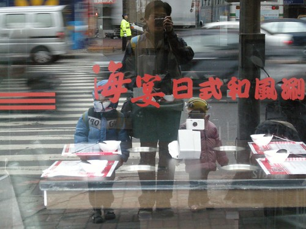

九月開始每天早上是由徹爸負責送阿徹與小愛去學校 雖然在我八點出門前 阿徹小愛大部分都已完全清醒且著裝完畢 但徹爸還是常被兄妹倆拖的很晚才出門 反正小孩子好像不"亂"一下都不行…. 其實陪著小孩上學/放學的這段路很愜意 很幸福 可以一起抬頭看看天上的白雲 天上的星星月亮 可以談談學校的事 同學的事 週末的事 甚至可以好好數落/提醒他們最近發生的不好的不乖的事

不知不覺阿徹這條上下學的路已經走了三年多接近四年 唉~平安夜的今天我又忍不住驚嘆"時間納ㄟ貴賈呢緊…."

我常會用"分數"的想法去看時間 看等待的日期 常在用分數比例的概念去看時間後 就會覺得"好棒! 已經過1/3了"或是"真快 只要再1/3"… 也許分數可以擴大已經過去的(擁有的)比例 卻也縮小了尚須等待或沒有擁有的比例  (哈! 越講越饒口…) 如果把今年切割成三等份的話 我的第一等份在期待/掙扎/決定 第二等份意外的是我人生中最寶貴/充實/難忘的一段休息 而第三等份在適應新環境中即將進入尾聲 希望今年的這三等份 可以讓自己更有堅持毅力走完剩下的工作年

平安夜祝福每一個人每天都平安快樂!!!
