當在日本全團第一次集合在車上時  
其他團員看到我跟徹爸一人帶一個的走往後頭座位時  
傳來此起彼落的聲音"架細漢ㄟ嬰ㄚ"  "架厚命架細漢就出國"  "架細漢出去玩伊嘎ㄟ季條"  
(後兩句話在行前跟行後一直被週遭的長輩拿來講)  
聽的我跟徹爸只能微笑傻笑 然後低著頭往後走  
吼~~~阿就大人想要玩   小孩不帶著能怎麼辦~~~  
  
"四個人出去 很多錢ㄛ???"很多人這麼問  
的確不少錢加上又是7天的豪華團  
但我想 像我跟徹爸這樣的工作(主要還是徹爸在資訊業啦)  
省其他享受花費  2-3年出國玩一趟應該不是件太不可思議 太難達成的事  
(雖然徹爸公司給的真的比上大大不足)  
其實很多人 尤其在資訊產業工作的人應該都有這能力  
只是願不願意把這錢拿去7天內花掉 而不是拿去償還房貸(可以還好幾個月說)  
願不願意明知會累死還是扛著兩個小孩出去  
所以講穿了 我跟徹爸只不過是有"傻勁" 傻...傻...傻...ㄚ  
  
大家口中所謂幸福旅行的背後  
是我與徹爸每天累到快伸不直的腰桿  
是每天小孩入睡後/ 起床前的晚睡早起整理行壤  
還有背著重重的相機包 媽媽袋 或是扛著抱著牽著小孩  
然後死要面子的媽媽在每次集合前的戰戰兢兢(超不想讓人家覺得因為小孩子拖累了大家)  
吼~累~~真的累~~  
雖然真的好玩 真的甜蜜 但這種事真的久久才能來一回  
幸好...小孩子一直在大 這輩子應該再也不用像這樣玩的這麼累了  
所以又在想下次的旅行了~~哈哈  
  
   

透過照片 阿徹似乎真的記得他小時候曾經來過日本這事  
也常拿出相本翻找迪士尼或是玩雪的照片說 他還想要去"迪士尼授權"   
(阿徹很愛用迪士尼授權形容迪士尼的所有事物)  
這回阿徹真的是從頭到尾的參與這趟旅行:  
行程規劃的小小決定權以及只少大人幾千塊的貴貴團費  
  
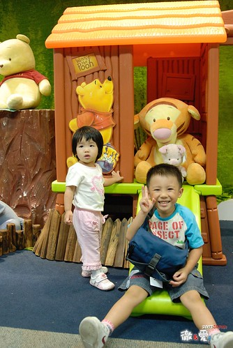  
  
在異鄉看到家鄉也有的東西格外有親切感  
7-11也是 麥當勞叔叔也是  
  
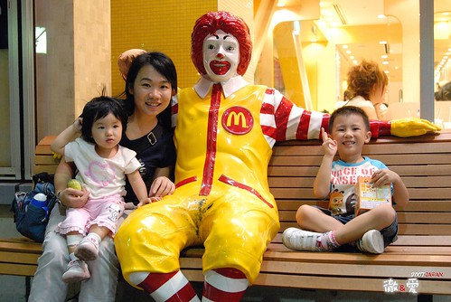  
  
雖然第一晚的寢台列車真的很難睡  
媽媽幾乎徹夜難眠 徹爸瞇的也小於4hr 甚至兄妹倆清晨5點多(台灣時間4點)就清醒  
但天亮後沿途的東北田野風光真的心曠神怡的讓人甘願受這苦  
只是這經驗真的一次就夠 下次別再自找苦吃了  
  
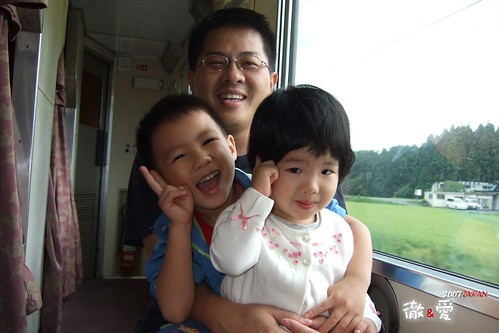  
  
這回坐了不少日本國內的交通工具  
北斗星寢台列車  青涵海底隧道電車  美瑛富良也賞花火車  札榥東京國內線班機  
(聽說單程票價就要台幣7000多 很搶人)  還有一般的地鐵  
很新鮮的體驗 但很苦了徹爸  
因為車站人很多又要趕時間 所以媽媽得抱一個牽一個  
徹爸只好兩手拖著兩個重重的行李箱落在團體的最後   
尤其在上下手扶梯或樓梯的時候很明顯的手不夠  看的我眼框都忍不住紅了   
但誰叫我們當初貪心選了這麼豐富的行程ㄋ  
不過幸好在我們落單出了一點小狀況後 很多熱情的團員出手相助  
真的感謝這些大哥大姊 美麗的小妹妹哩~  
  
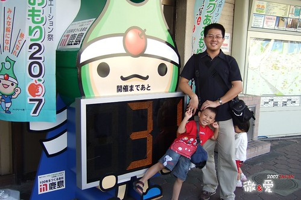  
  
連三晚的溫泉飯店 給他每天泡的熱呼呼 然後睡的爽呼呼  
  
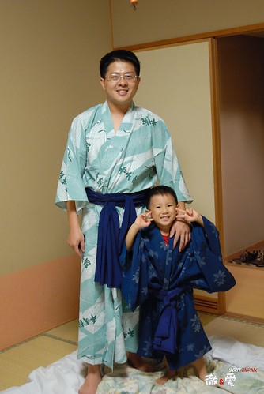  
  
徹爸很用心的用隨身硬碟裝了兄妹倆最愛看的佩佩豬  
讓每天累癱的兄妹倆可以看到佩佩一解思鄉苦  
  
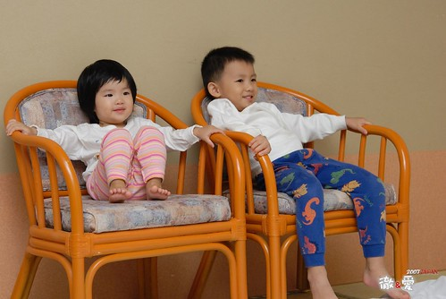  
  
徹爸不只要拿著重重的相機照相  
還得跟在堅持自己騎車的阿徹後面  時而推他一把   
時而快馬加鞭擋在下坡時即將落水的阿徹前面  
徹爸真的不是那麼好當的   
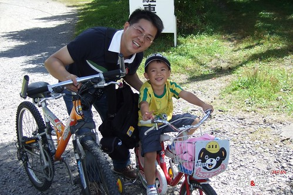  
  
其實我也算文靜 溫文儒雅ㄚ    
阿怎麼生的小孩這麼調皮ㄚ...  
  
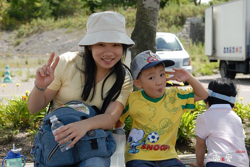  
  
在異鄉 兄妹倆格外的依賴  
  
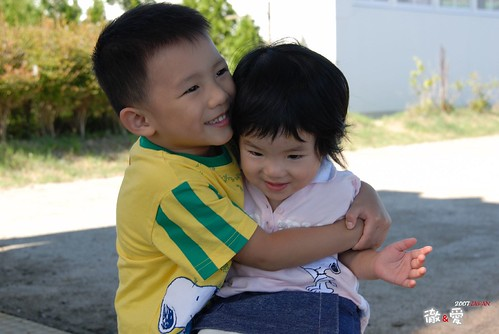  
  
第一次體驗了把水蜜桃從樹上摘下來的快感  很奇妙的感覺說  
阿徹摘了兩顆 徹爸也摘了一顆  我千叮嚀萬交代的要留一顆給我摘  
趕在阿徹興衝衝的摘下前(他真的摘的很爽很順手) 媽媽我總算及時的握住了桃子  
如果那時候沒讓我摘到  我想我真的會翻臉...  
  
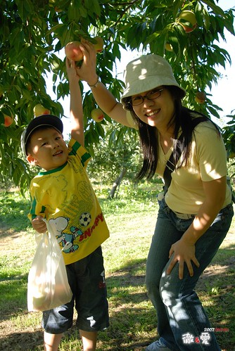  
  
行前徹爸掙扎許久還是決定只帶了個爛小腳架  
對它的期待也只是晚上在飯店時照全家福  
只有徹爸掌鏡的全家福才會一家四口都是大大的...  
  
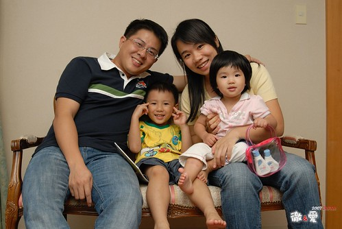  
  
很多時候我會跟徹爸說"你就自己去照相吧 別管我們"  
然後母子三人悠悠哉哉的亂逛亂看亂玩  
趕路的時候則跟徹爸說"你慢慢照 別擔心我們 隨後跟上就好"  
然後抱著小愛 要阿徹跟緊我 拉著我的手或包包  跟著其他團員一起前進  
很多大姐說"阿徹好乖 好有謀生力 知道要抓著媽媽的包包比較安全"  
ㄟ...沒辦法 爸爸媽媽都很忙 只好自己跟緊點ㄇㄟ  
  
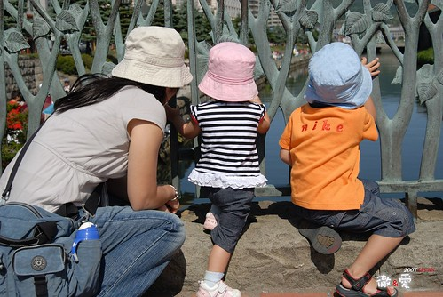  
  
當初因為阿徹這個美麗的意外 畢業沒多久就結婚生子  
苦哈哈的倆人 蜜月只能去北橫兩天小旅行  (那晚住的旅社還很記憶深刻的破舊冷清)  
所以這兩次帶著阿徹與小愛來日本 對我跟徹爸來說都像是在補度蜜月一般  
彌補當初的遺憾 犒賞兩人這幾年來的辛勞與苦哈哈 (就因為這樣想才失了理智大敗家ㄚ...) 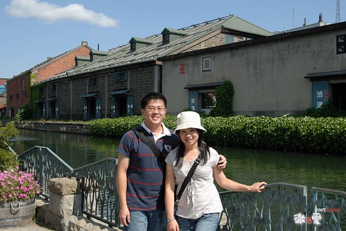  
  
這回總算有了阿徹最愛的草莓口味冰淇淋  
即使冰淇淋真的超級香濃好吃 但冰這玩意還是別吃太多的好  一家四口分享一隻就好   
這情況下 爸媽當然只能等著在一旁 "接"阿徹小愛來不及吃而流下來的冰淇淋汁  
媽媽可能因為這樣沒吃太多 現在還在對那些冰淇淋念念不忘  
衝著這些好吃的冰淇淋 真的會想再去北海道的  
  
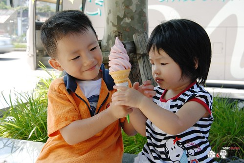  
  
用餐時間常常像在打戰一樣 時間很緊迫 很緊張  
坐定位子後就得趕緊帶著兄妹去洗手 "傳"好兄妹倆的小人食物 然後大人小孩一起低頭猛吃  
別人是悠悠哉哉 氣定神閑的享受美餐的精緻美食   
我跟徹爸卻常是一頓飯吃下來 滿頭大汗  
真不知道是吃的太飽太累 還是因為吃的太趕太急 ....  
不過我們一家四口有很努力的在吃夠本   
況且要吃飽飽才有力氣應付每天滿滿的行程  
  
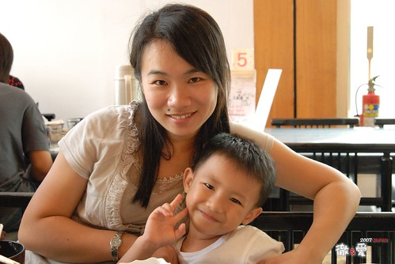  
  
難得天還沒黑就來到溫泉旅館  
別人都去泡溫泉好穿著浴衣舒舒服服的去吃宴會料理  
我們一家四口卻是把握這難得的天亮自由時間 到旅館外晃晃  
  
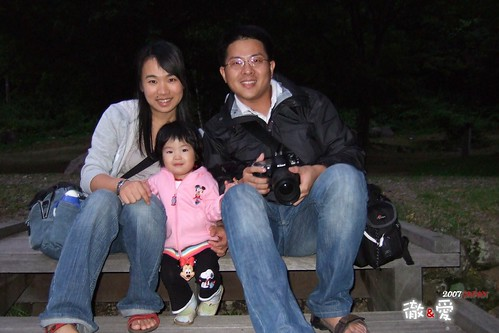  
  
大手牽小手 呵呵呵~  
  
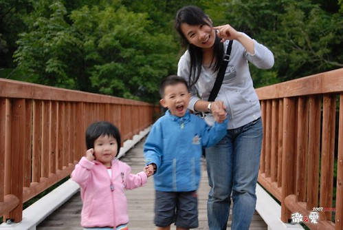  
  
如果只是我跟徹爸倆人的蜜月 我想我會穿著浴衣優雅的跪坐著享受這美味精緻的一餐  
但有阿徹小愛這兩個小皮蛋  一切還是免了吧  
免得要抓小孩的同時還得顧忌自己浴衣是否敞開走光了  
阿徹的好心情毫不遮掩的表現出來  這麼寬廣的場地他要不High都很難  
三不五時跑去後頭東看西摸花瓶古董   
唉~一個不小心 阿娘可能就要贖在這裡洗碗了  
別看小愛現在一臉正經 小姑娘正在蘊釀爆發的情續  
當大家一片寧靜的開動享受美食 姑娘"哇"的一聲總算爆發  "為什麼我沒有自己的桌子阿"  
阿娘只好不好意思的請服務生再喬出一張桌子給小姑娘   
當小姑娘坐在阿娘後頭的專屬小桌子後總算笑了 願意進食   
然後吃飽飽滿場跑滿場笑  成為全場矚目焦點好像很理所當然  
當團員中的阿嬤認真投入的唱著演歌時 小愛自個在台上開心的玩耍  
很突兀 很衝突 但卻有股很溫暖溫馨的感覺  
豐富歷練的老人跟天真無邪的小孩真的替這旅行增添許多樂趣 都是我們的寶~ 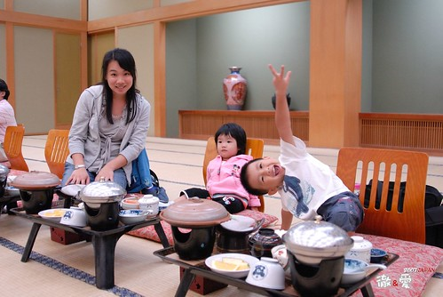  
  
難得穿著浴衣來照一張日本行最佳代表全家福吧  
(阿徹面對鏡頭真的有夠矯情的)  
  
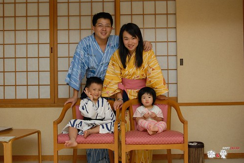  
  
8月底的北海道很像10月的花東  
曬著暖暖的太陽 吹著涼涼的微風  
雖然時間有點尷尬 既不是花田盛開的夏季也不是滿山楓紅的秋天  
但這樣舒服的天氣跟著家人一起愉快享受就是個好旅行  
   
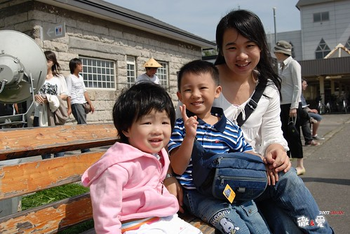  
  
嘿嘿~ 連累的瞇瞇眼的小愛也笑的好開心 (媽媽超愛這張的 媽媽照的喔)  
  
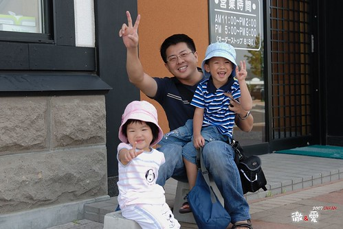  
  
大半時候媽媽被王子阿徹指定走  
所以幾天下來 小愛與爸爸的感情越來越甜蜜  
躺在腿上 邊笑邊喊著"爸比 爸比..."的小愛 讓媽媽好生羨慕阿...  
阿徹 偶而也交換一下ㄇㄟ 別這樣霸佔媽媽啦~   
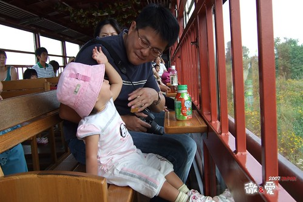  
  
羨慕徹爸歸羨慕  媽媽也知道王子阿徹對我這老公主很好的  
看到媽媽累到披頭散髮的還會出手相助  
只是這一撥更像瘋女十八年阿~  
  
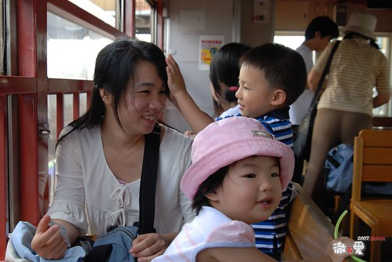  
  
拍照時 阿徹常很撒嬌的依偎在媽媽身上  
媽媽蠻像養了兩個女兒  
  
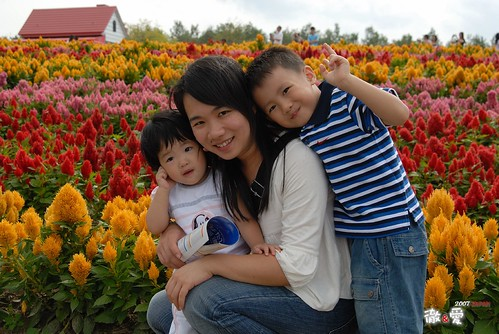  
  
後來跟其他團員很熟了 大家都幫主動幫我們拍全家福  
希望我們多留下一些美麗的合照  
  
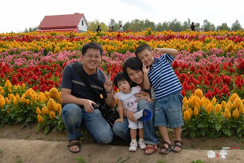  
  
真的 只有我們家愛拍大頭照 哈哈~  
不過這次爸爸也改進許多 不像以前不是大頭照就是風景照  
這次多了許多觀光照  
  
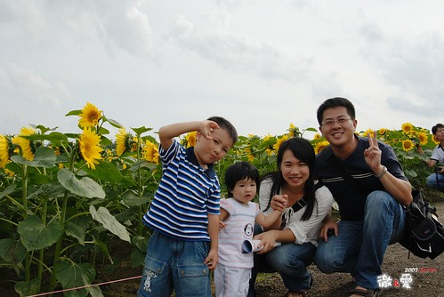  
  
去迪士尼一家四口都很High  
為了一掃上次除了跟一堆卡通人物照相外 有來跟沒來一樣的恥辱  
行前媽媽上網抓了地圖跟表演表 還跟玟姿請教了攻防戰略  
只是迪士尼可以看可以玩的東西真的太多  
重點是人真的霹靂多ㄚ 隨便一個熱門的都要排隊等120分鐘以上  
這真的太強我們這家所難了( 小孩沒耐性 大人腿快斷掉了)  
不過這回媽媽做好準備要來當凱子 給他很歡樂  
二話不說的貴三三爆米花來兩桶啦  頭飾也來兩個啦  
(米妮是阿徹選給自己的 米奇雖然是媽媽刻意選給妹的 但他也很愛哩 後來哥哥要跟她交換帶還不要)

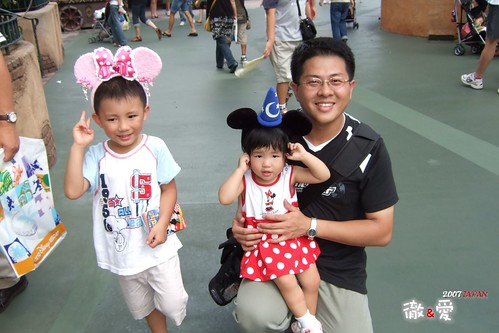  
  
幸好有聽玟姿阿姨的話去坐環園單軌電車  
對當時又累又熱的我跟徹爸來說 真有如雀巢檸檬紅茶灌頂的"清涼爽快"阿  
要不是阿徹在第二圈時就吵著要尿尿 要入園  
我跟徹爸真想多坐幾圈 有沙發可坐 有冷氣可吹 有view可以看   
比起園裏又熱又擠又貴三三的一切   
這電車真的是今日最佳享受阿  迪士尼推薦No.1  
  
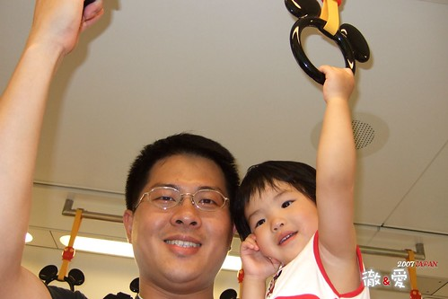  
  
再度入園正好趕上下午的遊行  
歡樂熱鬧的氣氛果然振奮了大家的心  
開心喔~玩喔~買喔~ 給它玩到攤~  
  
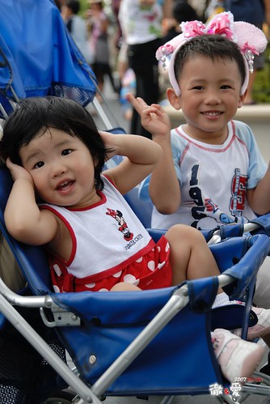  
  
雖然行前玟姿阿姨建議了幾個好玩必玩的遊戲 但現場全翻了盤  
繞了大半圈總算有個只需排隊20-30分鐘的"小小世界"  
雖然很不緊張刺激 但這樣的聲光效果 等候時間剛好適合小兄妹倆  
來到迪士尼 爸媽就是抱著當孝子孝女的心就對啦  
把自己的喜好 原則都放一邊吧...  
  
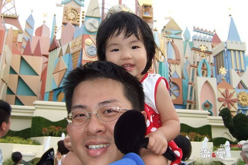  
  
因為早上才從北海道搭機回東京 進入迪士尼時已經是中午了  
而且還先在園外吃了個便當 填飽肚子  
(吃到那個很台灣的便當 我跟徹爸感動萬分 口口皆美味阿 雖然一個要價1000日幣很搶人)  
我跟徹爸才有體力這麼撐到晚上看夜間遊行  
也許大多的人都會覺得中午才入園很短很虧 但我們來說卻是很好的一個安排  
中午1點入園 去坐遊園小火車 路邊看點show 然後慢慢逛晃出來出園坐電車  
然後再入園 租推車 看遊行  找爆米花桶  進去小小世界 高飛跳跳屋  再找公主爆米花桶...  
這麼些事就已經傍晚六點  而我跟徹爸的雙腿也已經酸累到不像是自己的腿

雖然4-5點的時候才在不可思議怎麼廣場前已經有一狗票人在佔位看夜間煙火遊行  
但當我跟徹爸也在6點多時便去遊行途徑的路邊佔一席之地  
當時真的累到不想再繼續走繼續看 ( 況且兄妹倆也都睡著沒啥好搞頭了)  
放棄了其他別人說的好玩好看的東西 只想專心的等著看八點的夜間遊行就好  
幸好等候的時候 我與徹爸又輪流的去晃達了一下(雖然都是為了幫阿徹找火箭爆米花桶跟買紀念品)  
很累很酸但總算坐下來  加上微風徐徐以及16的大圓月  真的會覺得這樣的等待其實很愜意  
而之後的40分鐘夜間遊行果然讓大家的等待很值回票價  
連小愛都看的呼呼叫猛跟遊行隊伍揮手(阿徹就更不用說了)

雖然我跟阿徹說 媽媽短時間之內再也不想來迪士尼受罪了  
但我真的得承認迪士尼是大人小孩都愛的歡樂世界阿  
等哪天我又忘了這次有多累  我真的還想再去迪士尼  
  
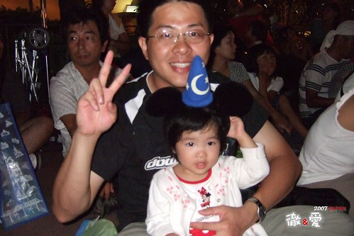  
  
最後一天的半天自由活動時間 也總算如媽媽多年的願去了上野公園一趟  
上次雖然也是跟團玩 但媽媽做足了東京的功課  對上野公園有種難以言喻的情有獨鍾  
而這次住的東京飯店離上野剛好也不會太遠  
所以就去上野動物園看北極熊 看熊貓 看老虎嚕  
公園很大 動物園很小 但很整齊且動物看來個個精神飽滿 虎虎生風  
如果能有一天的時間好好待在這裡逛逛阿徹沒看到的昆蟲館 美術館 街頭表演  那一定會更讚的  
雖然導遊說不要每次都來東京  日本其他地方更好玩 但人家下次還想去上野耶~  
  
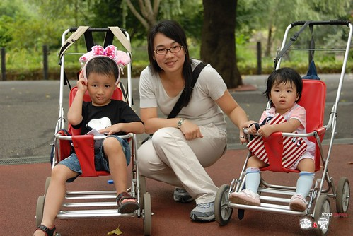  
  
矯情 矯情 矯情的阿徹~~~  
  
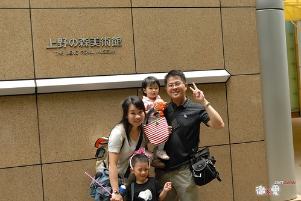  
  
跟好嚕~要撘電車回去集合 搭機回台灣嚕~  
  
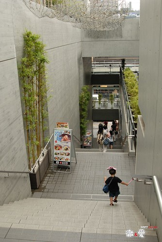  
  
雖然這張照片很昏暗 但突然覺得這張是個很好的ending  
好一對孝子孝女的米奇&米妮阿  哈哈~  
希望接下來的大半輩子裡 我跟徹爸還有這樣的體力 心力 與童心這麼跟小子們攪和下去~~~  
  
  
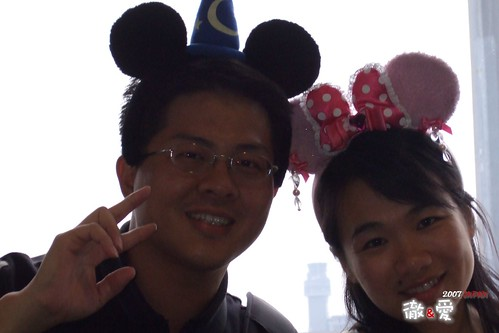
