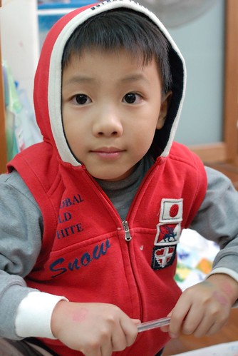
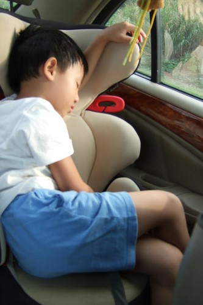
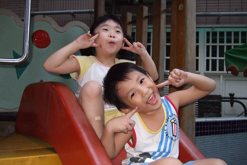
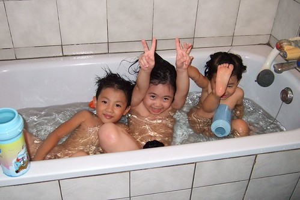
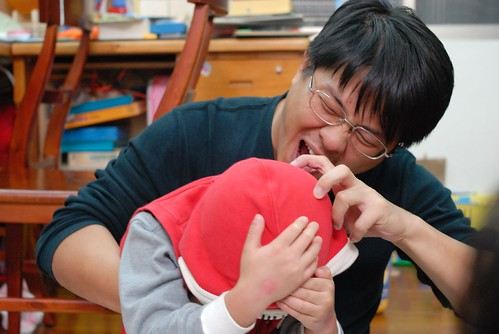
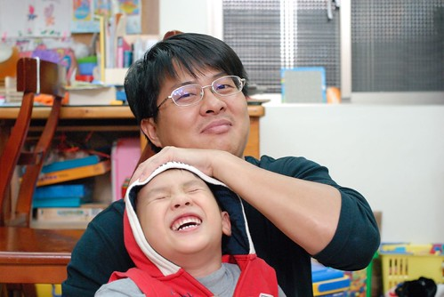
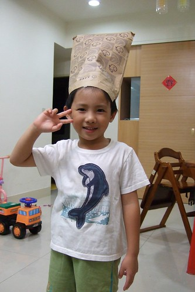
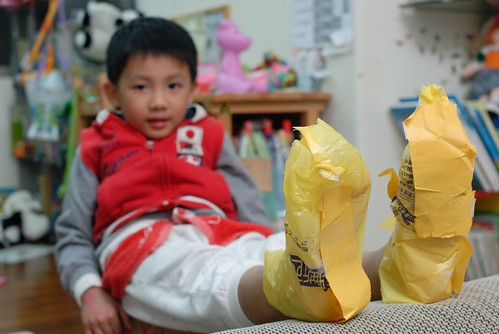
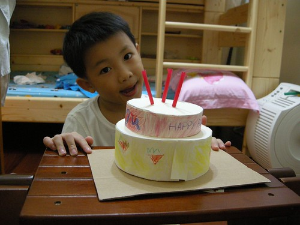
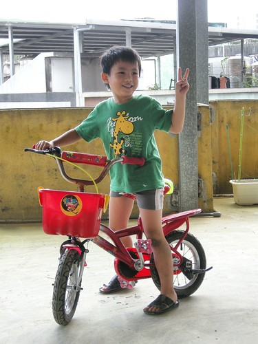

很久沒有說說我們家的阿徹哥哥了… 徹爸說"你都寫妹妹 你好久沒寫哥哥了" 是偏心嗎? 當然不是! 小愛正值4-5歲前腦袋大開發語言大進展的爆發成長期 所以一切從她嘴裏蹦出來或是行為表達出來的第一次都是那麼的新鮮 那麼的讓人訝異驚喜 好笑到讓媽媽必須強迫自己一定要寫下來 而阿徹早已過了那樣裝口愛的幼稚年紀 且大部分的行為模式/思考/說話方式都已在穩定中小幅持續成長 少數轟天地的應該也都是哪天筋斷掉愛生氣愛哭哭的事吧  所以媽媽也就比較沒衝勁寫啦

簡述一下我們阿徹哥哥的近況:

\- 進食: 完全不用擔心過少或是偏食 只有偶而擔心他吃太快或是吃太多

\- 睡覺: 除了當天下午太晚睡午覺會失眠超過11點才入睡外 大部分時間10點左右即可入睡且可以跟妹妹獨自在房中入睡 在台北嘉義的車程裏可以完全不睡覺電力十足 且已經過了小小朋友那種沒睡覺便會耍番的情境 因此假日的時候不再硬性要求他一定要午覺 只是平常在學校常常躺著休息到人家都快起床了才會不小心睡著 所以在學校的午睡對他來說是躺著休息的耐性大考驗

\- 寫功課: 當媽媽準備晚餐時 可以自動的拿出功課寫完 因為媽媽規定沒寫完功課就不能看電視… 只是寫功課用心度的變異數有點大 所以練習簿常會在隔天被Freda擦掉一筆一劃重新用心來過 最近媽媽有比較要求一點點作業的美觀度偶而會當擦手 雖然阿徹常又叫又跳的但起碼還是能含著淚完成

\- 看電視: 口味越來越重了 最近有點小迷神奇寶貝 常會問媽媽"你要當神奇寶貝裏的哪一隻" 不過還算可以遵守媽媽看電視的規定不敢大違背 只是雖然在家裏被我們嚴格限制可以看的卡通節目 但還是從學校同學那獲得大量的卡通資訊 所以很多節目雖然在家根本沒看過 但阿徹對於裡面主角的名字/穿著卻還是熟悉的不得了 唉~同儕的影響果然大 而且防也防不了

(最喜歡一起玩的維維哥哥(左)) 

(還有超級麻吉的萱萱) 

(三個人可以在阿嬤家的遊戲間玩一整個下午的爸爸媽媽遊戲)  \- 遊戲: 雖然嘴裏常講著卡通暴王怎麼樣 要當著哪一個系的神奇寶貝 但最愛的還是跟妹妹玩爸爸媽媽或是老闆賣東西的遊戲 除了這些偏小女生的遊戲外 遊戲的種類與層次有漸漸拓展提升 所以偶而也喜歡玩排七 數字賓果 記憶轉轉盤等可以被歸類為"智能啟發"的遊戲  

(大野狼要來吃小紅帽嚕...) 

(被揉佞的可憐小紅帽) 

(最後跟大野狼一同安祥睡去...) 

\- 撿垃圾嗜好: 阿徹很喜歡保留各式各樣的袋子/盒子/彩帶啥的 我跟徹爸私下都稱為"愛撿垃圾"啦 也許因為阿徹覺得什麼東西可以留下來做項鍊 什麼東西可以留下來裝寶貝 所以他的桌上永遠亂七八糟 甚至家裏到處都可見他垃圾的蹤跡 因此最近常被嚴重警告

阿徹撿垃圾的行為有時候真的很好笑: 有一次阿徹戶外教學回來 高興的拿著一張金沙巧克力下面的那張金紙給我看  他說是同學給的 因為金沙很貴我急著跟他釐清 他是只有拿同學的紙還是同學給了他整顆的巧克力 幸好阿徹說是同學吃完之後他跟同學要的 回家後阿徹高興的拿著這張小圓金紙還有一個吸管跟小色紙做了一叟可愛的小帆船

(阿徹自己做的室內鞋) 

又有一次阿徹高興的展示著Pin-gin薄荷糖的小瓶子 我問怎麼有這個 阿徹又開心的說"同學吃完後給我的" 回家後阿徹請我在裡面裝水然後冰到冰箱裏 當他用這討來的瓶子喝著冰涼的水時表情又誇張的幸福樣 我常想阿徹其實是個幸福的小孩 永遠有令他自己開心的怪點子怪主意…

(阿徹發明要幫妹妹做的蛋糕) 

\- 物慾: 物慾還是有一點重 尤其是回嘉義的時候 常在跟阿公阿嬤玩回來的時候手上不小心就多提了玩具 雖然都是很便宜的小玩具 雖然阿嬤都說因為他很乖所以就買給他 但都會被我跟徹爸嚴厲的訓斥一番 然後被處罰扣除他一年僅有的兩次買玩具機會 只是奶孫倆竟也天真的一再預支買玩具的機會 所以目前已經把明年過年阿公阿嬤可以買玩具的coda用完了 (今年的聖誕節跟明年初的生日也早已用完) 前陣子去costco看到各式各樣有趣的玩具只能眼巴巴 不捨的摸著看著時 就被我跟徹爸笑"你看 你就愛去買那些玩沒幾次就壞了或是不想玩的小玩具 現在就沒有機會可以買你真的喜歡真的好的玩具了吧"… 幸好小子對於爸媽的冷言諷刺都還能欣然接受且發出"下次不要這樣"的豪語

\- 邏輯思考/語言表達: 發現阿徹似乎有遺傳到爸媽的愛說大道理 現在常三不五時就蹓個幾句令人驚豔的大道理 雖然我們常會忍不住為他拍手叫好 讚許一番 但我們也逐漸明白在他的'說與做'之間是存在著或大或小的gap的

場景一: 我們常會在阿徹被教訓的隔天再與他重申一次他被教訓的原因 阿徹往往會認真的聆聽 最後還露出一臉天真董事的模樣說"我知道你們是為我好…" (咳咳!!!給爸媽扣了一個好大的帽子) 而當妹妹被爸媽修理時 阿徹邊做著自己的事邊說''妹..我們是為你好才要教你…"

場景二: 某次媽媽在數落妹妹有關吃飯的事"這很簡單阿 為什麼你不能自己…" 阿徹又在一旁悠悠的說''我知道什麼事最簡單….不用寫功課最簡單" 哈哈! 我想這應該是阿徹升上大班以來對寫功課這事很深的體認吧 不寫不能看電視  寫了還會被要求要美要整齊… 唉~果然不用寫功課最簡單

(可以每天這樣賴來賴去 可以不用收玩具應該也很簡單) 

場景三: 阿徹哼著媽媽聽不懂的英文歌 媽媽問"你在唱什麼歌阿" 阿徹說"幸福的歌"  幸福的歌? 阿徹又補充說"Happy song'"  媽媽說"你一定是幸福的人才會唱出幸福的歌'" 阿徹笑咪咪的說"對阿 我很幸福'" 謝謝阿徹在每天被爸爸媽媽照三餐唸的情況下依然覺得自己是幸福的人… (今天阿徹又跟我說他在唱愛的歌曲, love song… )

場景四: 妹妹食言沒有輪流當老闆 霸著收銀機不放 阿徹在獨自躲去房裏流了幾滴眼淚後出來跟他妹妹說"妹 一個人玩你覺得這樣好玩嗎?" 妹妹不理他於是他又氣呼呼的進房 隔了幾分鐘之後又再出來跟他妹說 "妹 一個人玩你覺得這樣好玩嗎?" 妹還是不理他 於是他總算來房裏找媽媽告狀 然後我們兩人故意玩的很開心 果然妹忍不住的進來找我們了 於是阿徹哥哥又說"妹 一個人玩你覺得這樣好玩嗎?" 這回妹總算一臉落寞的說"不好" 於是阿徹又開開心心的拉著他妹的手去玩老闆遊戲 很霸氣的當他的老闆 這回妹妹很認命的當乖客人…

總結來講(不小心又寫太多了) 雖然阿徹哥哥常會調皮的讓人想扁他 但就像徹爸常捏著阿徹的臉說"你不哭哭生氣的時候 超級可愛的" 真的 我們家的阿徹哥哥真的超級可愛  有他的日子真的不無聊 因為他永遠有令人噴飯的新點子鬼主意來娛樂你 雖然他還不會寫自己的名字 認識的字也不超過三個 但很高興他是個快樂的 懂得遊戲的小孩(雖然每天都把家裏搞的像垃圾場)

