接下來幾個月我應該會常唉"時間過的真快吧!" 沒辦法! 誰叫阿徹這小子已經大到要從幼稚園畢業 要上小學了 上週拿著阿徹的入學資料去小學審核(因為我們的學區小學是滿額學校) 就已經讓我大大感受到 咱家的小子還真的長大了 隔幾天後又再看到那個在舞台上自信認真跳舞的男孩 唉~ 怎麼這麼快啦!!  雖然欣慰但還真的很不捨哩~ 捨不得那個baby阿徹  那個只有學齡前才有的稚氣.... 徹爸曾說 既然這麼愛小小孩那就再生一個阿! 再一個勒?!  如果小孩子可以一直停留在3歲前我一定願意....

阿徹在晨暘的歲月即將在5/1滿4年整整 (也就是我們這個窩也已經住了四年整) 期間學校的任何活動 阿徹跟我們幾乎都沒缺席(除了去年5月的園遊會因為去台東玩沒參加) 看著阿徹在台上越來越認真專注的神情  越來越優雅美麗的舞姿 衷心的感謝 晨暘的老師們給了阿徹一個充滿回憶的童年~

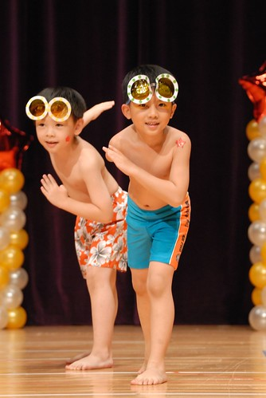

這回阿徹舞蹈班要表演的曲子剛好家裏有CD 因此阿徹常會要我放音樂讓他練習 而表演的那個週日早上起床後 阿徹開口第一句話就是笑咪咪的說"好期待喔~ 今天要表演了" 看來小子對於今日的表演可是充滿自信喔~

學校的活動依舊在台北縣政府舉行 這回租借到的場地據園長說是超難借的多功能室 可能因為這廳有強烈表演感的舞台跟燈光設計吧 而且座位容量也非常的大

面對倘大的表演聽  擔任開場重責大任的阿徹班上小朋友似乎顯得有些緊張 連阿徹都緊抿著雙唇

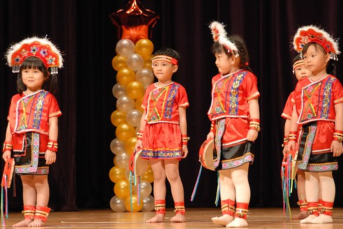

第一個表演曲是曲風很有中國味的蘭花草 之前聽阿徹說時 我還心裏好奇想像著莫非小朋友們要比蘭花指 可是實際的表演服跟舞蹈卻是很"原住民"的

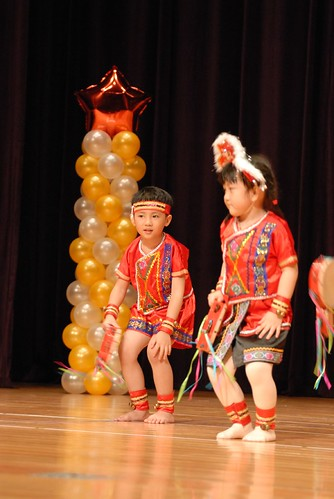

小朋友們的舞蹈加上手上的鈴鼓給人一種不沉重但很盛大莊嚴的感覺

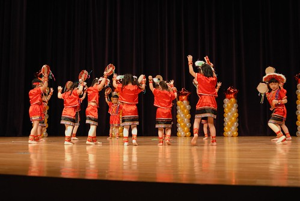

只是小朋友們似乎很緊張都忘記要笑了

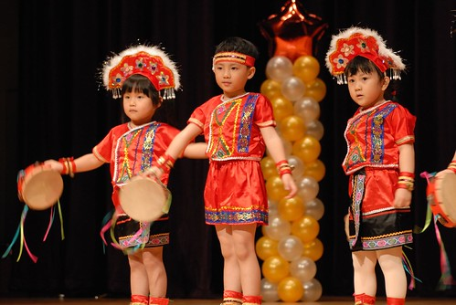

直到最後的ending 大家都還顯得戰戰兢兢

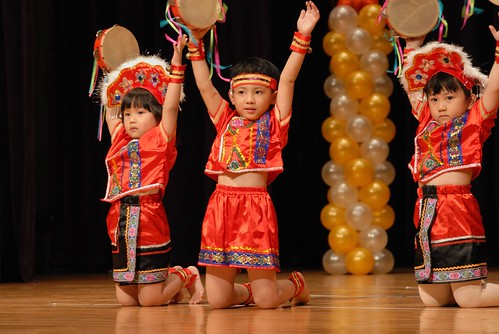

阿徹總算注意到我跟徹爸  衝著我們傻笑

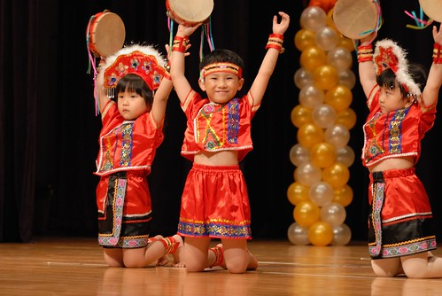

小朋友們趁著每次的表演 難得的可以穿著體會不同平日的各式打扮 學校也越來越了解每個父母們"拼命"想要替自家寶貝留下難得回憶的照片 因此每個表演完後 都會讓小朋友們在舞台最前方排排站好讓父母好好照個夠 有的小朋友們甚至會擺出很厲害的招式 pose讓父母照個夠

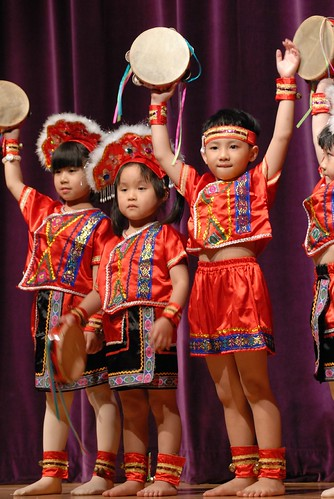

既然名為"音樂發表會" 小朋友們當然會show一下所謂的音樂成果嚕 全體大班小朋友一起進行直笛吹奏 老實說那個合奏聲並不是很悅耳 但哪個父母在乎ㄋ 除了反正也搞不清自己小孩到底吹的怎麼樣外 父母一心只想把自家小孩站在舞台上的一舉一動錄下來 照下來而已吧  (起碼我就是這樣啦 呵)

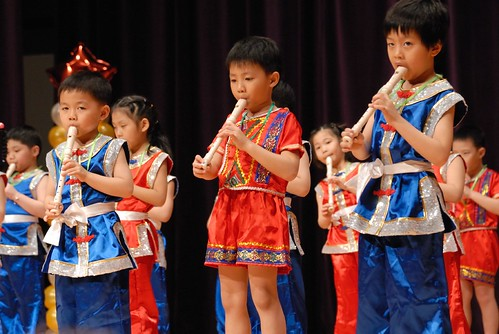

這次的表演讓我深覺阿徹已經長大的原因是 每次換阿徹班級出場時  布幕一拉開後我都得睜大眼找一會才找能找到阿徹 尤其當全體大班約莫40人一起笛子演奏時 我眼盲到明明阿徹就站在第一排的正中央  我竟然直到表演快結束前還在嚷著阿徹到底在哪裏 找不到阿徹我只好硬著頭皮把全體小朋友一起錄進去 結果等到回家看影片時 徹爸才說阿徹就在第一排正中央 仔細一看 哇勒~果然勒~ 除了因為自己潛意識的篩掉紅衣的(根本不覺得阿徹會穿紅衣吹笛子)外 我想最主要的原因是 阿徹真的已經大到跟我腦海中的baby模樣很不一樣了 所以...媽媽我得要努力接受這事實 這面貌!

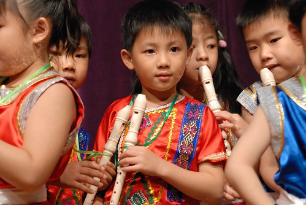

穿著紅衣的阿徹混在男男女女中實在有夠難認的

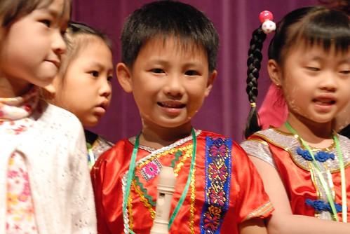

阿徹班這次不僅肩負著開場還有壓軸表演的大任 當倒數第二個節目布廉拉開時 看到一群穿著泳裝泳褲的俏男俏女們笑咪咪的排排站好 眼睛都亮了 雖然之前阿徹在家曾嚷著要我幫他再準備T-shirt還有短褲  他不想穿泳褲登台 但不知在老師的威脅還是善誘 還是同學間的團體力量 阿徹還是給他脫啦~ 穿著清涼性感的出現在舞台上啦 就像我事前一直跟他說的"你這麼瘦穿泳褲很好看的"  穿著泳褲的阿徹果然帥阿~

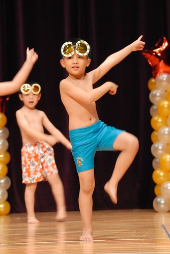

這首曲子的名稱是水男孩  每個男男女女果然都"水"阿

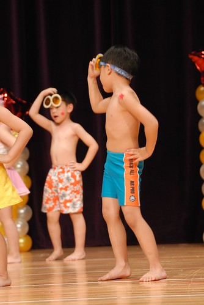

舞台上的每個小孩開心的游著蛙式

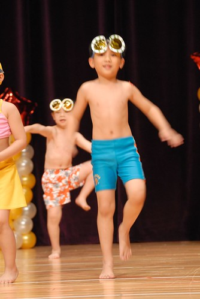

自由式

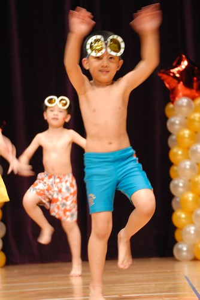

還有仰式(沒有照到照片)

還搔首弄姿ㄋ

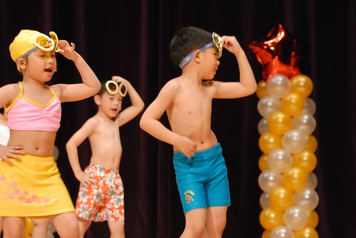

這啥式? 暖身操嗎?! 哈哈

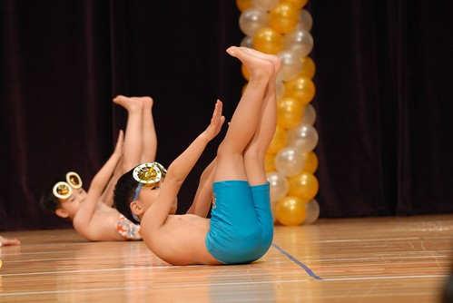

反正一群小孩在台上跳的開心 我們在台下也看的超High 似乎都能感受到在海邊開party的熱情與開心

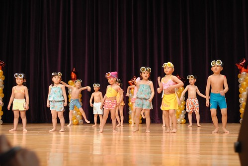

最後這個應該出於Freda巧手的蛙鏡更是酷到最高點 ~~ (最後的Ending pose 阿徹很賣力的一直扭腰撐住)

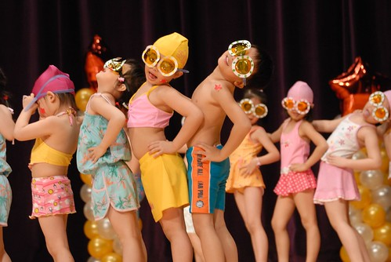

表演結束後 主持人趙老師還不放過孩子們 老師一個口令 小孩們一個動作擺出停格pose給家長拍照

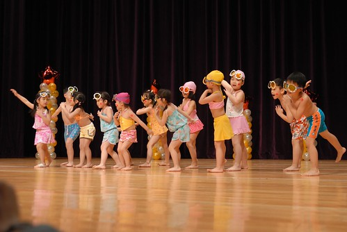

在台下的我真的可以感受到台上的阿徹有多賣力 有多開心 看著他那完全到位的動作 直挺的腰 忘情的投入他的表演中 我跟徹爸都看呆了 也真是覺得我們阿徹帥呆了

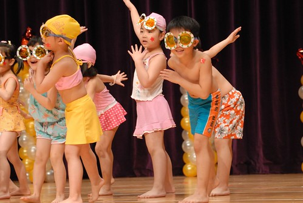

小子的水男還真的太棒了 讓爸媽在接下來的幾天還是一直回味無窮...

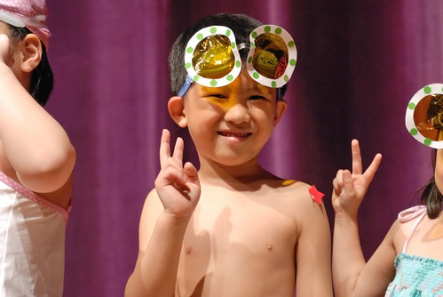

水男孩完緊接著是舞蹈進階班的表演 熊熊發現阿徹今日的三個表演都是脫鞋子走原始路線的哩

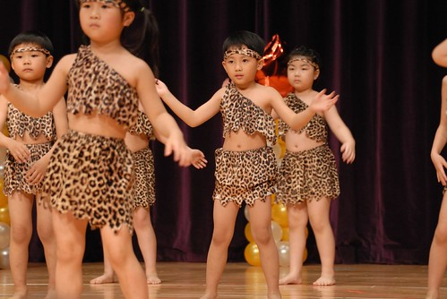

這是在家練習很多次的舞 表現的當然就不出媽媽的意外嚕

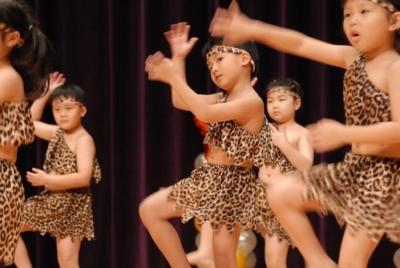

在家練習時 兄妹倆還會要求媽媽跟著一起上舞蹈課 阿徹甚至要我跟著練習做這下腰動作 雖然他說"你要多練習骨頭才會軟 慢慢就可以摸到腳了" 但是真的很為難媽媽這把老骨頭哩...

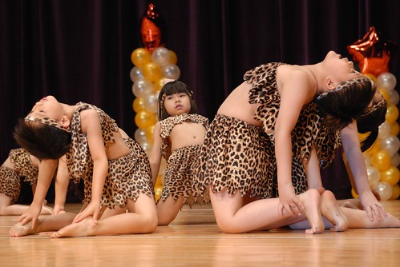

不知不覺阿徹上舞蹈課也上了快兩年了 雖然這半年他偶會嚷著好累不想上了 但總被我們以"要有始有終上完大班"給回絶 我想上了小學後 他應該是真的會不想去上了吧 還真的很喜歡阿徹在舞台上認真快樂跳舞著的模樣 小學後大概很難看到了吧!    (長大真不好)

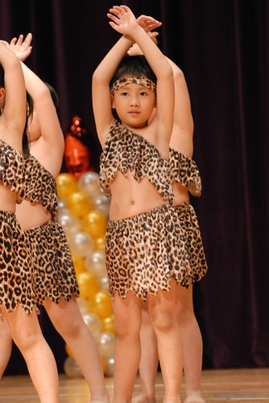

跟徹爸兩人真的超喜歡阿徹今日的表演 他也算是替自己的幼稚園表演留下最後美好的結束吧

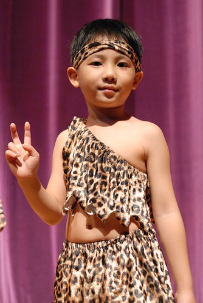

最後當然也要逮住機會跟他想結婚的女孩子合照一張喔 如果說阿徹很棒 那洪同學更是棒呆了 每次的表演都姿勢優雅美麗但又確實 重點是永遠真心的笑咪咪 投入享受她自己演出 莫非阿徹跟她就是這樣互相吸引的?!  哈哈...(當作是媽媽我自己聯想太多)

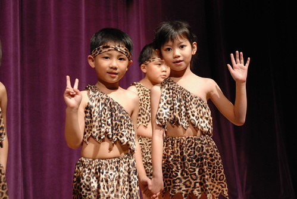

活動的最後依照往例是老師們的精采演出 老師為了讓孩子們知道不是只有他們在努力練習 連老師們也都很努力在學習 所以每年的此時老師們也都會上台表演 曾經打太鼓 樂器演奏..今年更是大突破帶來啦啦隊式的熱情演出 讚啦! 台下的小孩與家長個個看的目瞪口呆 拍手歡呼叫好

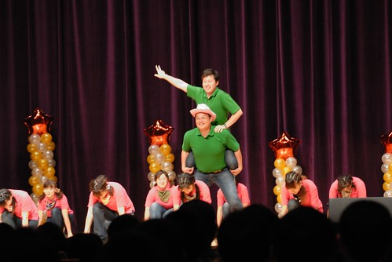

很棒! 今年的"來跳舞吧"

Video 2 [http://myvlog.im.tv/?id=5761319&mid=322793&MemberID=&inIMTV=Y&album=0&playnext=0](http://myvlog.im.tv/?id=5761319&mid=322793&MemberID=&inIMTV=Y&album=0&playnext=0) Video 3 [http://myvlog.im.tv/?id=5761320&mid=322793&MemberID=&inIMTV=Y&album=0&playnext=0](http://myvlog.im.tv/?id=5761320&mid=322793&MemberID=&inIMTV=Y&album=0&playnext=0)
