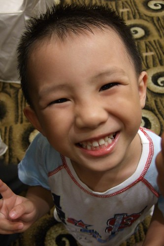

前幾天吃晚餐的時候   
跟阿徹講到某事 我腦袋秀逗了一下轉不過來  
阿徹就跟我說"你沒有吃魚喔~"  
啥咪~我們講的事跟魚有啥關係 媽媽我更是摸不著頭緒了  
阿徹竊笑~~~  
突然間我明白了 我說"你是說媽媽笨阿"  
阿徹笑著說"對阿 沒有吃魚笨笨的"  
ㄟ~ 雖然媽媽常說"吃魚會好聰明喔"  
但是笨不代表沒吃魚吧  
況且吃了魚不保證就會聰明吧 ㄘㄟ~  
不過第一次見識到阿徹的幽默感 讚~   
也才驚覺原來我家兒子已經大到會耍幽默了...(時間納ㄟ櫃架緊)  
  
後來有次爸爸耍笨時 阿徹又跟他爸說"你沒有吃魚也沒有吃蕃茄喔"  
哈哈~誰叫你爸不愛吃煮的蕃茄 笨死他活該...  
  

