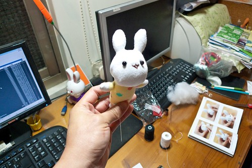
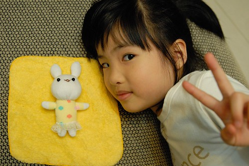
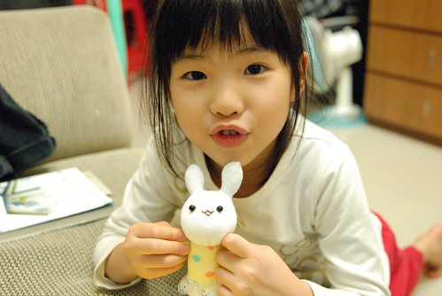
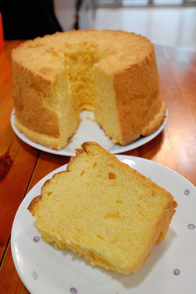

春暖花開的四月初 感謝老闆賞我們跟著她一起放六天的春假 扣掉4/4兒童節(那天在我們家不是清明節)以及週末 當中有三天是完完全全屬於我自己一個人的假期 難得的假期 很多朋友好像比我興奮的跟我說要好好把握出去玩 可是除了去全聯 去材料行補貨外 我卻是哪也沒去... 最後一天上線時玟姿問我做啥去了 我說"第一天做了一下午的土司 餅乾跟蛋糕 第二天熬橘子果醬與一個失敗的餅乾也大半天了" 玟姿笑我"有烘培這興趣 時間過比較快" ㄏㄏ~ 好像真是這樣喔 不過可以一個人安靜的在家裡窩著 或是不知是手忙腳亂還是心無旁鶩的忙著 著實是令人放鬆的好日子 感謝天~

而更令自己驚訝的是 我竟然在假期的最後一天還拿出徹愛年初買的襪子娃娃材料做起女紅 雖然手藝實在不怎麼樣 但自己都忍不住要敬佩起自己的那份衝動與決心 聚精會神的在書桌前弄了5個小時就為了這15\*7公分大小的兔子  完成後徹爸說"書上的小兔是可愛妹妹 怎麼你的像是兔子爸爸阿"  誰叫我兔子有著厚下巴 愛愛問"書上的小兔手上有拿著愛心 怎麼你的小兔沒有"  我說因為手做太短了 所以沒法像書上兔兔那樣雙手環胸拿著愛心 還真是狀況很多的實驗兔阿!  不過原以為材料包裡的材料會將兔子的每個構造畫好區分好 但開始後才發現原來得自己在襪子上畫出兔子的耳朵 手與腳 這下子真的難倒我了... 以致於我的兔子大小耳還長短腳 不過基於這是徹愛家張媽媽的第一個自製且純手工娃娃(雖然真的很小)  還是值得讓人流下幾滴欣慰的眼淚 至於兔子的小主人 愛愛 當然是開心的大呼"媽媽 你好棒" 只是我很懷疑這善變的愛愛能愛這兔子有多久?! 而至於阿徹的小熊材料包 我想可能要等明年老闆再賞我春假才有可能再這樣心血來潮了吧!  有時後我跟徹爸在家裡忙著時 阿徹會問"你們做這個做什麼阿 你們好忙阿" 徹爸總說"我們在培養興趣 這樣我們老了後日子才不會無聊" 只是有時候我會想烘培這興趣到底是好還是壞 畢竟好像很多的蛋糕跟餅乾還真是多做多吃 多吃多胖的 但是越來越習慣在晚餐飯後來片餅乾或蛋糕  那樣的滿足完全不同於晚餐的飯菜! 我想我們的興趣目的或許不只在於以後 也在現在所經歷的過程吧 也或許只是單純的度時間~~~  那也真的沒有關係~~~ (這是南瓜戚風蛋糕 我好喜歡這樣超級金黃色的蛋糕體 讓人感覺像陽光般溫暖又洋溢) 
