真快~ 一年又到底了....... 不知不覺已經進行好多年的徹家桌曆 徹爸總算在最後的10天"趕工"&"精心製作"出來了(前面我說的 後面徹爸自己說的) 每年在桌曆照片挑選的過程中 兩人常會感嘆"這地方不是才剛去過而已"  怎麼又已經是快一年前的事了... 

前幾年年底總會聽到新聞說"今年101煙火可能是絕響" 但怎麼每年每年還是在放而且越放越盛大ㄋ 不知不覺也這樣讓電視上的101煙火陪伴我們度過好多年的跨年夜了... 今年裡週遭很多朋友紛紛結婚成家生子了屬於先驅部隊的我們雖然欣慰自己的脫離苦海 但對於大家都已漸漸步入中年(很多身不由己的階段)很是感嘆阿! ..... 其實我是很認命地接受自己的四捨五入為40歲的 甚至喜歡自己這樣的"熟味" 只是如果時間可以多一些或是走慢一點 讓我可以多些機會好好跟小孩說本故事 跟老公看部電影 跟家人相處 那該有多好阿!!! 

雖然徹爸不承認不接受 但我真的覺得徹爸今年拍照的"積極性"弱很多 不過拍照對於我們來講本來就只是紀錄小孩成長 家庭生活的一種方式 所以就不強求 一切隨緣吧 只是徹爸逃避了很久 最後非得挑照片時 自己也忍不住murmur"怎麼可以挑的照片這麼少阿" 呵呵~ 今年沒有玩比較少阿 怎麼可以做桌曆的照片卻少很多ㄋ?! 好吧! 姑且就歸因於因為旅遊型態的改變所造成的吧 不過徹爸最後挑選的15張照片加上我最後的刪除跟月份編排後 連續播放看起來還是煞有其事的樣子啦

一月 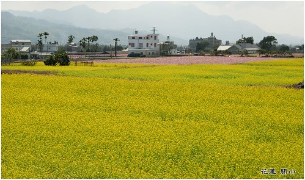

二月 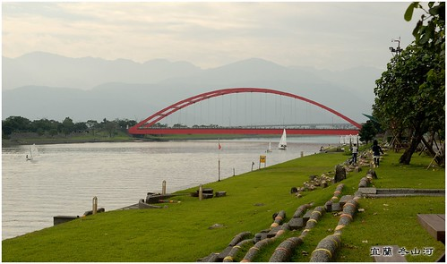

三月 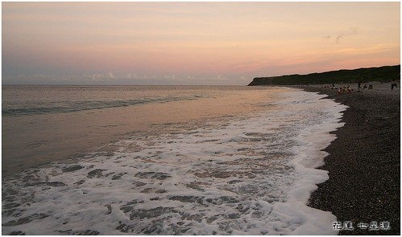

四月 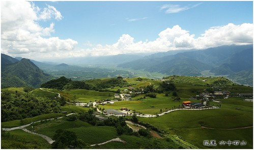

五月 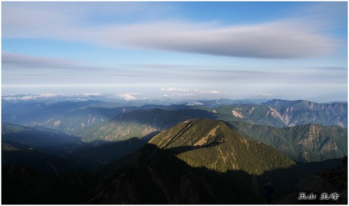

六月 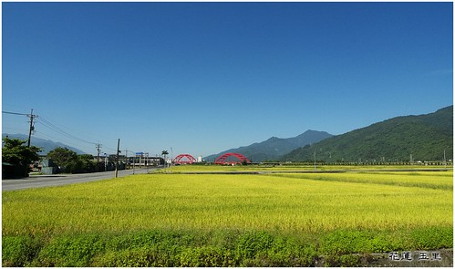

七月 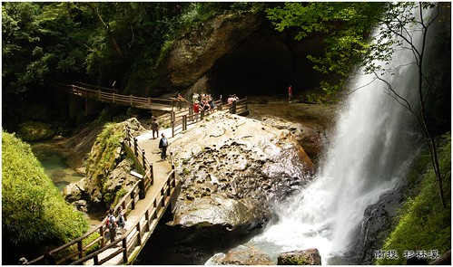

八月 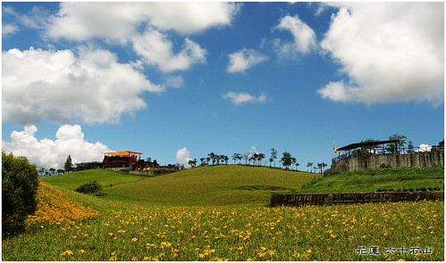

九月 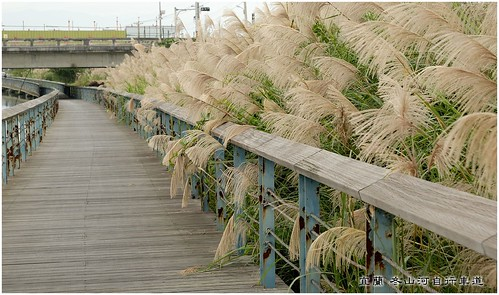

十月 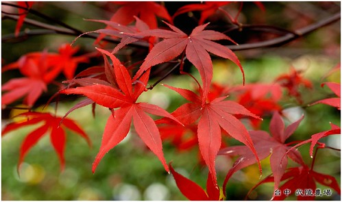

十一 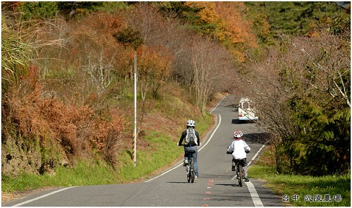

十二 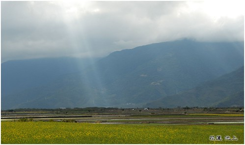

少了個櫻花讓人覺得四季變化少了那麼一味... 嗯~ 今年得更努力地玩 好豐富我們後年的桌曆...這是徹媽最大的心得與年終結語阿! (只是都已經送印了 怎麼我現在才發現第一張跟最後一張是台東而非花蓮阿....懊...)

BTW, 順道貼一下聖誕夜那天我們難得拍的這麼應景的照片 雖然知道台北市裡 尤其信義區有很多漂亮特別的聖誕樹 但很怕人潮的我們永遠提不起勁去朝聖 今年在家裡附近的"新巨蛋" 雖尚未交屋落成但已提前佈置上帶有濃濃商業氣息的聖誕樹 平安夜裡一家人吃完平安的聖誕大餐後 刻意跑去跟聖誕樹合照一下(只是是用徹爸iPod拍的 解析度粉差) 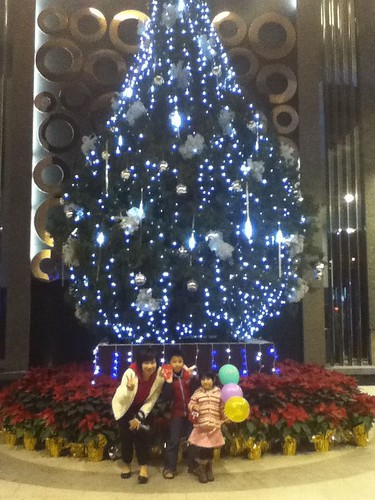

再加上教會遊行隊伍發送的一串汽球  嗯~ 我們家難得過了個這麼有節氣的聖誕節阿!  yammy!! 讚!!! 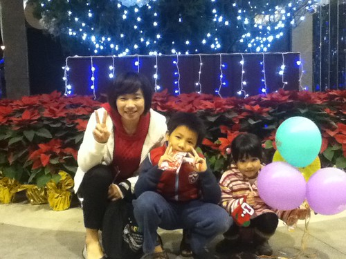
