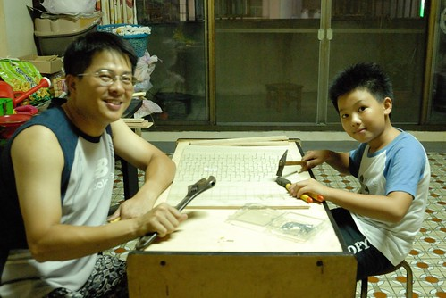
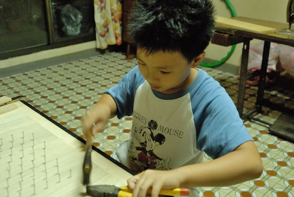
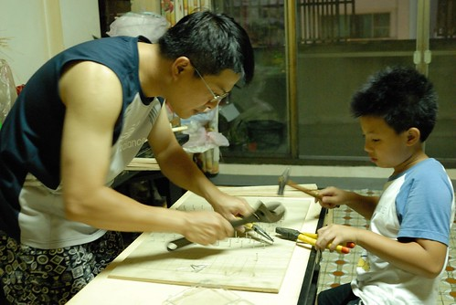
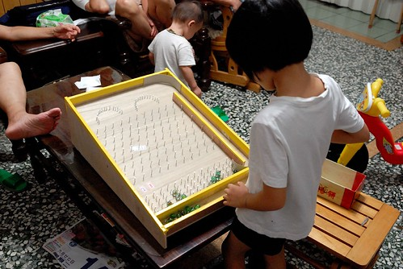
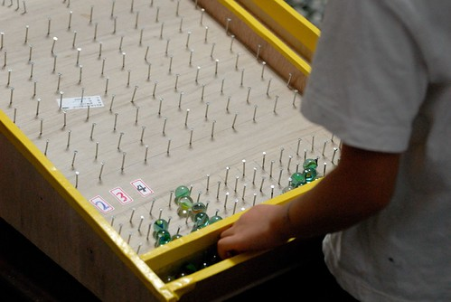
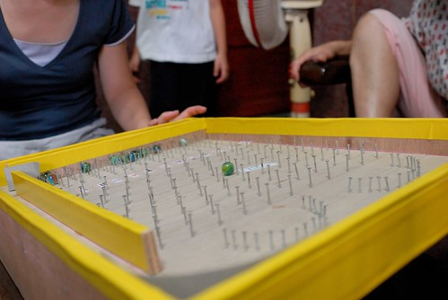

話說回嘉義的時後 阿公阿嬤常會帶徹愛去嘉義公園溜達 徹愛年紀小的時後 公園裡的溜滑梯 大空地便足以讓他們玩翻天 而隨著年紀的增長 能吸引徹愛去公園的理由是那些擺攤的套圈圈 打彈珠 畫砂畫等遊戲 雖然這一兩年因為市政府的嚴格取締而讓這樣的樂趣變成可遇不可求 但只要讓他們遇上了 阿公阿嬤則更是大手筆的讓孫子們打(彈珠)到爽 套(圈圈)到滿載而歸 而徹愛也練就一身打彈珠功力   雖非優秀 但絕非只是沙士糖 好歹都是蘆筍汁 泡泡罐或是一袋彈珠(話說從他們帶回的戰利品就也能想像阿公阿嬤的豪擲) 看著阿嬤家裡數量頗壯觀的彈珠 於是作彈珠台的念頭從阿徹與徹爸的心中油然而生 而想不到就在我壓根不看好徹爸的行動力下 父子倆還真的做出一台彈珠台了 而且這是阿徹跟徹爸第一次聯手的DIY 足具紀念意義阿!  給徹爸好多個讚啦!

木板跟釘子是上上回嘉義時 徹爸去特力屋買的 而這回特意從台北帶了鋸子跟槌子回嘉義 (當我看到徹爸把工具放到行李包裡 我是完全的不看好) 剛好那個週末嘉義天氣不好哪都不能去 於是傍晚時分徹爸招了阿徹開工(此時我還是不甚看好 覺得頂多裁好板子) 當我煮完晚餐到樓上看到敲敲打打中的父子倆 吼~ 那個畫面真是感人 就像愛愛跟我在廚房同工那樣的感動與安慰阿  雖然徹爸笑說阿徹只是頭興興 但阿徹一臉投入與堅毅的表情讓阿母我很是相信他的真誠與認真  雖然技術很生澀 雖然叮的歪七扭八 高低不等 但在爸爸還有阿嬤的協助指導下 也煞是有模有樣且漸得要領  於是晚飯前的一小時加上晚飯後的一小時(期間徹爸再去買不夠的釘子) 父子倆努力的敲打下 一個彈珠台就這樣神奇的完成了  徹愛迫不及待的把所有彈珠都放上 噹啷啷的開打起來 (此時阿徹還正忙於替彈道編號 貼標籤)  於是接下來的晚上跟白天 我們四個人就這樣常坐在珠台前噹啊噹 看著我跟阿徹一顆顆快速的連發著打 徹爸笑說"應該打慢點 享受這過程阿" 我們笑說去公園打要付錢 才需要一顆一顆慢慢的打 (等一顆塵埃落底才再打下一顆 延長享受的時間) 就是因為家裡的彈台才能這樣享受連發的快感阿  而且那彈珠彈撞釘子所發出的聲音清脆的就像水晶玻璃的敲打聲 噹啷噹啷的打完一盤彈珠就像聽了一曲好聽的水晶音樂 真的很棒ㄋ~
