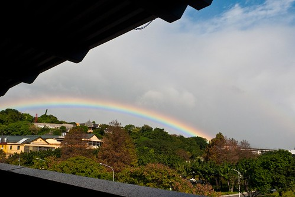
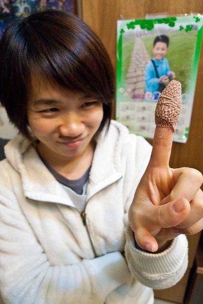
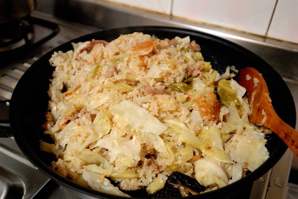

2012年的最後一個周三下午 我與徹愛戶外教學到花博爭豔館 捷運抵達圓山站正準備下月台出站時 赫然發現一道彩虹大剌剌的掛在不遠處的天上 好多乘客同我們一樣都被這美麗的彩虹所吸引 拿出手機 相機照個不停 就如阿徹說的"今天真是太幸運了" 能看到這樣鮮明美麗彩虹的我們真是收了老天爺的一份大禮物阿! 晚上與徹爸分享這彩虹時 我說"日出可以等 楓紅可以算... 唯有彩虹可遇不可求 永遠不知道下一次會在什麼時候 什麼地方看見彩虹" 也或許就因為這樣 彩虹永遠都能讓人這樣驚喜與開心! 看見彩虹的那一天 我們的心情都飛了起來....  

最近左手食指受了不算輕微的刀傷 才體認到原來每根手指頭都有它的功能 端拿東西時為了避用左手而讓右手分擔 結果沒幾天右手大拇哥竟就鬧起小彆扭來 工作上編輯文件時 剛好需要大量的複製貼上動作  也才發現原來受傷的食指跟同手的小姆哥是這樣簡單指令的最重要拍檔  我語重心長的跟徹愛們分享這件體驗 徹愛異口同聲的問"那你的小妞妞有什麼功能ㄋ?" 我說"她讓我知道充實自己內在的重要" 而徹爸說"她讓媽媽遇到喜歡她的內在更甚於外在的好男人"... 不是玩笑話!  這個小妞妞真的曾經讓我的童年備受幼稚園小朋友的欺侮嘲笑 但或許真的因為她而讓我更好勝的唸好書 做好自己吧! 直到現在還是常會有天真的小朋友不厭其煩的常問我"愛愛媽媽 你有11根手指頭對不對" 雖然還是會有些尷尬 但我真的發自內心的告訴小朋友"因為老天爺要讓我可以做很多的事..." 而話說一個老公有多愛他老婆 從他幫老婆傷口包紮的大小應略可窺見 望著我手上的這顆"女王頭" 我知道徹爸肯定是愛我的! 希望我的傷口趕緊好的!! 而當然最重要的是他不想幫我洗衣服阿....  週五的晚餐 因為不用準備隔天的便當 我常會用一大鍋的炒飯 炒麵 鹹粥或是義大利麵等解決 其實常常花的"工"沒有比煮四菜一湯來的少  但卻是我們一週餐點的重要調劑 每當我端出新花樣且父子三人吃的津津有味時 總會開心的告訴我"媽媽 你真是太厲害了" 我總笑說"是Carol老師厲害"  真的! 拜現在網路發達之賜 想當個賢妻良母真的比以前容易.. 那天總算煮了一鍋放入口袋名單中很久的高麗菜飯 滿屋子的香氣讓我異常的期待掀蓋那一刻 也讓下班回到家的徹爸聞香到廚房偷拍照片(我剛好去接愛) 果然! 高麗菜的甜脆香讓我們一家子硬是吃完這一鍋明明食譜上寫的5-6人分量 四個人邊吃邊喊真是太好吃了 徹爸還說"好像油飯喔" 而愛愛更是別有見解的說"好像蘿蔔糕" 我忍不住咦了好大一聲"蘿蔔糕?"  沒有蘿蔔也完全不是糕阿?! 後來我們一致下了這樣的結論 "因為跟蘿蔔糕一樣有米蒸炊過後的香氣阿" 真的超讚的高麗菜飯 值得在這什麼菜都好吃的冬天來上一大鍋!!! 
