曾經的小三 不知不覺竟也已經是高年級生了 中年級的二年是小女生的成長醞釀期 開竅期 不論是生活上 課業上 成長為女孩這件事上  愛愛很努力的讓自己越來越好! 每天認真的上學 認真的玩 認真的過日子  我們看著窩心也放心!

其實每天愛愛放學後都玩很大 常一進家門就喊我今天好忙 要做甚麼 要玩什麼 跳舞 唱歌 家家酒遊戲都要玩一輪 需要不少時間 因為遊戲的時間如此寶貴 愛愛更懂得分配自己的時間 有效率的寫作業, 複習功課 而想不到總被我們笑愛玩的愛愛 竟然在四年級下學期生平第一次進入班排第三名 愛愛大呼不可思議 但難掩興奮與臭屁 不過她也直說自己應該只是運氣好  但沒想到 第二次的段考(期末考)竟然再次班排第三 我們知道愛愛真的開竅了 ! 愛愛說雅文老師真的是很有有經驗的老師 讓她這一年成績進步這麼多 我說 或許也因為這一年完全沒上安親班 讓她可以盡情的玩 自己作主時間 所以功課變好了! 成長是很多的累積而成 欣見思路清晰 有條理的愛愛把這樣的特點發揮應用到她的學習上了! 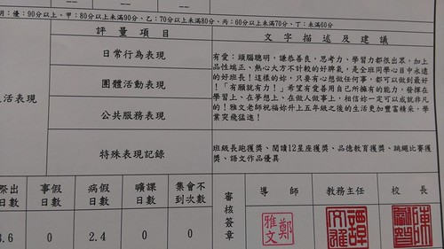 

其實愛愛是個貪心的人 想要當個聰明又漂亮的女生  她常說"這樣好帥!" 夢想洋洋灑灑十多個 從音樂老師 電腦老師 醫生 護士 警察  店員 到明星洋洋灑灑十來樣 常常眼睛發亮的跟我說她現在最想要成為什麼 但愛愛知道夢想都是要付出努力的 所以她認真學習 讓功課好 也心中自有計畫的要求去上烏克麗麗課  之後還要接著上鍵盤 吉他 貝斯 每天躲在房間內練歌 練跳舞... 夢想無限大 !!! 看著這樣的她 真覺得可愛又青春!  咪咪永遠挺你啊! [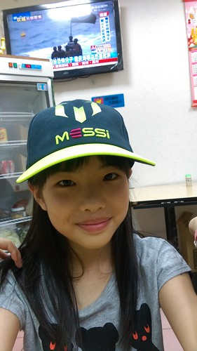](http://flickr.com/photos/33703965@N00/26720922453)

以下開始看圖說故事: 很久沒有留這麼長的頭髮 愛愛很喜歡長髮的模樣 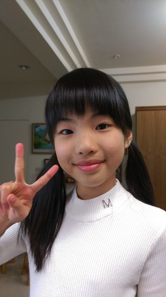 長髮讓她覺得可以跟漂亮沾上邊  長髮也可以讓她造型多變 [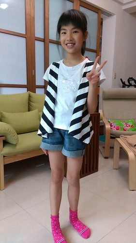](http://flickr.com/photos/33703965@N00/27294192036) 還自已上網查髮型要阿母多學點變化 可惜阿母手拙加上愛愛的頭髮太滑順不好使 有一天她自己竟然就搞出了包包頭  阿母深深覺得女兒有材太多  只是長髮伴隨的掉髮問題 實在讓人擔憂加阿雜(地板永遠有落髮) 加上愛愛也有很多美女具備的懶惰問題 很不喜歡要花很多時間洗頭吹頭髮 所以暑假結束前  五年級新班級開始前 再度剪短髮 不過這回千叮嚀萬交代 不要像以前那樣幼稚型的 要像高中生那樣的.........  愛愛的"玩具"越來越多 阿爸協助上網買的麥克風 [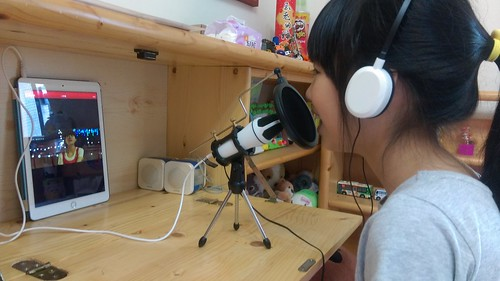](http://flickr.com/photos/33703965@N00/27230452942) 假裝是廣播人員 假裝自己是歌星 [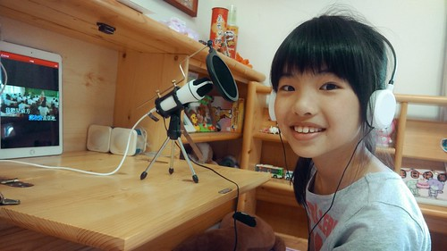](http://flickr.com/photos/33703965@N00/26720233274) 不知不覺蒐集二三年的二大箱瓶蓋 是玩開店遊戲時的最好食物  飲料店老闆娘很忙!  無所不在的玩 真的很忙!  五月母親節前班上的小媽媽體驗活動前  全副武裝的在家裡模擬過 [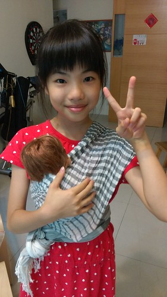](http://flickr.com/photos/33703965@N00/27230405812) 揹小孩  餵奶 換尿布 煞有其事  還彈琴唱歌給小孩聽  老師遊戲也是愛愛很愛玩的家家酒之一  從音樂課 數學課 英文課 到社會課無所不包  厲害的是家家酒不只是家家酒 透過老師遊戲 愛愛也複習好了她的功課 我想這絕對也是她這學期成績猛進的重要原因之一 [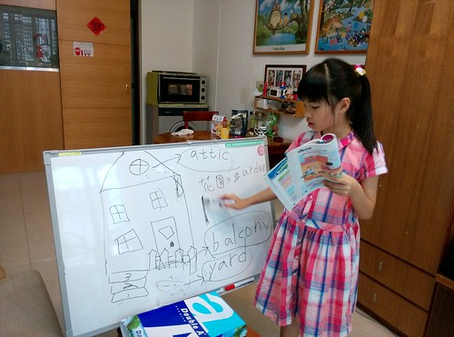](http://flickr.com/photos/33703965@N00/27294060036) 校慶體驗到比手畫腳遊戲的有趣  在家自製卡片跟哥哥二人也玩得開心 [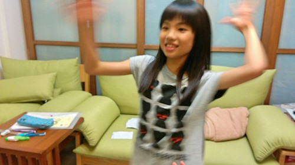](http://flickr.com/photos/33703965@N00/27230318232) [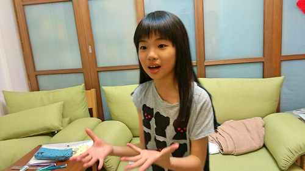](http://flickr.com/photos/33703965@N00/26720136554) 後來爸爸找到APP 全家一起玩HIGH  愛愛常很佩服她的哥哥有好多創意  但其實她的遊戲能力也超狂阿  兄妹倆是不同面向的創意能力  而二人也常激盪出讓我們拍案叫絕的火花  以前小時候哥哥很喜歡用棉被 浴巾幫妹妹還有自己打扮成公主 我說七年過去 兄妹倆還能這樣玩真的也是個奇蹟 (當然青少年絕不會這樣打扮自己了)  雖然常常被對方氣得生氣 但二人都是彼此最在乎 最重要存在的夥伴 [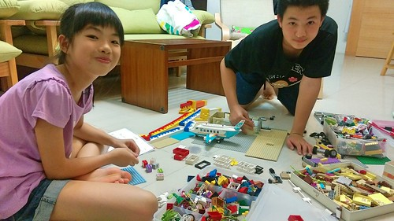](http://flickr.com/photos/33703965@N00/27327289985)  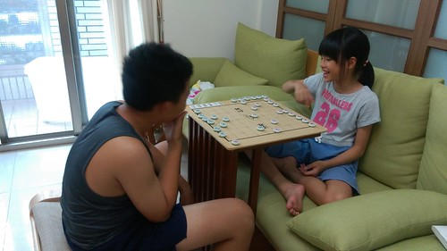 另方面 雖然已經升小五但愛愛一直是爸爸心頭好的小三 [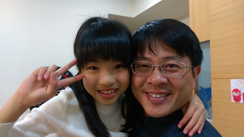](http://flickr.com/photos/33703965@N00/27294221666) 是家裡最能跟爸爸提出諫言與溝通的心理師 [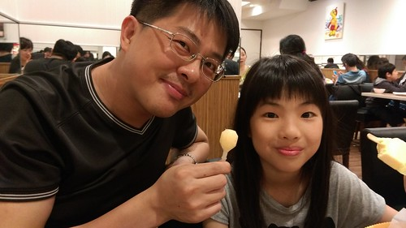](http://flickr.com/photos/33703965@N00/27052463480)

愛愛腦袋裡想做的事真的很多 包含勾毛線這事 暑假跟哥哥一起去救國團上了一期八堂的勾針課也是圓了她的夢想之一  做事向來仔細的愛愛 勾的作品都很整齊乾淨  愛愛自己也不可思議一個暑假可以完成這麼些作品 太不可思議 只是勾針對她來講真的有些複雜 尤其是起針時 常聽她求救 哥哥這個要怎麼勾... 看著兄妹倆如老婆婆般的邊勾毛線邊聊天 是幅很溫馨的畫面 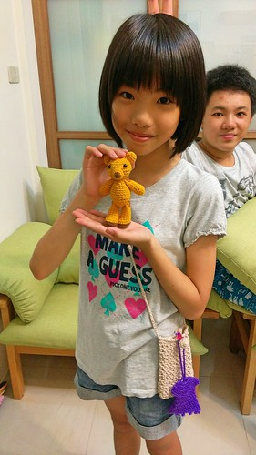 雖然愛愛越來越像個大女孩了 不論心智還是外表 但愛愛一直還是好瘦.... 完全的養不胖..........  雖然胃口比不上哥哥那樣好  但也算是個不挑食 食量也OK的好孩子 希望即將邁入青春期的她能多留點肉在身上阿!  前陣子的五年級家長會 愛愛寫給爸爸媽媽的一封信中這樣說: "我現在長大了, 我可以自己管自己, 也會保護好自己, 你們不用擔心, 而且我會讓自己不要頭暈的" 真的! 小女娃已經是個自立自強的小女孩了 希望接下來小女孩轉轉為大女孩的日子裡 能繼續開心自信做自己 你真的很棒! 
