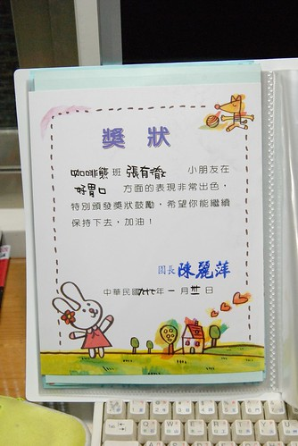

看到阿徹的這張獎狀 我跟徹爸都哈哈大笑  
"好胃口"方面的好表現竟然值得"特別頒發獎狀鼓勵"  
該說阿徹是除了好胃口以外沒有其他優點可以鼓勵  
還是阿徹的好胃口實在太突出 沒有好好鼓勵他一番實在不行ㄋ...

不過這張獎狀倒可以替徹媽的"養兒"無方洗刷了點冤情  
很多沒見識過阿徹"好胃口"表現的人 (小愛在這方面雖不如哥哥傑出 不過也還差強人意)  
幾乎都會在瞧瞧阿徹小愛後問我"他們很挑食是吧"  
我總一臉無辜+狐疑(其實也沒啥好狐疑的 就真的瘦ㄇㄟ)說"不會ㄚ"  
接著我要用很肯定的語氣說"他們的胃口算OK的 就是吃不大隻我也沒辦法"  
雖然聽的人都"喔"了一聲 但心理大概還是會存疑我這媽到底有沒有給阿徹他們吃飯吧  
今兒個總算有老師這獎狀證明"我家小孩是有乖乖吃飯的啦"...

有一次看著阿徹在家吃飯津津有味的模樣(其實應該說是狼吞虎嚥)  
徹爸開玩笑說"阿 在學校是都沒吃飯 餓很久喔"  
我說"說不定老師在學校看到阿徹吃飯的模樣也會懷疑  
     阿 是在家都沒吃飯喔 餓很久喔"  
真的~我想老師跟我們一樣都很好奇的

雖然阿徹對白飯以外的主食接受度頗低 (真的要白飯 淋了醬汁的飯要看心情 不特愛)  
但一頓飯搭配的青菜 魚 肉 湯 水果等...  
接受度頗多樣 吃的量也頗多 (我可以接受幾樣食物的挑食的 )  
起碼可以跟媽媽配合盡量達到專家所要求的"一日五蔬果疾病遠離我"  
雖然真的很瘦很矮 (同年齡的體重幾乎都是20以上了 阿徹還在17徘徊很久)  
但我想活動力旺盛的阿徹大概吃的都消化掉了吧  
而且所謂小時候胖不是胖 小時候瘦也不是瘦阿(聽說徹爸小時候跟阿徹很像)

  

雖然"感覺"上模範寶寶都是輪流當的 但看到這獎狀還是會小小開心一下的

 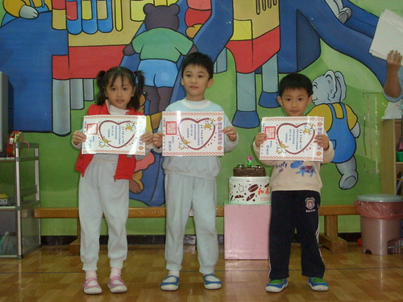

上了一學期的舞蹈課 還是很開心很愛

 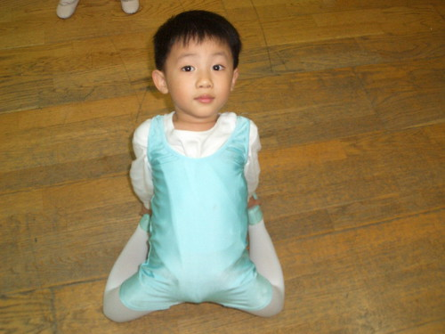

雖然我還是覺得湊熱鬧的成分居多 但不可否認有時候的姿態還蠻優美的  
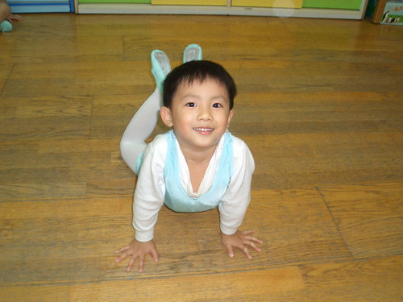 

阿徹右手邊的女生就是他的同班同齡同學  
size上有沒有給他很顯著的差異ㄚ  
你就知道阿徹有多麼的浪費糧食了 吃的都不見了  
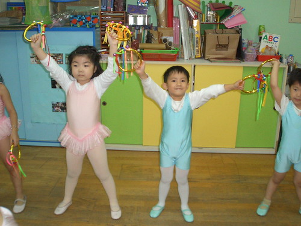 

很愛的戶外教學 (左右都是大班的 所以身型小是合理的)  
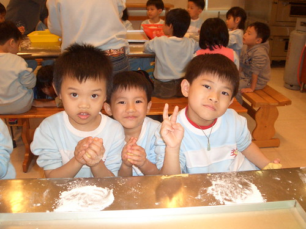 

~包水餃活動~ 本來很不愛吃水餃的阿徹自己動手包了一次後對水餃接受度提高許多  
只是他說沒有紅羅蔔的水餃不是水餃 要像學校那樣的才行  
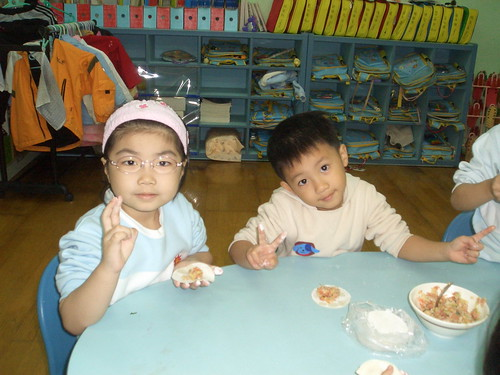 

~主題課程 小工具的使用~ 釘子拿的頗有乃父之風喔  
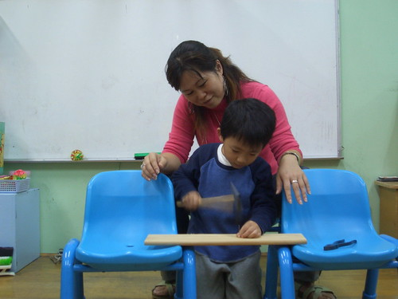 

~主題課程 種綠豆~ 後來真的長有15公分之高 被徹爸移植到頂樓的花盆裡  
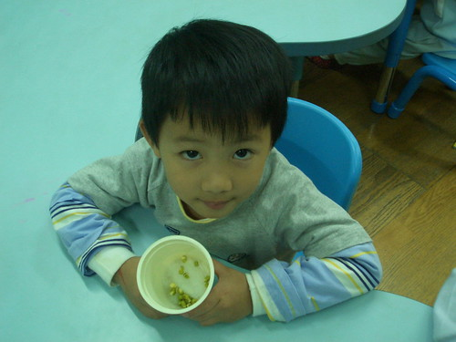 

~資優數學課程~ 就是現在很夯的邏輯 空間 數理...的訓練  
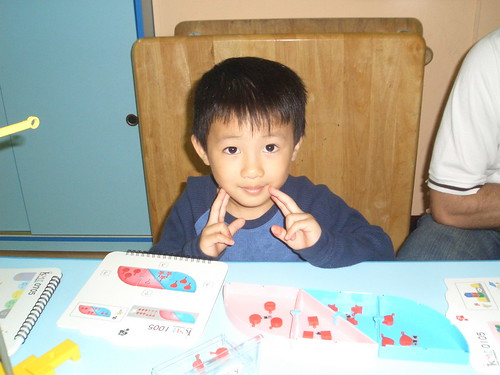 

~戶外教學 採橘子~ 這是班上的五個中蜜蜂  
遮住臉不看的話阿徹有點像是矇混在其中的小蜜蜂  
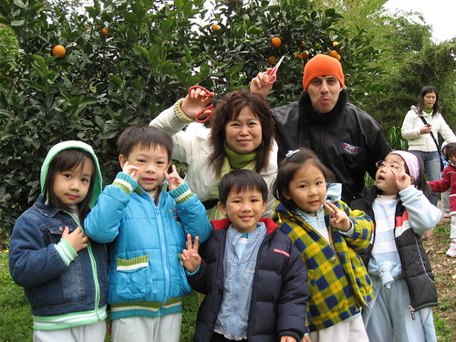 

雖然跟別人比小歸小  爸媽看到這模樣還是深深覺得"怎麼長這麼大啦"  
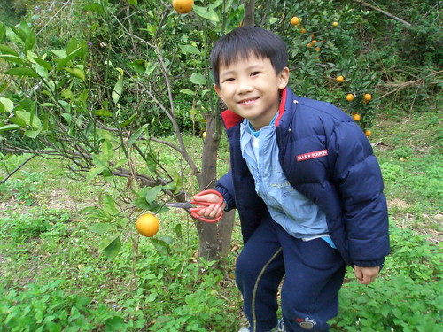
