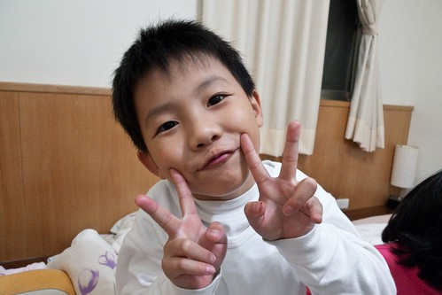

這是啥?!  不要懷疑 這就是那個傳說中的暗部啦~ (有興趣者可以用 火影+暗部 下去估看看) 我們家這個暗部最厲害的忍術就是搞這些五四三 甚至可以用雙面膠好讓這面具可以服貼在自己的臉上 我跟徹爸看到這些 真的也只有笑著搖頭的份 徹底的敗給這位忍者了....

這位忍者的變身術也挺曆害的  尤其特愛男變女 連喝喜酒時拿的小餅乾包裝花繩都可以拿來增添妖嬌  這...這...未免也太...唉...

親親術也是他常用的招數 連阿爸的臭腳也願意親....

不過當敵人不吃軟時  還是得這樣兇猛來一下的 尤其正當換牙缺牙時刻  看起來又更顯兇猛了

不過身為娘親的我 還是覺得接下來的正常版比較可愛 比較像是我兒子 只是這兒子怎麼感覺他越來越有老樣  越來越沒BABY的奶味了

連阿爹常也忍不住捏著小子的臉說"你真的老了"  (尤其又在有愛愛這個強烈對照組兩相比較下)

小子就會大喊"哪有!?"  然後使命裝岀可愛的模樣 可是那感覺就好像看著電視上那些偶像玉女在裝可愛阿....就是太假了啦...

不過自然表情時候的阿徹是真的還挺帥的說

常有些老人家會對我說 '唉優~你兒子長的還煙斗'     好啦~就是歹竹岀好筍ㄇㄟ...

阿徹目前的飲食習慣跟小時後蠻不一樣的 小時後超不會吃肉的他 現在算是愛肉愛菜一族 每天回家經過日理萬雞筒仔雞 都會喊著'好香 好想吃...' 在徹媽生日那天總算用生日價買了一隻回家嚐鮮  阿徹超開心吃的超過癮...

'感謝阿母賜我好吃的雞' (背影就是那個不願照相的臭小妹)

四月回嘉義時 徹爸像是實現多年以來放在心中已久的願望 帶他兒子也就是阿徹去買他生平的第一個棒球手套 打從高中起就一直持續有在打棒或壘球的徹爸 心裡應該很是期待有天可以一起跟兒子傳接球 甚至上球場打球吧 (就像我心裡也一直期待著有天愛愛跟我一起逛街敗家 或是跟我並肩站在廚房裡忙著)

希望小子也能有不怕曬 不怕苦的精神  有朝一日父子倆一起打球去

只是興趣這種東西還真強求不來 目前看來阿徹對於騎車的興致還是高一些  棒球+手套現階段算是在'玩具'階段而已吧 倒是阿徹的座騎被徹爸每次每次偷偷調高一些的情況下  已經越來越像小大人在騎的車嚕 望著他騎車的背影 會特別覺得小子真的長大了

阿徹這學期的學習態度 功課表現又比上學期又更進步些了 因為明白亂寫只是得花更多時間擦掉重寫  所以寫功課時的認真度跟美觀度改善許多 而有關考試這事也漸漸董得如何準備 如何因應 甚至慢慢有自己的訣竅

(期中考前的那次國語聽寫小考不小心考了100分 阿徹高興的回家看到誰就現)

學習跟成就感是很相輔相成的 有好的成績(徹爸說的 嚐到甜頭)  我們相信阿徹會更樂意去學習 去認真對待課業這件事的...

而因著洪同學家住到我們家樓下  阿徹平日也算是多了個學伴 玩伴 除了互串門子玩樂 像是有4個兄弟姊妹般熱鬧外 一起上學 偶而一起寫功課 討論學校 討論學習心得...  這是今年讓我們大家都很異想不到的收穫

上了小學後 阿徹依舊繼續上幼稚園的舞蹈課 只是已經進階到第三梯次的高級班了(跟技術沒關 跟年齡比較有關啦) 全班6-8個人 只有阿徹一個小男生 每每看到練舞時最調皮的就是這麼男生時 忍不住搖頭嘆'這猴小子' 可是看著萬紅叢中一點綠的他 又會忍不住笑了出來

4月底的音樂發表會 阿徹成了舞台上唯一的男主角 阿徹從表演前一個月就開始唸著 好緊張 好緊張 甚至在表演前一天晚上 緊張到躺很久才睡著

因為男生柔軟度跟可愛度的問題  老實講就是不若女生般優雅 確實 美麗

可是很欣慰阿徹願意是這唯一的綠葉  而且是個認真 賣力的綠葉...

曾經跳的辛苦時 阿徹唸著不想上了 可是跳的開心 跳的有成就感時 他卻又會說 '上二年級後還要繼續上舞蹈課' 要邁入第四年

繼續當這個綠葉 做這綠葉才能做的事 呵呵~

小子 繼續加油~ for every thing~

