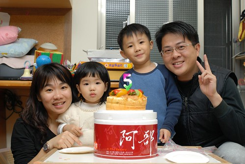
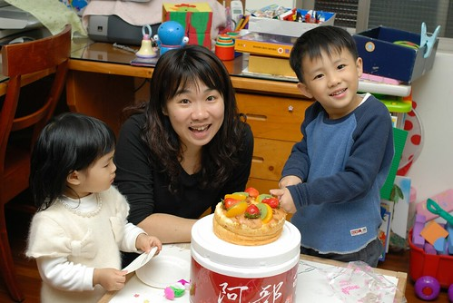
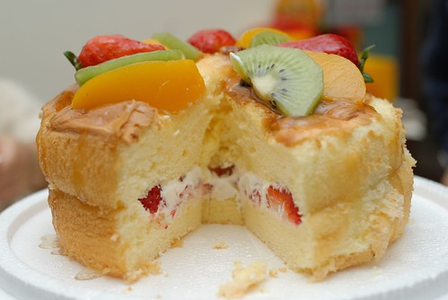
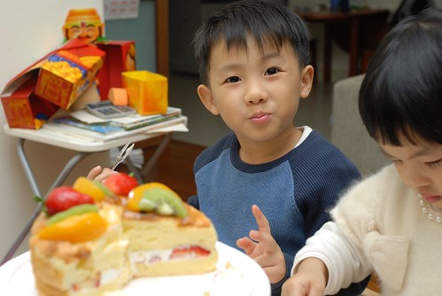
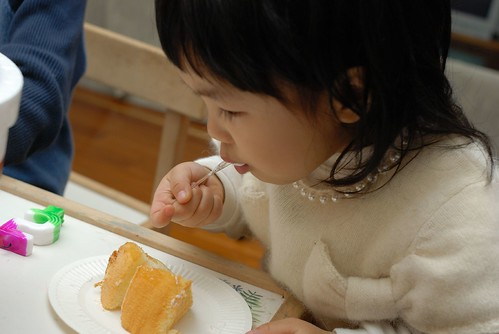
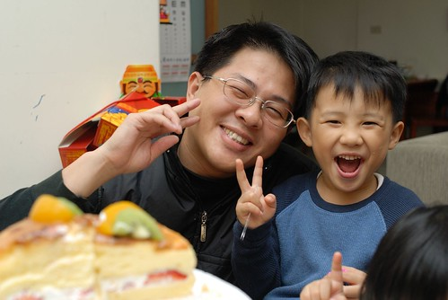
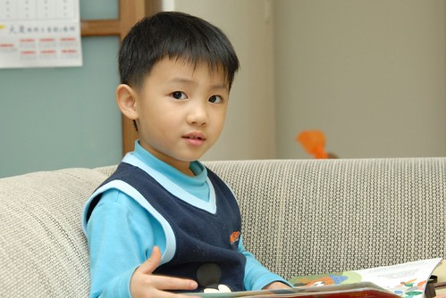
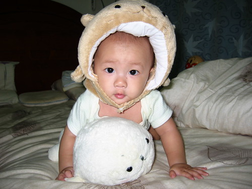
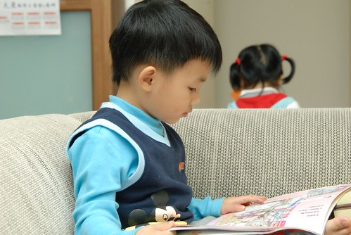
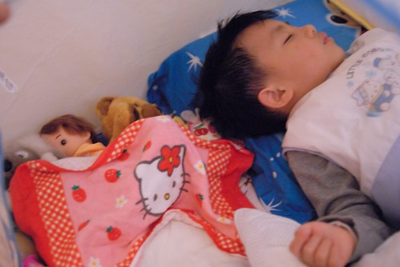

阿徹唸了一整年的生日總算到了  
92年2月22日 很好記的一個日子  
(當初生小愛時還期望來個1111的 可惜1111早預產期2個星期  有點窒礙難行)  
  
其實阿徹對於月份/日子還是搞不懂 釐不清  
明明就已經2月了 還會問我"現在是2月了嗎"  
跟他說"是ㄚ 你的生日快到了"  
他便又巴望望的問"是明天嗎 明天是2月了嗎"  
再跟他說"現在就是2月 現在是2月\*\*號 你的生日是22號"  
他還是一頭傻呼呼的問"那明天是22月了嗎"  
所以其實他在乎的只是一個可以吃蛋糕 有生日禮物的日子  
2月22日或是滿5歲了 跟他又有什麼關係ㄋ...  
  
徹爸家是不過生日的 所以徹爸常說"過什麼生日...為什麼要過生日"  
所以我們家很少在生日蛋糕前唱生日快樂歌  
印象中好像只曾在阿徹三歲生日時買過一個超迷你蛋糕  
至於小愛還有我跟徹爸這兩個老人更是離生日蛋糕好遠好遠嚕  
生日對於我們來說只不過是個計算日子的方式  
計算小子已經跟了我們多久了 而我們還有多久就可以從小子難纏裡解脫了...  
  
不過也許真的是長大了  
阿徹今年特別的期待吃蛋糕 一個可以屬於他的草莓蛋糕  
所以我還是當了孝女 去訂了一個不要有奶油的草莓蛋糕  
只是阿徹好像覺得生日蛋糕就是該要有奶油 沒有奶油就不叫做蛋糕  
所以小壽星有點小小失望    
不過對於超不愛吃甜點的徹爸與不太愛吃甜的我來說 這種小時候口味的蛋糕可超對胃的  
所以蛋糕最後全進了我跟徹爸的肚子裡還意猶未盡...  
  
Anyway 阿徹還是開心的完成了一年中的大事  
唱了生日快樂歌 吃了自己的蛋糕 領了已被扣押半年的迪士尼買的公主音樂珠寶盒  
然後又開始期待聖誕節的到來  
恩~乖小孩~過日子比較重要~  
  

唱完生日快樂後要阿徹許願  
阿徹很害羞不要許 (是不知道他心裡有沒有偷偷許啦)  
不知道是因為心願太多還是因為最近沒有結婚對象阿徹不願意許願  
(告白了幾次都紛紛被拒絕  小小傷心難過 人生似乎失去了目標一般)  
沒關係~爸爸媽媽希望你健康 勇敢 認真就好~  
  
小愛很融入氣氛的一起唱中英文版的生日快樂歌  
唱畢還很盡責的開始分盤子等著領蛋糕  
而且今天還很湊巧的穿的很貴氣的幫哥哥過生日  
  
  
  
講真的蛋糕看起來有點其貌不揚  
沒有奶油的裝飾果然如店員所說的容易傾斜 坍崩  
不過我們小時候的蛋糕真的都長這樣說 (因為陳嬤完全不敢吃奶油 )  
  
  
  
以前有機會吃別人的生日蛋糕時 阿徹明明就是不愛吃奶油的   
望著真的沒有奶油的蛋糕卻又直呼"我覺得有奶油的蛋糕比較好吃"   
ㄘㄟˊ真有奶油的蛋糕可能在生日那天後就只能躺在冰箱中然後等送進垃圾場了  
不過也許下次應該訂沒有奶油的巧克力草莓蛋糕  那應該會比較像個美麗的生日蛋糕的  
  
  
  
小愛則是只挖草莓吃  看的到的草莓全進了她的肚子  
兄妹倆還為了最後一顆草莓小爭奪一番  
  
  
  
生日就是開心  嘻~~~  
  
  
  
最近看阿徹的照片常常挺不習慣的  
真的不太習慣我的兒子已經像是小少年的模樣了   
  
  
很難想像原來五歲的小孩不論外貌或是心智已經可以成熟到這程度了  
腦海中的兒子還是那個繞在身邊爬來爬去的小嬰兒說  
  
  
  
我甚至會想像很快的就有別的女人也會像我現在這樣從他的小嘴上啄下去了   
唉....要調適要調適....  
  
  
  
孩子就這麼在"一暝大一吋"  用著我們難以想像的速度長大中...  
阿徹 ~~生日快樂~~  
  

