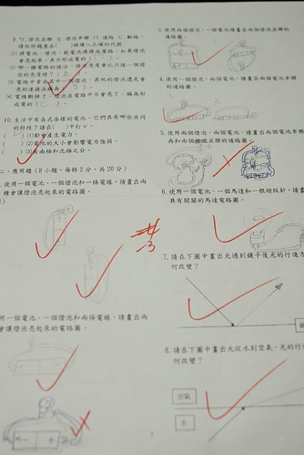

徹愛這兩個小學生下學期都開學半個月了 媽媽我卻一直還沒做上學期的小紀錄 其實照片陸續已經貼好 但卻遲遲一直沒開始寫 除了因為真的工作忙 加上寫遊記較具新鮮感外 最大的原因乃是我覺得我一旦開始寫就會字很多上身 (我承認我是很碎念的媽媽) 想到可能的漏漏長就覺得工程浩大 以致一拖再拖 拖到怎麼累積的照片越來越多 而我們的阿徹也都過完10歲生日了... Orz 是滴~ 媽媽該是好好給個交代的時後了!!!

這半年很多看著阿徹長大的長輩們常會很驚訝似的告訴我們"最近, 阿徹大好多喔" 雖然我總笑說"是胖很多" 但我們也明白快要青春期的阿徹是真的越來越不一樣了 身材壯碩不少 腦袋越來越記得用 而舉手投足間也漸漸有"Man"的味道飄出... 看著他那似小孩但又似大人的內外在模樣 更是讓身為父母的我們體認到教養的任重道遠 就如我們常跟阿徹說"接下來的10年是你人生中很重要的階段" 父母的我們除了期望他的未來 同時也超級感觸與珍惜過去的10年! 

阿徹的四年級上學期 在媽媽安親班的加持下 就如他自己說的"日子好開心阿" 沒有才藝課 沒有補習 沒有繁重的作業壓力 而且還是一如以往的不知回家為什麼要念書 每天就是開開心心的去上學 去遊戲 去吃營養午餐 然後回家後的大半時間也還是開開心心的東晃西玩 雖然偶有狀況外 被老師 被我們罵或處罰的時候 但整體來講 我自己也覺得這一學期的阿徹在情緒與學習表現上穩定許多(起碼讓人大爆炸的機會少很多) 至於成績 只要我們看的見他的努力 他的誠意 剩下的也就隨緣了 所幸阿徹雖然沒有突出表現 但起碼中規中矩  這樣的學期成績也算令我們安慰了  老師的評語依然很是中肯 點出阿徹有的優點與缺點 我想老師可能也跟我們一樣雖然真的很喜歡 但常好氣又好笑的想扁下去吧  阿徹的自然是所有學科裡面表現最好的 曾經有一次我們談論到他那很爛的國語  我說"你的國語屬於不僅上課要認真 回家後還要多複習 不像自然那樣只有上課認真卻總是考高分" 阿徹一臉不以為然的告訴我"沒有! 我自然課常覺得無聊發呆 可是不知道為什麼就都考很好" 是是是! 只能說爸爸平常生活中的科學教育做的真是好 讓阿徹的自然成績這樣渾然天成  (這是阿徹的期末考 講真的覺得比我門小學難很多ㄚ 電ㄚ啥的 不是高中物理才學的嗎)  阿徹的數學是我們最是要求的學科 解題的邏輯性 式子的列法我們很是要求也是他寫作業時最會讓我們刁難的地方 只是阿徹很容易粗心 常不是加錯一個數字就是題目抄錯或是最後"答'騰錯 而偏偏他又一直不願意養成檢查的習慣(這點 媽媽還在跟他大鬥法中) 所以作業與考試成績常時好時壞 徹爸笑說"表示你兒子是做大事業的人 不拘小節阿"  ㄟ...雖然觀念是最重要的 但品質也是要顧的  慶幸的是阿徹越來越會問問題 甚至與我們來個科學對話  算是不枉他老爸老媽是唸理工做RD的  至於國語 雖然可能真的是有遺傳到(徹爸的大一國文被當) 錯別字的問題非常嚴重 但起碼這學期作業的工整度比起以往進步許多 而且令人感恩的是老師常在作業本上給予鼓勵與好成績 以表達對於阿徹認真態度的肯定 能遇到這樣的老師對於這樣的阿徹的來說 真的是菩薩有保佑 佛心來著阿  除了國語外 四年級換了書法老師後 不若三年級那樣每周末都有書法作業 常寫的阿徹發脾氣說"為什麼要學書法" 四年級從沒有書法作業要帶回家 阿徹竟也學出趣味 常說書法真是好玩而且自豪自己寫的真不錯 更難得的是還會對自己寫的字評比一番 點出還需要改進的地方 真的! 就如我深信的 小學老師的重要性 對於孩子影響之深大阿!  週末常有的週記作業 雖然還是偶會有讓阿徹哀號的時候 但已經越來越會擬文章的架構了 只是認真度很視心情而定 而且常會字很多的廢言一堆 深度與精實度還須多磨練  不過被我大幅修改 甚至要求重寫的機會已經降低許多  甚至還常讓我鼓勵叫好  一樣感恩的是 老師也觀察到並常大大給予鼓勵  真的 我們常說的"態度很重要" 人家會明白你認不認真的 唯有認真過後才能大聲說過程重於結果!  

常覺得10歲的阿徹有時候還像2-3歲那樣天真 那樣憨  但很多的時候 見識到他那越超乎我們想像的思考力  行動力與超過我肩膀的身高  不得不面對他真的長大了的事實  這一年裡 很多人都跟我們說要珍惜現在阿徹還會膩在身邊的日子 以後就完全不一樣了 但我莫名的相信 我家阿徹應該不會離我們那樣遠 而且我們想從他們小時候便累積起的親密 應該夠面對以後可能的折抵吧!  重點是阿徹現在真的還是常很幼稚 依然像小時候那樣的每天有玩不完的新主意 每天跟他妹妹玩在一起  所以不是因為害怕以後失去才珍惜現在  我們是一直努力活在當下阿 這個笑容還能擁有多久 對我們來說真的不是問題! 

過完年後 阿徹便開始倒數他的生日 因為今年的生日很特別  今年的生日可以買蛋糕慶祝 (好多年前我們立下的規則 只有每逢5的倍數生日才能切蛋糕) 或許因為這樣 阿徹今年10歲的生日才格外的令人期待與感嘆吧 就連愛愛妹妹也很共襄盛舉的 拿零用錢去買了一顆金沙還有一瓶養樂多要送哥哥生日禮物  生日那天傍晚買回家後 妹妹很慎重的授禮給哥哥 還要求非得用她的相機拍下來  收到禮物的哥哥當然也是開心的不得了 畢竟這可是花了妹妹快一週零用錢的心意阿  而晚餐過後 全家人期待的時刻來了 拿出預訂的特製蛋糕 插上10歲蠟燭 一起唱著生日快樂歌 阿徹許願說: 希望變成大富翁 希望能有多啦A夢 阿徹直想要說出第三個願望 但被我們努力的制止住 孩子! 希望你的第三個可以實際點的讓你夢想成真!  YA~ 阿徹真開心自己10歲了  慎重的切下第一刀 希望接下來的五年都平安順利  滿懷期待的等著 家裡好久沒出現的鮮奶油生日蛋糕 (順道回答蚊子阿姨在FB的問題: 媽媽功力還沒到鮮奶油生日蛋糕 所以蛋糕當然是用買的 況且對徹愛來說 這樣的蛋糕才叫做生日蛋糕)  吃蛋糕前 先喝妹妹送的養樂多先 好甜阿~ 格外珍惜  阿徹事前交代的蛋糕模樣"不要巧克力 不要太多鮮奶油 好多草莓"   媽媽不負所託  小壽星好好享受10歲生日蛋糕!  那天我在FB寫下的生日祝福是: "我們的徹今天滿10歲了! 媽媽最大的讚嘆是:10年 原來男孩可以長到這樣大了! 而男孩則開心又滿五歲 可以吃生日蛋糕嚕~ 阿徹前陣子常問我他有什麼優點, 我每次說了"單純 天真 有那麼一抵點創意"後就會開始吱唔 當然我明白阿徹是希望多從我口中聽到好的話 讚美的話, 只是阿母我真的說不出那些不算優點的事 不過我真的很喜歡我們家的阿徹, 雖然他有點懶惰 愛抱怨 愛生氣... 但他就是那個每天晚上會期盼著我說故事, 會追著問我"今天可以陪我躺一下嗎", 在睡前親臉時想辦法偷親我小嘴的可愛大男孩! 我們的寶貝兒子 生日快樂! 期待你接下來10年更大的成長!!!" 也謝謝舅舅 姑姑還有眾位看著/抱過阿徹長大的阿姨們的祝福~ 滿滿的祝福肯定可以讓即將升上高年級的阿徹像大樹一樣越長越大! 

對照昨天找著阿徹小時後騎車照片時 不小心看到的5歲生日時候照片  真的! 阿徹長大好多! 但也真的依然還是我們記憶中的阿徹  我想這是件難能可貴的事 

順道紀錄阿徹最近的大事 就是阿徹腳踏車升級24吋嚕 上網買的二手車 經過徹爸精心整理後 依然帥氣的讓阿徹滿意的不得了 有了24吋 阿徹更能享受單車馳騁帶來的快感 也希望這更大的車也能帶阿徹騎更遠的路 到更多不曾去過的新地方  哈哈~ 生日加上換車 真的很讓媽媽我感觸萬千 忍不住同場加映阿徹這8年的單車史 真的就彷如另一個刻畫成長的紀錄史阿 2歲半擁有生平第一台腳踏車 (12吋還有輔助輪的小橘是兄妹倆小時候很重要的大玩具)   4歲半在我們家頂樓學會騎腳踏車  小車子陪伴阿徹經歷幼稚園階段重要的4年  大班時候12吋的小車子已經不敷阿徹身高 換了一台16吋的小黑  雖然小黑使用時間真的很短 只有半年 但幫助阿徹對於車子有更好的掌況與實際上路練習 這期間曾經跌倒撞流血過(這是唯一一次單車流血意外)   但也很勇猛的騎著16吋到過鶯歌  經過16吋40公里鶯歌挑戰後 阿徹正式升級20吋了(其實這台20吋比16吋還早買)  升級後立馬又去挑戰鶯歌行 自此阿徹才真的開始享受單車的速度感與成就感  但也同時接受過很多的挑戰 從板橋到過大溪 到過八里 到過動物園...  甚至還去了花蓮挑戰193  雖然有時候真的很累 但阿徹越來越強壯與(應該有)堅強  用著阿徹的速度看台灣 是我們一家子最是喜歡的旅行方式 我們肯定一輩子忘不了 在阿徹小時候我們曾經一起騎在花東縱谷裡  20吋就這麼陪著阿徹也3年多 直到上四年級後才發現騎在上面的阿徹竟已經大的這樣不協調了  於是噹~ 該是更大的24吋單車了 也同時墨鏡跟車衣也都加大尺碼了  新的10年 一切都漸漸不一樣 阿徹要努力繼續馳騁 陽光下去喔!!! 
