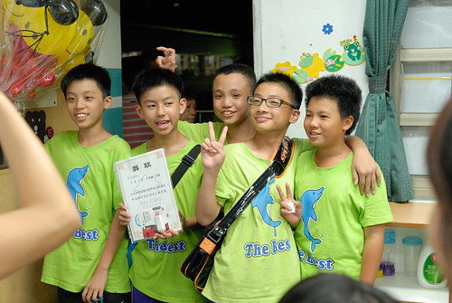

我們家的徹哥從小學畢業了!徹哥第一天揹著書包上學去的背影依然清晰在我腦海裡  沒想已是六年過去徹爸說的 再一個六年就上大學 男孩變男人了時間真的過好快~...

原我不打算參加畢典的 因為場地小家長多 加上向來不喜歡公式化的典禮流程 還是因為徹哥希望我們參加以及徹爸的堅持而準時出席

端午節連假前一天晚上的典禮 戶外的場地讓人仿若來看野台戲  前半段冗長的來賓介紹 致詞等 別說畢業生個個一臉無感 連站在外圍觀看的我們也累的坐到球場上遠遠觀看  幸好中場開始的校園生活回顧戲劇表演 讓氣氛回到每到畢業生的手上 心中  連我看著看著也忍不住滿身起雞皮疙瘩  一個半小時的典禮結束 畢業生們回到班級教室由導師進行最後的話別  孩子們的臉上看不太到離別的不捨  反而有著進入人生下一階段的期待與興奮  謝謝阿徹在低中高三個年級遇見三個截然不同類型的老師 同樣的給予天兵徹很多的教導與包容  聽著老師最後唱給同學們的祝福"勇敢去飛"(小虎隊單飛前的離別歌 是老師國中畢業時的歌) 阿母我腦海裡閃過這些年來的一幕幕  眼角不自覺的濕了 百感交集 養兒子竟然到了好像再眨個眼 兒子就將高飛而去的時候  典禮結束回到家 一家子吃著宵夜時請徹哥發表畢業感言 不是很喜歡高年級自己狀態的徹哥 很高興從國小畢業了 可以到國中新環境從新開始 而對一家人的謝詞分別是 "謝謝妹妹一直以來包容他的膽小" "謝謝媽媽每天煮好吃的飯 常常給好多的鼓勵" "謝謝爸爸總能回答他的問題 幫忙解決/提供各式需求/工具" (徹爸真是有著多啦A夢可以解決徹愛任何問題的能耐)  雖然這幾年對於徹哥的學習態度越來越傷腦筋 甚至到有些莫可奈何 但一直相信(自我安慰)他是個好孩子 起碼不會做出讓媽媽傷心的事 雖然調皮 雖然不定性 雖然純蠢又白目 但在一次次叛逆與低潮中 慢慢往好的方向去 只是在等候徹哥開竅的那一天 找到自己學習的動機, 努力的目標與態度 很是考驗急性子的媽媽我阿...

徹哥很期待新的國中階段  可以告別以前在班上不如意的人際關係與已被定型的自己 我們也期望新環境帶來的改變契機與不一樣的他 只是必然需要更多的決心與毅力 改變 相信.......... 我們全家一起努力!
