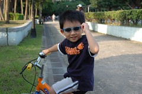
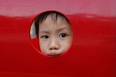
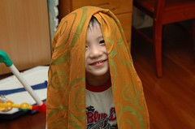

(大手牽小手上學的路上)  
徹:今天下雨耶  
媽:是阿 昨天就下雨了ㄚ  
徹:太過分了  
媽:ㄣ~ㄟ 大概雲很難過在哭哭吧  
徹:所有的雲都被罵罵哭哭了~

(喝完便當店的養樂多後 阿徹把空瓶放在餐椅下)  
媽:瓶子不可以放這裡喔 等會會有很多螞蟻跑來喔  
徹:放這裏阿 要不然蟲蟲螞蟻就沒有家了  
ㄟ~會不會太好心了 想幫螞蟻建個家阿

(洗完澡穿衣服中)  
爸:趕快穿衣服喔 要不然把你鳥鳥剪掉喔  
徹:不要  
爸:沒有鳥鳥會怎麼樣阿  
徹:就不能尿尿了  
   會像媽媽一樣從大便的洞尿尿  
媽:ㄣ..ㄟ..ㄚ 你怎麼知道  
(阿徹一臉竊笑)  
爸:我沒有教他喔

(母子倆很久沒有一起洗澡了)  
徹:(玩著一堆玩具昆蟲)為什麼他們都有翅膀阿  
媽:因為他們是昆蟲阿 會飛阿  
徹:那蜘蛛不是昆蟲嗎  
媽:ㄟ~蜘蛛也是昆蟲 (發現自己說錯了)  
   昆蟲有的會飛有的不會 會飛的就有翅膀  
徹:喔 (謝謝你沒兔你媽槽)  
...  
徹:為什麼你有妹妹的ㄋㄟㄋㄟ阿  
媽:哪裡  
徹:這裡阿(用手指比著我的奶)  
媽:ㄟ...因為我是女生阿  
(阿徹還是一臉狐疑 我只好很認真的跟他說)  
   之前媽媽是不是有大肚子 妹妹出來了 所以媽媽有ㄋㄟㄋㄟ了

(前提 前一天上學途中阿徹帽子上的蜘蛛人貼紙不小心掉了 我承諾他今天跟他在路上找)  
(上學途中)  
媽:我們小心看看貼紙有沒有掉在路上喔  
徹:應該在樹那裡 (比著遙遠的對岸)  
媽:好 那等會到了你要提醒我喔  
到了對岸也沿路仔細看  
媽:找不到椰 可能被人家掃地掃走了  
徹:恩  
媽:也可能貼紙迷路哭哭 然後他爸爸媽媽找到他帶他回家了  
徹:是被螞蟻跟蟲蟲吃掉了  
媽:阿 這麼可憐ㄚ 被螞蟻跟蟲蟲吃掉阿  
阿徹一臉認真的說"是阿"

