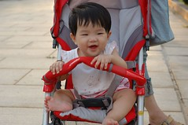
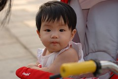
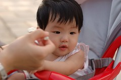
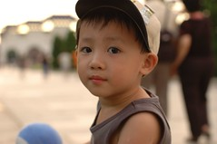
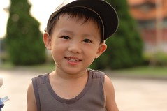
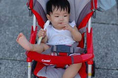
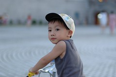
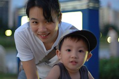
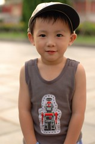
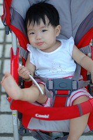

這個週末有點忙  
但很久沒這樣悠哉的過平凡正常的週末了  
週六早上一如往常是媽媽上菜市場買東西 爸爸打掃家裡的時間  
兩件事做完也往往都近中午午餐時分  
平日晚餐都是住家附近的營養便當  
趁著週末煮了跟徹爸最愛的鹹粥(筍子粥)  
開始覺得真是好個美好的週末阿

今兒個下午爸爸要拎起球棒打壘球去了  
從小愛在媽媽肚裡第九個月起 爸爸宣告封球  
(最後一場球賽還將手套遺忘遺失在球場了)  
等阿等 總算盼到小愛會爬了  
媽媽一直跟爸爸說"放心啦 你可以去打球了"  
(實在因為爸爸的身材日益中廣  
 不過重點是媽媽特喜愛愛運動的陽光爸)  
只是基於球隊繁重的比賽以及爸爸考量  
復出之日就這麼一直緩著  
前幾天爸爸興沖沖的開始整理他打球的家絲頭  
宣告這個週六下午要跟同事去打壘球  
哇~真好 又可以看到穿著球服英挺的爸爸了~  
其實自己照顧兩個小孩沒啥問題的  
只是一大一小輪流睡覺害的我只能小睡午覺30分鐘 有點糟

晚上依照慣例的回到陳嬤家吃晚餐  
已經有2個多月沒讓三個小毛頭聚一起了  
后~三個三歲多的小孩在一起玩  
真的就是哭~吵~鬧~輪流上演  
大人們紛紛忍不住懷疑是自己耳朵的耐受力變差了還是真的太吵了  
大家的結論是 真的粉吵~

離開嬤家又帶了阿徹去舅公家  
很久沒去舅公家的阿徹剛開始都會有點生疏  
但很快的就找回小時候白天在舅公家的回憶啦  
其實阿徹真的都還記得2歲前給舅婆帶的記憶的

週日早上徹爸問我"今天有什麼計劃"  
我說"去陳嬤家吃飯 下午拜拜就這樣嚕"  
阿徹在一旁說"好久沒照全家福了"  
ㄟ~你想排這計劃阿 你最近很愛照全家福喔

週日中午回陳嬤店裡吃中餐時  
阿徹很enjoy的大口大口吃了一碗碗稞還有大骨湯  
舅公跟媽媽看他吃的津津有味的模樣也都忍不住拿了一碗碗稞吃  
陳嬤賣碗稞已經賣了10多年  
很多當年吃著碗稞長大的小小孩也都成為高高壯壯的年輕人了  
很希望阿徹也能這麼吃著阿嬤的碗稞長大~

下午忙完拜拜的事 "修周"爸爸去中正紀念堂  
突然很想帶阿徹去那寬廣的廣場上騎腳踏車  
於是帶著小愛的粥讓她有了戶外野餐初體驗  
晚風徐徐 我想連小愛都覺舒爽愉快吧

在中正紀念堂呆了一個小時 天已黑肚子也餓  
於是打道回府到住家附近吃涮涮鍋  
小愛越來越難掌握 不安分了  
搞的店裡ㄎㄧㄥ ㄎㄧㄥ ㄎㄧㄤˋ ㄎㄧㄤˋ的  
跟我們一同吃過幾次飯的玟姿阿姨就曾經形容  
跟我們吃飯不知不覺都會緊張 加速了起來 好像在打戰  
哈哈~帶著兩個小孩就是這樣ㄇㄟ~習慣就好啦  
重點是又沒少吃到啥 不是嗎...

這個週末很平淡 很徹家風格~  

