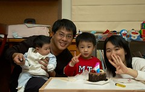
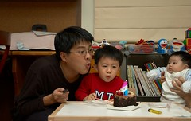
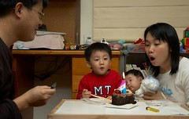
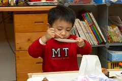

好久沒有買蛋糕的喜悅了...  
昨天提早下班趕回板橋去世運買阿徹的生日小蛋糕  
找不到鋪滿草苺的小蛋糕 只好選擇了尚有一顆草莓的巧克力蛋糕  
要不然這小子準會嚕我"我的草莓口味蛋糕ㄋ"  
雖然只是小小的150元蛋糕 還是跟店員要了4歲蠟燭跟盤子  
小心翼翼的提回家冰在冰箱 等待著小壽星回家

去幼稚園接阿徹時  
阿徹一如往常的問我"你今天買什麼東西給我吃ㄚ"  
"今天沒有買耶 不過今天是阿徹的生日 要送你一個禮物"  
"什麼禮物阿"  
"呵呵 一個生日蛋糕喔"  
聽到蛋糕 阿徹就跳阿跳的牽著我的手過馬路~  
回到家後 阿徹急切的問我"蛋糕在哪裡ㄚ 我要看"  
只好打開冰箱門讓他瞧瞧蛋糕上的草莓  
他更是忍不住的說"我要點蠟燭 吃蛋糕"  
"不行啦 要吃飽飯而且等爸爸回來才可以點蠟燭"  
嚕了一下下後 雖百般不願還是接受了  
乖乖的洗手 吃飯 玩遊戲  
等爸爸回到家一進門 便又迫不及待的說"我有一個蛋糕喔"  
拉著爸爸的手要吃蛋糕  
"等爸爸吃飽飯才可以吃蛋糕啦 爸爸吃好快"  
等爸爸吃飽飯 一家人認真且慎重的搬出阿徹小桌子 拿出蛋糕 架好相機 點上蠟燭 關上燈 唱著生日快樂& Happy birthday  
吹蠟燭  
一家人這樣慶生的感覺真的還挺溫馨的...  
平常不太愛吃蛋糕的阿徹 吃完一片後竟然還意猶未竟的說還要  
看他吃的津津有味的樣子忍不住問他"自己的蛋糕比較好吃ㄚ"  
這小子竟也一臉認真的說"是"  
呵呵!喜歡就好~  

