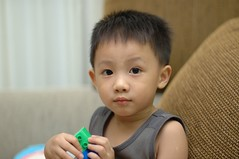

話說我們家一樓人戶有請個菲庸  
早晚阿徹上學經過時  
那戶人家的鐵門都是拉開呈開放狀  
前幾月的某天那位菲庸阿姨突然很熱情的跟阿徹說"Hello 弟弟"  
當下阿徹害羞的往我身後躲  
之後菲庸阿姨開始很有毅力的每天早晚跟阿徹說  
"Good morning 弟弟" "Good night 弟弟"  
雖然阿徹依然扭捏的拉著我的手躲在我身後  
但臉上的微笑卻越來越"燦爛"  

有一天回家時沒看到熱情的阿姨  
阿徹問我"阿姨ㄋ 跟我講英文的阿姨ㄋ"  
我說"阿姨在忙吧"  
阿徹有點失望的"喔"了一聲  
隔天放學回家時一聽到熟西的聲音喊著 "Hello 弟弟"  
阿徹急切的走向前問阿姨"我昨天沒有看到你耶"  
就這樣她們之間的距離被移除了  
阿徹在我提醒之下會開口跟阿姨說"Good morning" "Good night"  
而阿姨跟他說的英文句子也越來越多了  
有次阿徹竟然在跟阿姨道完 "Good night"後  
在沒有我的提醒下 自己主動開口說"See you tomorrow"(這是阿姨每晚必說的話之一)  
阿徹越來越能自己跟阿姨溝通了  
雖然我覺得阿徹其實聽不太懂ㄚ姨在說啥  
但是每每聽到阿姨在句尾加個"好不好" "OK?"  
阿徹卻都也大聲且爽快的回答"OK!"  
(反正聽到Ok就是ok啦)  
我想阿姨應該也知道阿徹有時聽不懂 但卻也都笑的很開心  
前幾天阿姨問他"How are you"  
阿徹又突然很順口的接了"I am fine. Thank you. And you?"  
哇!又贏得阿姨的大拇哥讚賞了

全美班貴貴的學費似乎有了點代價 哈哈!  
其實並不特別期望能有多顯著的英語學習成果  
但很高興阿徹漸漸有開口說英文的勇氣  
從一個字 慢慢道兩個字 一個句子 兩個句子  
都是在進步!

