趁著清明連假開始前一天 我可以多放的學校春假 我跟徹爸來個許久不見的小約會徹爸問想去哪 我說想去淡水吃阿給 不知怎麼的 對於淡水阿給 我有種不知為何的喜好與懷念於是4/3週三上午送完徹愛上學 倆人遊車...

很多人都會覺得我是個嚴肅的人 從中學時代起我便似乎一直給人這樣的印象 特別是剛認識我的人 我常想應該是因為我不笑的時候臉很難看的原因吧 因為徹爸常會說我臉很臭但我明明只是在認真的想事情... 而另一個原因也就大概是我講話向來太真實 太坦白 太自信 總容易讓聽的人難以下嚥吧! 年紀越大倒也越來越不在意別人看自己的方式 只是自己對自己的那條線卻也越拉越緊 越高... 最近幾個月的工作量與需投入的腦力及心力 破了自己工作十多年來的紀錄 連徹爸都很驚訝與好奇 我的老闆到底是接了什麼樣的新計劃可以讓向來笑看工作的老婆這樣耗竭 晚間 週間 許多小時間累積的work@home 上床睡覺時 因為腦袋的停不下來而輾轉難眠 甚至程式持續的在睡夢中running 然後前所未見的眼角皮膚過敏 口腔破洞 疼痛... 果然! 我還是適合過如閒雲野鶴的日子!!! 所幸日子雖然忙碌 但還能每天準時的接剛放學的徹愛回家一起坐在桌前吃點心 聊他們開心的事 這是最大的感恩 也是最重要的喘口氣及動力來源 而同時 每天早晚的廚房備餐則是安穩自己的時間與方法 這就是我目前的"活在當下"!!!

來淡水吃過好幾次真理街阿給 但總算這次吃到了老牌阿給 九點時分的阿給加黑輪魚丸湯 是一頓令我們滿意又滿足的早餐 然後把握難得放晴的空檔 吃完後我們來到淡水的古蹟園區走走 帶徹愛出門玩時 我總習慣先上網估狗一番 有個大略了解跟計劃後 執行起才覺得踏實與效益 (出門玩還講效益  可見我真是很嚴肅的人  不過做點功課就可以讓全家玩得更開心 這樣的效益很值得先付出的) 但只有徹爸的兩人小散步 我喜歡隨心所欲的亂亂走 安靜的走 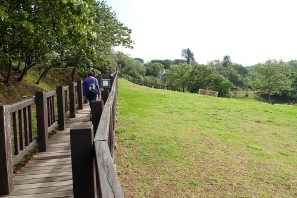 只是今天的風真的好大 兩人的手得牽緊一點 勉得被風吹倒了 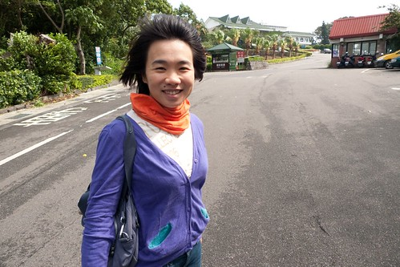 我們誤打誤撞的來到耳聞許久的滬尾砲台 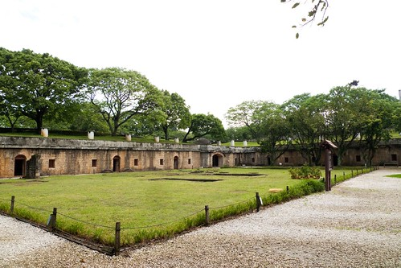 第一次發現與走進這樣的淡水  我們很是驚喜 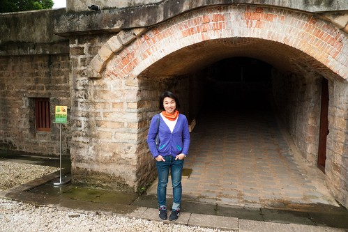 清閒裡 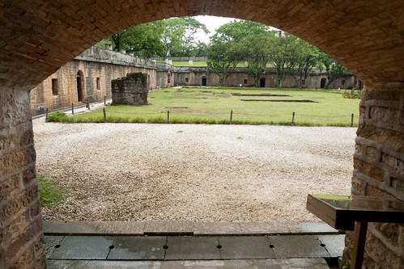 我們穿梭在古蹟裡 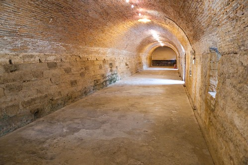 遙想曾經發生的故事 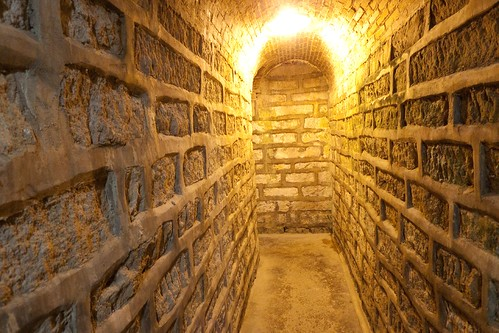 感受每個石頭與木材的呼吸 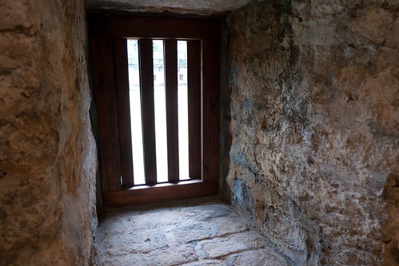 我真的比較喜歡以前的建物 讓人感覺踏實 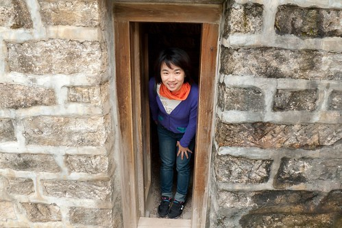 曾經的曾經... 隨著時間到現在的風淡雲清 這就是歷史 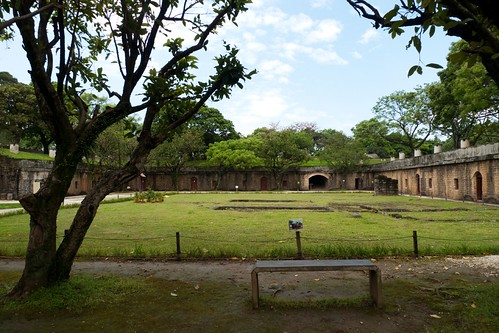 我說這裡真是個好地方 有機會一定要帶徹愛來走走! 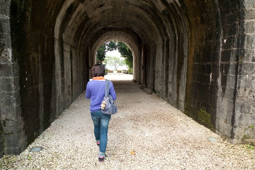 同時 雖然不是淡水最好的賞景處 但看到這樣的淡水河跟觀音山也夠讓我們心曠神怡了 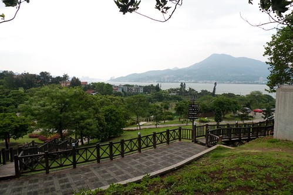 接著我們散步到園區旁的一滴水紀念館 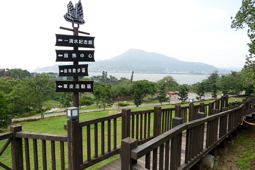 為紀念911地震以及台日兩國的友好交流 百年古厝從日本飄洋過海移建在台灣的淡水鎮上 (真不愛升格後 淡水區的正確說法 FU很不稱) 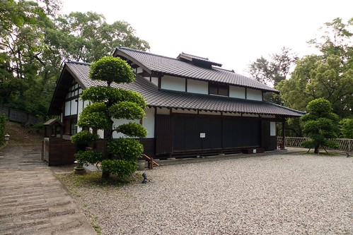 完全不用一根釘子的木房子 經過眾多有心人士的通力合作  完好又美麗的在此重生 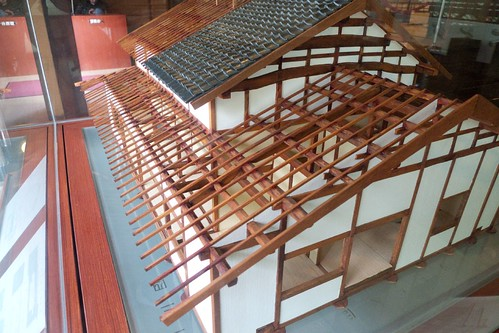 我們悄步其內 聽著房子告訴我們的故事 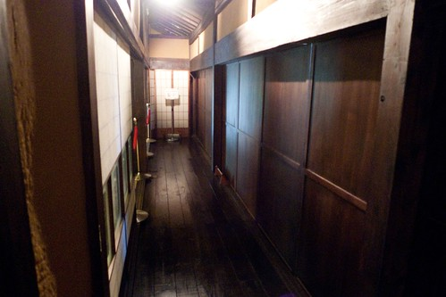 我最是喜愛凝聚大家子的這樣空間與一口爐 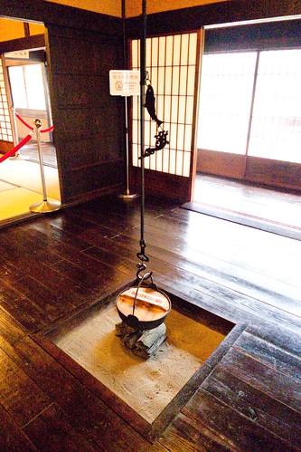 一滴水紀念館取名由來本館取名一滴水，一為紀念原起造者水上覺治之子水上勉先生一生承襲自日本「滴水」禪師的禪宗思想，崇尚珍惜萬物資源，就算只是微不足 道的一滴水，也當物盡其用；另一則是為感念移築過程中所有的苦力群志工，他們透過實質的行動傳遞了無私奉獻的思想，縱使小如一滴水，終能匯聚能量完成此一 跨國移築艱難工程，故取名為「一滴水紀念館」 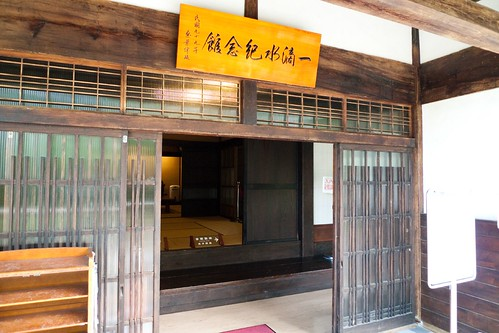 一滴水 真是很美很有意境的名字! 真高興我們又透過小旅行小散步 多認識了點台灣!! 走出紀念館 抬頭看見久違的藍天 我們忍不住說"真美的天空"  真美的故事與紀念! 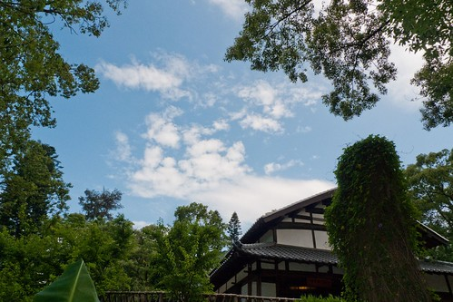 散步回停車場的路上 徹爸說這裡好像日本阿! 呵呵 是阿~ 這裡是個美麗的地方~~~ 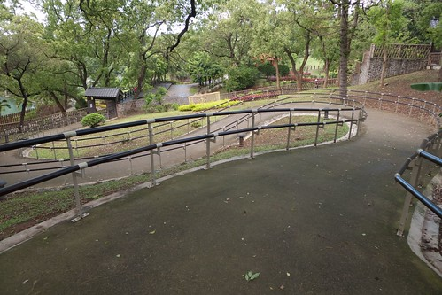
