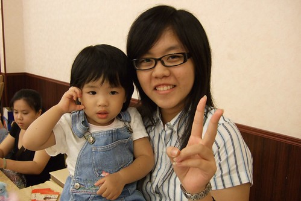

不知道是太懷念小愛的可愛恬靜嬰兒模樣  
還是太期待小愛與阿徹長大成人的日子  
怎覺得小愛這陣子"大很多"....  
當然不會是身高體重的大很多  身材依舊迷你但身高起碼有81CM了 連衣服的體重也有9.8kg了( 感恩 娘很不貪心的 )  
而是言行舉止 思考反應的"大"很多  反應在....  
晚餐時候不再是啥不巄東的低頭猛吃了  
不再傻不巄東的接受哥哥任何敷衍他的交換行為  
可以坐下來跟著哥哥看感興趣的卡通節目  
越來越煞有其事的跟著哥哥玩一樣的玩具 遊戲  
總知就是越來越能溝通 但也越來越難搞了 這就是"大很多"  
  

自從日本帶回娃娃的雨傘與揹巾後 小愛玩娃娃的時候越來越多了  
睡前(尤其是難眠的夜晚)會找娃娃一起睡 而且娃娃還得跟她一樣來個睡前奶  
忙著其他遊戲前先把娃娃安置好在書桌抽屜的小床裡(阿徹哥哥發明的)   
從媬母家接回家的路上跟她說"我們回家嚕 阿徹哥哥在等了" 她便喊著"娃娃 娃娃"  
想見娃娃的心大概甚於阿徹哥哥  
  
  
  
哥哥要做什麼事 妹妹一切也得比照辦理  
要不然3秒鐘抿嘴落淚 哭趴在地上  
真的很能哭 可以呼天搶地的哭很久  
但漸漸懂得沒人理後 要稍微停止觀望一下 如果發現大人在看她再好好繼續哭下去  
否則還是擦擦眼淚 假裝什麼事都沒發生過的繼續玩吧   
  
  
除了四肢纖細外 其實"胸坎"還蠻厚實的說  完全有遺傳到張家  
雖然越來越多人說 小愛長大後越來越像媽媽了  
但張阿嬤也越來越直呼"張家小孩就是長這樣 姑姑(張三姐)小時候就是這模樣"  
所以結論是 "這事沒有結論的"  大家開心就好  
  
  
  
下面犬齒也冒出頭後 牙應該算是暫時長到一個段落了  
每晚還是很堅持的自己拿著牙刷"巄一巄"  
然後有樣學樣的拿著漱口杯漱口(只是水都喝下肚了 將剩下的水帥氣的倒掉才是"丕"的重點)  
  
  
  
超級愛玩也很有愛玩的命    
會拉著阿公阿嬤去找樂趣玩  
別人(認識很久但非爸爸媽媽的人 其實定義還是有點嚴苛啦)也可以用散步 玩梯把她騙上手了  
瞧 難得抱到她的佩姨多得意  
  
  
  
我真的相信小愛會喜歡以後上學的日子  
絕對可以滿足她射手座 愛玩愛冒險的特性的  
嘿嘿~~~  
  

