最近週四上完舞蹈課後  兄妹倆在家都會"尬"舞一下 每當哥哥說著/ 示範著她們今天又做了什麼困難度的動作後 愛愛便也會不甘示弱的show著她會的那幾個動作 雖然難度比不上哥哥 可是柔軟度有給她越來越好喔 而且越來越像那麼一回事了.... 

看著短腿短手的愛愛做這動作 覺得可愛到超好笑 

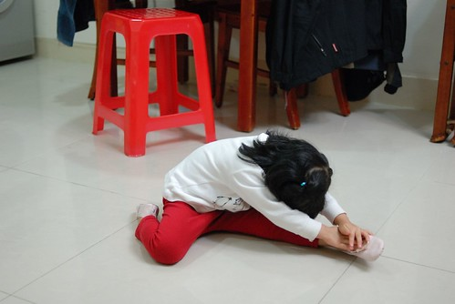

一切縮小版的小舞者 (愛的腳版很窄小 穿起舞鞋更顯秀氣)

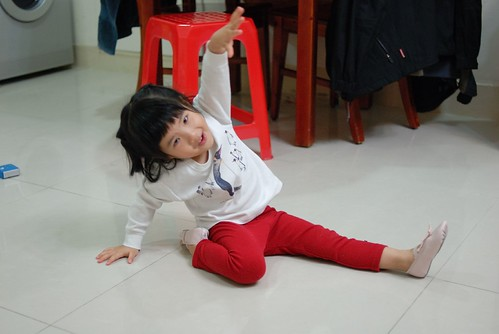

她會的幾個動作就認真的一直重複做著 反正就是輸"徹"不輸陣啦

很喜歡徹爸照的這系列"舞者"照片...讓媽媽忍不住又多幻想小愛舞者的模樣

除了尬舞 兄妹兩還會尬吃水果   為了怕吃輸對方拼命的一口接一口往嘴裡塞

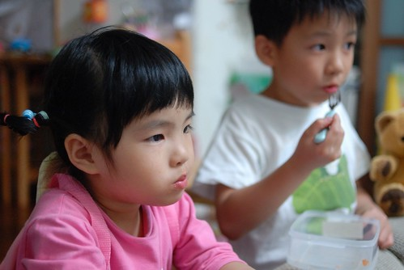

五月初阿徹哥哥去畢業旅行不在家的那一天晚上 小愛放學回到家後一個人呆了很久 提不起勁 坐在餐桌吃晚餐時 吃一吃突然望向那難得整齊空蕩蕩的遊戲區說 "今天好無聊 因為哥哥不在家" 講完後又悠悠的回過頭繼續吃她的晚餐 哈哈!!  平常吵歸吵其實很依賴阿徹哥哥的啦 哥哥不在家好像就不知道要玩什麼  要做什麼 (老實講阿徹的鬼點子/創意也真的比較多)

吃完飯後 好不容易提起一點勁玩醫生遊戲

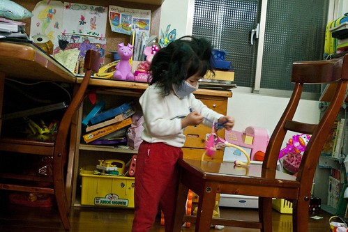

自己一個人孤單的準備傢司頭  有夠無神的兩眼... 加上那硬是要拔掉橡皮筋後的披頭散髮... 唉.....可憐.....好像失戀一般可憐..........

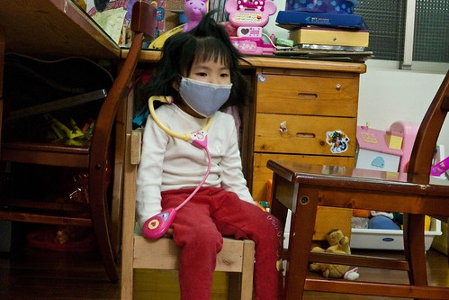

就算失戀 日子還是要過 活還是要幹!!! 打起精神打處方箴

人總要失去後才懂得珍貴 不過第二天哥哥回家後 兩人一樣繼續吵吵鬧鬧 哈哈!

認真的幫娃娃打針  還很殘忍的打比較痛的手臂 對了 小愛並沒有生病 純粹無聊的直嚷著她要戴口罩

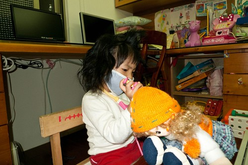

五月初第一次的去看舞台劇  戲碼刻意選了小愛應該很熟悉劇情的"七隻小羊與大野狼" 看完戲後 阿徹哥哥一如平常的愛問人家"你想要當什麼什麼 (你要當哪隻小羊)" 哥哥跟媽媽都選了很可愛或是很勇敢的某隻小羊

問小愛"你ㄋ?"  小愛酷酷的說"我要當大野狼" 哈哈!! 果然這小女子非泛泛之輩阿!!!

小孩真的不可以"褒" 前陣子才誇說吃飯都有乖乖 乾脆俐落的吃完 最近開始又一頓晚飯吃好久好久 這幾晚甚至可以從七點多吃到八點半  唉... 只有吃甜甜圈還有水果餅乾點心時好胃口 所以最近開始又被爸爸媽媽嚴格盯吃飯了 不吃飯啥都免想!!!

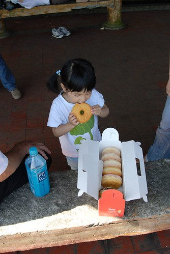

最近又更愛講話了 且還常一臉"自信"的講的頭頭是道 鏗鏘有力 不過聽在我們其他三人的耳裏 共同的感想是"愛越來越恰北北了"

最近很愛說"我是大姐姐了耶!" 晚上喝ㄋㄟ要用杯子 因為Eileen說她是大姐姐了 堅持自己拿東西 因為她是大姐姐了 有一次她自己脫褲子的時候又得意的說 "我是大姐姐了所以會自己穿褲子了" 結果媽媽無情的告訴她"你是小姐姐而已 因為你還不會自己脫衣服" 此後偶而可見愛自己奮力的用著小短手想要自己脫掉上衣  可是卻常大頭卡住而動彈不得 不過可見她好像真的很想當大姐姐哩…

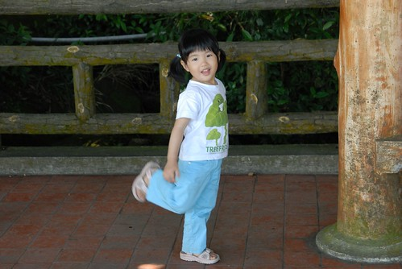

只是最近有點喜歡用"哭"來表達她的需求情緒 常啪的就又生氣又哭的說要幹麻幹麻 每次都會被我們數落"有什麼事用說的 哭人家怎麼知道你要做什麼.." 然後媽媽再補上一句"大姐姐才不會這麼愛哭勒" 希望多盯著點 愛的脾氣可以收斂一點 可別真的成了恰北北又愛哭的大姐姐 (脾氣拗起來時就是下圖這模樣)

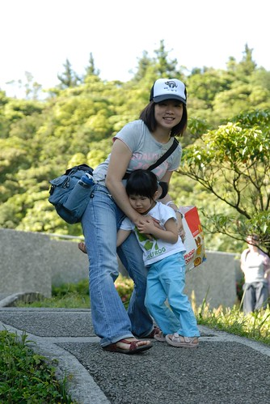

有時候翻看一兩年前的照片會覺得其實愛愛的外表實在沒什麼改變

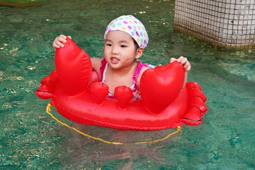

臉的成熟度 或是身高體重好像都變化的超緩慢 身高92 體重13 應該隨便一個兩歲娃都勝過她了

最近徹爸跟徹哥迷上"練車"  小愛的輔助輪車還無法跟著一起踏出門 所以徹爸想辦法搞了台親子車 搞了個後座讓一家四口可以一起單車出遊

問愛坐車好玩嗎 她說"好玩"

"會無聊嗎?" 她也說不會 實在很好奇坐在後頭的她到底都在做什麼 想什麼

也許對跟屁蟲愛來講 只要可以跟哥哥跟爸爸媽媽一起 爬山也好 騎車也好 就都好吧!! 每次這麼想就會想起美賢阿姨說的那句話"小愛以後一定是個不會隨波逐流的好孩子"  呵呵

萱萱姐姐很照顧小愛 在阿嬤家的時候常可聽到姐姐說"愛愛來.. 愛愛走..." 啥她已經不適合再用的包包鞋子衣服也都第一個想到愛愛

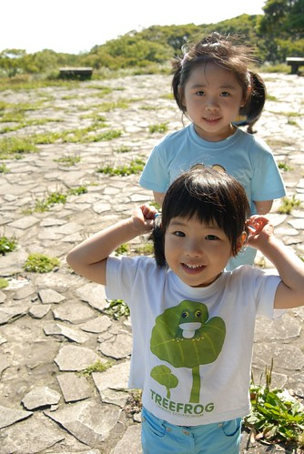

只是三個人在一起時 玩的超誇張 一整個白天不用睡不用休息 除了玩還是玩 然後往往到傍晚洗完澡休息看電視時 呈現下圖這樣的呆滯樣 我們常說"有必要玩的這麼累嗎?"  唉...

哈哈! 拉哩拉雜寫了一堆也清完一堆照片了 (這篇還真的沒啥主旨 哈拉來哈拉去的) 感謝收看!!
