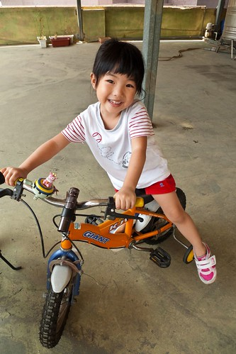
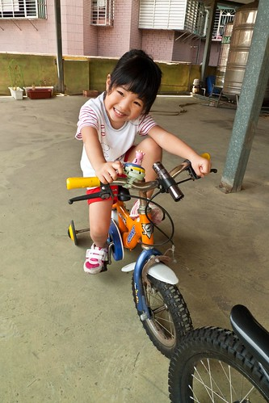
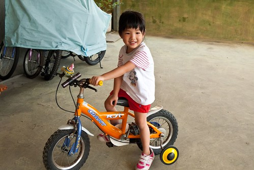
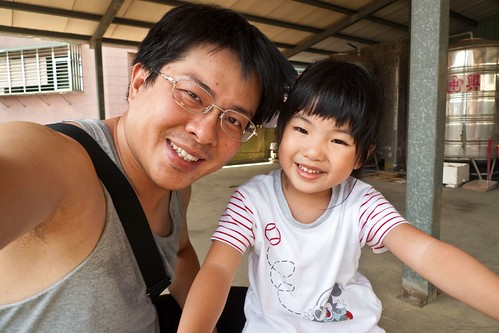
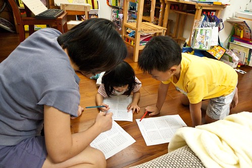

結束一年又9個月的寶寶熊幼幼班  小愛總算在今年八月升上小班當小姐姐嚕 (叔叔阿姨們不要再懷疑"阿不是唸很久了 怎麼才小班阿"  小愛真的只有小班阿... ) 在"玩具熊"小班一個多月以來 小愛這個小姐姐適應的很不錯 沒有因為換老師換教室而適應不良 也沒有因為跟"男朋友"阿嵂分開而鬱悶 反倒因著新環境 新人事務 而有不一樣的學習 成長與快樂

Jennifer 老師在園刊中介紹班級小朋友時這樣形容小愛 "愛愛, 小小的 上課很厲害的女生. 不管上什麼課, 愛愛都可以很專心的聽, 很認真的做, 很快的就完成喔 超級超級棒的! 還有,愛愛很喜歡和Jennifer 聊天, 也很會帶我們一起玩遊戲... 我想如果有一天愛愛請假沒來上課,那...那一天一定會很無聊的. 真的"

看來小愛這個大姐頭 現在在只有6個小朋友的玩具熊還真的"混的很不錯"說....  就像Jennifer 說的 愛愛是個"認真"又"勤奮"的好小孩阿 所以也常可以在老師的教學日誌中看到類似這樣的描述 : "....(其他同學名)有愛專心的聽完題意說明後, 能夠迅速的將各題正確的操作完成, 很厲害喔" "有愛...(其他同學名)對於數和量的概念很清楚, 能夠明確的數出要求的量來..." "有愛今天在三角椎堆疊部分只花了十分鐘就完成了12頁的操作 好厲害喔 拍拍手" 恩~ 小愛在所謂"課業"學習上的確比較不用我們擔心 老師費心阿 跟哥哥相較之下  小愛似乎比較有"潛力"以後繼承父母志唸理工科系ㄋ (徹爸說"幸好! ")

這幾週的寶寶手冊上  Jennifer陸續有下面的這些描述: "這二週來和愛愛的近距離相處下 終於發現愛愛其實非常善於言語的表達 教室內隨時充滿了愛愛的聲音 不論是單元討論 童謠律動 玩玩具...甚至連著色和畫線時 手上忙著 小嘴巴可也沒閒著呢! 哈哈! 真是讓 Jennifer大大的吃了一驚.."

"午睡起床後的摺被工作 愛愛以能迅速且確實的完成並等待... 這兩週來發現愛愛對於拼圖很有興趣喔! 9 片16片的小拼圖對他而言 早已不成問題了 多次建議他挑戰更高難度的25, 30片大拼圖 但是思考許久後 總是搖頭拒絕了我 看樣子 得再等他多建立點信心 才肯踏出那一歩囉"

"教室內的愛愛超級主動 超級熱情 超級多話的! 不論進行什麼活動 他都會大方的表現及表達出來 但是一跨出玩具熊的門口, 上KMI, 音樂課,體能課...這位小姑娘就又成為害羞 微笑不說話的人啦 看樣子 咱們家的愛愛"熱情可不是隨便散發的喲" 非玩具熊人還別想看到呢.."

最近有些老師或常在幼稚園碰到的媽媽跟我說"覺得愛愛變活潑了" 其實在我們看來 愛愛的"活潑度"方面其實並沒有多大改變 只不過就像Jennifer說的 愛愛只在"自己人"面前忠實的 毫不保留的展現出自己 在自己地盤上的愛愛真的就是這麼的有主見 有想法 小嘴巴嘰嘰喳喳個不停 而且也算是個蠻懂得控制自己行為 自己情緒  不太有太"爆衝"的行為出現 記得以前阿徹大約每半年就會來個"逢半必番期"  總會搞亂彼此個一兩週 而愛愛偶有出現的叛逆 只要"噹"他個幾次便能明顯感受到她的改進或收斂 也難怪我們常愛逗著她玩 看著她忍不住對她說"你怎麼這麼可愛阿.." 如果說相真由心生  我想越來越多人說小愛可愛大概是因有感受到那股"氣"吧(哈~ 媽媽講的太神了)

聽愛愛講話或跟她聊天是件很有趣的事 而且她講話還蠻有條理的 在某一週被處罰不准穿裙子的週四晚上 我跟他說如果在哥哥洗澡前吃完飯那明天讓他穿裙子上學 吃飯拖很久的小愛也總算"使命"的在時間內把飯給吃完了 隔天早上她在嗯大便時跟我說"我昨天在哥哥洗澡前把飯飯吃完了 你是不是說如果哥哥洗澡前我把飯飯吃完 我今天就可以穿裙子 那我今天可以穿裙子嗎?" 聽完她這樣有著前因後果的描述 媽媽我也只能嗯 ㄟ阿...說可以阿

愛愛這三週的週四都會跟著徹爸一起送哥哥到小學 然後再從小學走到幼稚園 因為路程實在很不順路 加上整個走下來需要花費大約30-40分鐘 因此我們每次總忍不住勸她"不要去啦 這樣要走好遠的路 好累哩" 每次愛愛聽到我們這麼說總會悶悶的嘟起她的小嘴 於是我們只好讓她每週來個這麼一回 幾次問她對於這事的看法 有一回她說"走路是很好的運動 我很喜歡運動..."(所以我們不該阻擋她運動啦) 有一次我問她為什麼這麼累還是要送哥哥去上學 她說"因為我愛哥哥阿"

如果你就此以為愛愛是個百分百的天使 那你就錯了 小孩絕對是天使與魔鬼的綜合體 我想每個小孩絕對都有她的魔鬼面 只是比例的問題 就像愛愛很愛面子 以前很不能容忍你說她哪不乖哪不好 如果硬是要他面對錯誤 她會啪的就大哭給你看  一整個的很ㄍ一ㄥ 不過現在愛愛比較可以接受面對錯誤這事 隨然犯錯的當下 可能在你才剛開口要數落她時她就先下手為強的哭給你看 不過哭的時間縮短很多(可能也是哭面子的) 也可以比較容易的收拾情緒 道歉並且接受處罰 只是常常還是很愛嘟著小嘴在那"ㄣˊ來ㄣˊ的"   我們都說她"又在騎歐兜麥了" 有一回她竟然還寡廉鮮恥的說他在開車車 哇勒...看來愛愛的臉皮還是薄一點的好!!!

(趴著玩數字遊戲的愛愛模樣很可愛) 
