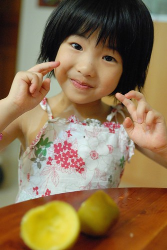

很久沒有這樣想念一個人了...只因為愛愛的一句"想要試試看跟阿嬤一起住" 加上表情那樣的期待 那樣的躍躍欲試我們第一次跟愛愛分開這麼久的時間...雖然相信愛愛可以照顧好自己 可以給...

前陣子我才跟徹爸在鬥嘴 "自由 堅強與脆弱之間" 想不到過沒多久自己便因為為了成全愛愛的獨立而脆弱中 (徹爸以後我再也不會鬧你了) 這就是所謂的"羈絆"吧! (火影忍者裡 就是因為羈絆所以才有這麼多的故事發生...) 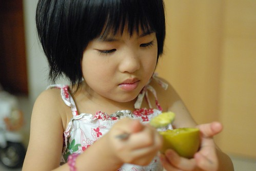 這幾個月裡 每次回嘉義要北上時 愛愛都會跟我嘀咕著"好想跟阿嬤住嘉義" 她也說明不是永遠住這裡 只是住一個星期那樣的住 問她怎麼會有這樣的想法 她總說"我喜歡阿嬤 我想跟阿嬤住看看" 那個試看看的語氣 就像她答應我願意去別的班級試試看不同的老師一樣 雖然我們真的很訝異為什麼她會有這樣想試看看的心情 因為畢竟從小從沒跟我們分開過一晚 但看她每次在嘉義跟阿嬤的互動 會讓我想成全她的這份心意 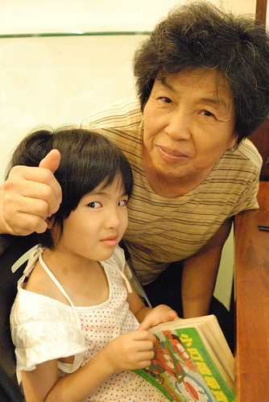 當我第一次口頭答應愛愛時 徹爸不可置信的問我"你真的願意 真的捨得阿" (其實徹爸超級捨不得) 呵呵! 不捨得還是得接受孩子長大 有自己想法的事實阿 而且就因為一直以來我們一家四口每天都黏TT也都以這樣的黏TT而深感幸福 讓我更是想成全愛愛想跟阿嬤一起生活的那份心意 (當然前提是只有一週)

不過答應歸答應 我們也一直在等適當的時機 直到這一週剛好阿嬤要從新竹阿伯家回嘉義 而愛愛也剛好快結束中班課程 只是我們本來仔細算好天數 盤算著 "ㄠ阿嬤週末上來台北住 然後週一早上帶愛愛回去 然後我們週六回嘉義就可以見面"的計劃 卻因為阿公週六一定得回嘉義  只好提前兩天讓愛愛跟著回嘉義了 跟阿嬤約定好的當下 我跟徹爸心裡應該都在喊苦  OS著"得跟愛愛再多分開個兩天了" 不過確定的當下 愛愛倒是很開心 且開始期待 倒數著日子的到來 出發的前一晚  愛愛如大事件的般整理她的行李 與我確認所需要物品與注意事項 雖然愛愛偶而開心說著"我好期待.. 明天是我最喜歡的一天..." 但有時後又看起來安靜的不像平常 然後比平常高頻率地抱在我或徹爸的身上 我們猜想愛愛期待歸期待 心裡一定也是很捨不得我們的... 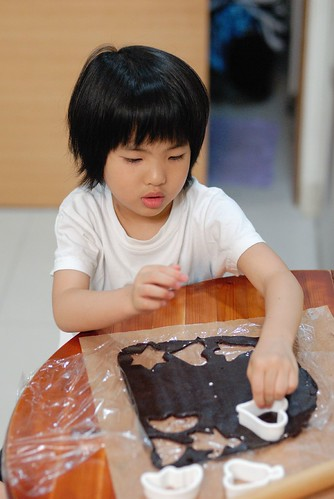 原本答應週五晚上要跟愛愛一起做餅乾好讓她帶去嘉義的 可是因為事情忙 只好等愛愛睡著後再自己做她最喜歡的奶油餅乾跟杏仁瓦片 那天有點累卻不管怎樣也想做出餅乾 讓喜歡點心的愛愛可以在嘉義時 飯後開心地來片點心 那一晚突然很慶幸自己這陣子有認真的學著手作 才可以讓愛愛每天還能嚐到媽媽的味道 做餅乾時的小複雜心情 就好像隔天要嫁女兒一樣 哈! 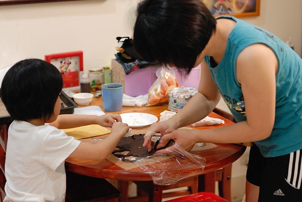 而離別前的幾天裡 我跟愛愛每天睡前的親吻從2下變3下 因為我們說要把下週的份量先親起來(愛愛還都親的特大力) 而跟阿徹哥哥原本平日不能同床共睡的規定也為此破戒 讓兄妹倆一起同床睡了好多天 只是分離前的週五晚上 兄妹倆不知道是不是彼此都有點敏感 多愁善感 原本同床的兩人聊到吵架 大哭 只好各自在自己的床上帶著淚痕 難過的睡去 隔天早上仔細問清楚中間來龍去脈時 阿徹說"因為妹妹說不喜歡他 不要跟他做朋友" (週五晚上我們只知道阿徹因為這原因大哭) 我說 哥哥一定有先說什麼事吧 要不然妹妹怎麼會說這種話 阿徹說"哪有" 聽到這愛愛頓時紅著眼眶說"是哥哥說晚上要跟你去哪裡 那裡..." 然後又難過的一發不可收拾 原來如此! 果然如我跟徹爸猜想的 週五晚上的愛愛也是有離別前的悵然的 只是我們更是好奇 為什麼愛愛都沒有打退堂鼓 都沒有說那她不要去了 哈! 我們的心裡真是這樣期待的 不過我們也有共識如果她真說不要了 我們反而會要她負責所做的決定 不能隨便辜負阿嬤 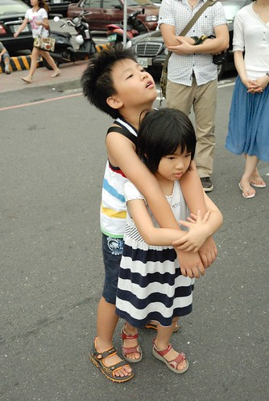 堅強的愛愛 加上表面堅強的父母於是促成了這段短暫的分離 可是送完愛愛的那個下午 我們三個人就開始覺得若有所失阿 車子裡少了愛愛那清爽明亮的聲音好安靜 阿徹哥哥說"聽點熱鬧的音樂吧!" 可是音樂結束 一切又都安靜了下來... 在家裡 阿徹玩玩具沒興趣 看書沒興緻 一個人玩wii沒有又叫又跳 跟著我們一起賴在沙發上 呆在沙發上 想著"愛愛在做什麼 沒有愛愛好安靜 好無聊..." 少了愛愛的跟前跟後 愛愛的高分貝說話聲與笑聲 才發現原來我們三個早已經中愛愛毒 中的這麼深阿! 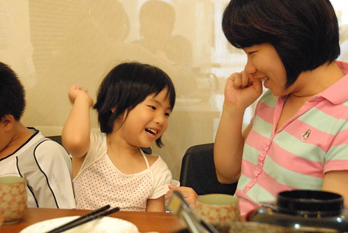 周六晚上因為我去喝喜酒 週日早上因為我剛好去買菜 我都沒有跟愛愛講到電話 徹爸還說愛愛都沒有說要找媽媽 可是週日下午4點多當我的手機響起 我還納悶著這時間誰會call我時 想不到竟然是愛愛打來了  平常她念阿念的媽媽手機號碼 總算有一天真的用上了 (阿嬤說愛愛跟他報備後就自己去打了) 聽到電話那頭的她喊著"媽咪" 我雖然開心但卻同時也難過的想掉淚了 愛愛問"你有沒有做餅乾阿" 我說"只有你最喜歡吃我做的餅乾 你不在家當然就沒做了" 愛愛喔了一聲 然後我們亂聊一通 那一刻感覺到愛愛很想我... 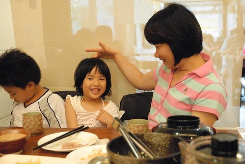 結果在晚上7點 我們在外面吃飯時 我的手機又響起了 而且聽到的是哭到不能說話的愛愛  那一刻我跟徹爸的心一整個的揪在一起了 後來阿嬤說 原來傍晚時愛愛說想睡一下 然後阿嬤趁他睡覺時去廚房忙 等到他聽到小孩子聲音去房間看時 看到愛愛趴在床上 阿嬤上前問怎麼了 愛愛突然地就大哭起來 哭的一發不可制止 哭的阿嬤大概也慌了 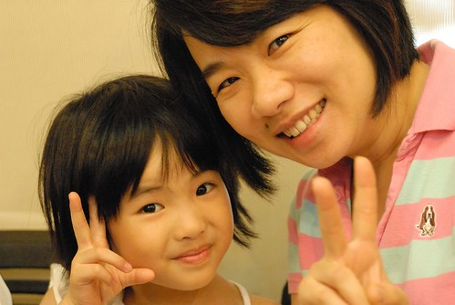 我們挺訝異愛愛這麼快就崩盤 是不是她也跟我們一樣 分離後才知道分離的滋味是這麼的苦阿! 不過我跟徹爸決定 電話中我們要更果決 堅強 狠心點 讓愛愛可以堅強地 順力地達成她的心願 ! 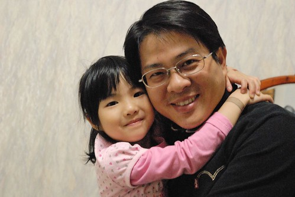 徹爸這一兩年常說 他總算可以體會為什麼有的人生了一個女兒後就不想再生第二個小孩了 那種想要把全世界都給寶貝女兒的心情.... 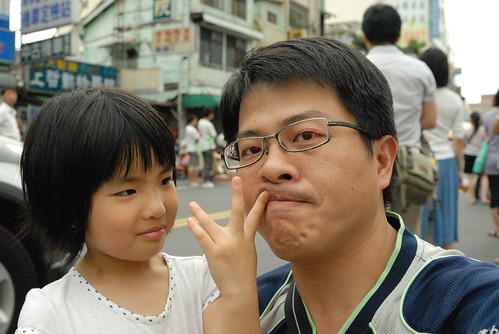 而如果有一天哪個男人欺負了他的女兒 真的得小心... 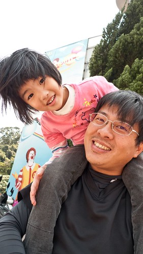 徹&愛 缺一不可! 爸爸媽媽希望你們像風箏一樣飛的高 飛的自由 但我們之間的那條線不論怎樣也要緊緊抓牢 雖然黏TT 但我們知道總有一天你們會自己去飛翔 自由自在的飛翔 但別忘了 爸媽永遠在這個家想你們 等你們 從生下你們的那一刻起就開始 而且伴隨著你們越多的成長越是確定這樣的心意!!!!!! 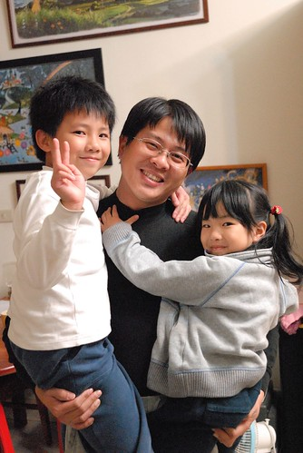
