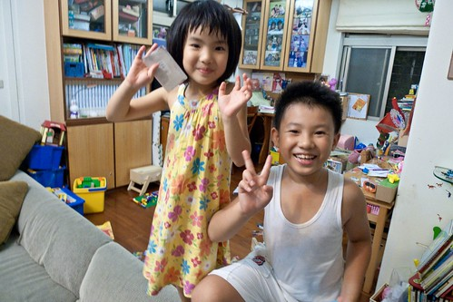

愛愛在日常生活中常會有驚人之語的出現 讓我們吃驚的常不在於她的言語有多好笑 而是驚艷於說出這些話的那個小腦袋瓜 我跟徹爸兩人私下常忍不住聊起愛愛然後相視而笑 真的! 雖然愛愛真的很愛講話 愛講到你有時候得請她安靜一下好讓我或她趕緊把事情做好 但跟她聊天 聽她說話真的是一件很有趣 甚至讓人感覺幸福的一件事 難怪每天早上徹爸帶阿徹出門後 剩下的我們兩個女生在家摸來摸去(這句愛愛說的) 還越摸越久 因為愛愛總在我身邊跟前跟後 跟我聊著我正準備的晚餐食材 或正抹著的保養品或衣櫃裡的衣服 點點點 以致每天早上 我總是在那喊著"快一點" "快一點" 可這小女子還常一臉可愛的問我"為什麼你每天早上都要說好多次的快一點阿" (兇手就是你阿....) 昨天在車上 當徹爸跟阿徹又辯論起兩個人誰比較呆時 突然聽到愛愛淡淡說了句"你說他呆 他說你呆 你們都是呆 ㄏㄏ" 語畢我跟徹爸爆笑 而徹爸也因此下了個決定(結論): 爸爸是大呆 阿徹是小呆 以後就這麼稱呼吧 於是我們家就這樣有了大呆跟小呆 再加上個自願的小小呆~  

趁著想紀錄一下最近的愛愛 順道清一下去年下半年度的照片(貼了好多個月嚕)以及寶寶手冊上的一些紀錄 --------------------------------------------------------------------------------------------------------------------------------------- 愛愛的唸了好久的幼稚園總算只剩下最後一個學期了 沒有將離別的惆悵 也沒有對於未來的恐懼  愛愛只有滿心期待於她也將要是小學生了 從上大班後她就常問我"我什麼時候可以上小學阿" "還要多久才可以上小學阿" 我說"等你大班畢業阿"  愛繼續問"那是什麼時候阿" 我說"(明年)夏天 快九月的時候" 愛就說"還要那麼久喔 我好想趕快上小學喔" 聽不下去的阿徹皺著眉 搖著頭跟妹妹說"上小學每天功課都很多喔" 愛愛一臉自信的說"我喜歡寫功課"  有時候再補上句"我絕得我上小學後一定比哥哥認真" 前陣子有一天愛愛也突然地問我"你覺得我上小學後 考試會不會考的比哥哥好" 我ㄣㄟ了一下後說"國語應該會吧 因為哥哥的錯字真的太多了 至於數學就不一定了 因為考試這種除了認真外 有時候是需要點運氣的" 不過可見愛愛真的很期待上小學後可以把她哥哥給PK掉吧  愛愛很小的時候 一個常在便當店遇到的阿姨给愛愛取了一個綽號為含羞草 因為每當有熱情的阿姨叔叔打招呼時 愛愛總是害羞的躲到媽媽的背後去 低著頭不敢吭聲 但是現在的愛愛已經可以落落大方的回應每位跟他打招呼的人 甚至有時候還會主動出擊 一些媽媽常掛在嘴邊講的阿姨 愛愛也如數家珍甚至可以很快的跟阿姨熟稔 六歲的生日時 愛愛收到玟姿阿姨寄來的明信片好高興 愛愛說"我好喜歡阿姨 因為阿姨是第一個寫信給我的人"  原來愛愛的心是這麼容易收買的ㄚ  Candy老師說"Candy在交代事情時 發現愛愛很認真的聆聽 深怕漏掉 真的是一位負責任的小女生呢" 認真的另一種表現方式就是超級ㄍㄧㄥ 臉皮又薄的一個小女生阿 做錯事的時候很不能讓人家講  人家一講 愛斗大的眼淚就像瓊瑤女主角那樣的瞬間垂落 要她不要哭 跟她解釋只是在教她不是在罵她 她哭的更厲害 還說"你不要再說了 你一直說我就一直想哭 停不下來" 所以這一兩年 我們一直在訓練愛愛要勇敢 坦然面對且接受自己的錯誤 甚至只是沒什麼的不好的地方 這點可以說是愛愛最大的弱點與我們唯一希望她改變的地方 而一切就從學會深呼吸開始  想不哭時努力的深呼吸~  Candy老師說"平常媽咪對愛愛教育的事 加上生活經驗 愛總是會適時的發揮她的功效呢 真的很棒 不過有時在大家面前太容入自己的私事喲" 徹爸說"會不會愛愛也跟大家說 爸爸很喜歡打我屁股喔"  幸好愛愛說"這個沒有說啦" 不過我真的很常在週末前接小孩時聽到老師問我說"妳們這個週末是不是要回嘉義 要去哪"之類的問題 我總訝異的問"你怎麼知道"  想想自己還真是多此一問  除了愛愛還有誰.... 不過我們想應該也是老師很愛跟愛愛聊天 所以愛愛才聊這麼大吧  愛愛的WII 玩的比媽媽好很多  目前顯現的運動神經也比媽媽好很多 很高興愛愛是個喜歡動的女孩!  前幾週在幼稚園等小孩時 跟candy老師聊著愛愛 老師說"愛愛是個動靜皆宜的女生 真希望以後女兒也能教的像愛愛這樣" 雖然我客氣的回應老師"沒這麼誇張吧" 不過其實我的心裡開心的很  愛愛對於公主一直有著很深的想望 連帶的也很期待自己長大到可以穿高跟鞋 穿美麗裙子的那一天 愛愛常會跟我說 "你的那個裙子/ 鞋子可不可以留給我以後穿"  我總笑著答應她 愛愛甚至還會跟我討論著 穿高跟鞋好不好 高跟鞋跟裙子該不該每天穿 我會就健康理論 價值理論認真的跟她說明 雖然愛愛還是一直覺得穿著裙子穿著高跟鞋好像公主般美麗 但愛愛很滿意於她現在固定只有週一跟周五可以穿裙子  且真覺得布鞋很好走 褲子很方便  上週有天早上 我們兩個女生又在家裡摸時 愛愛跟我說"你好久沒穿裙子了 可不可以禮拜一或是禮拜五我穿裙子的時候我們一起穿裙子" 我問"你這麼希望我穿裙子阿" 愛愛說"我覺得你穿裙子好漂亮喔" ㄏㄏ.. 如果我真的希望養出一個動靜皆宜的女生 我想我真得偶而一兩天跟著女兒一起漂亮的 媽媽的外在表現不也是一個很重要的身教  我想應該是吧!  愛愛每週一次的舞蹈課到現在已經持續三年多了 愛愛ㄍㄧㄥ的個性 在舞蹈課裡表現無疑 也難怪乎舞蹈老師總是特別喜歡她 對她讚譽有加  如果真非得學個音樂舞蹈的話 我想我真比較喜歡愛愛是個飛揚的小舞者  而如果可以 真希望愛愛可以一直跳下去 不需要是專門的舞蹈者 只要是個喜歡跳的女生就好  愛愛的個性比阿徹哥哥獨立也勇敢許多 所以常可聽到阿徹哥哥問著妹妹說"你今天要不要跟我ㄧ起睡覺" "你跟我ㄧ起睡嘛~" 前陣子兄妹倆竟然還為此發明了睡覺卡 阿徹哥哥讓妹妹公主開心滿意時 妹妹公主便會發睡覺卡給阿徹哥哥 只要阿徹哥哥亮出這張睡覺卡 妹妹公主便得乖乖陪睡 直到有一天 徹爸忍不住提出疑問"這睡覺卡也不是這樣亂發 也該經過爸爸媽媽同意才能發吧" 妹妹公主才發的節制點 不過妹妹公主的獨立 有時候會表現的近乎翻臉如翻書 有一天妹妹公主不願意再墮落於這種跟哥哥同睡的日子 她說"我覺得我已經習慣跟哥哥一起睡了 我不想要這樣子 所以我不要跟哥哥一起睡了" 聽的我跟徹爸拍手叫好 果真是有自己想法的妹妹公主 不過一旁的阿徹哥哥早就又難過的快掉淚了 我想這兄妹倆的睡覺大戰應該還會斷斷續續再戰個一兩年吧 因為妹妹公主獨立歸獨立 卻真的很好哄開心 而偏偏阿徹哥哥又真的很會哄妹妹公主開心  我們家有調皮的哥哥  有動靜皆宜的妹妹   難怪乎這麼熱鬧也這麼幸福阿~ 
