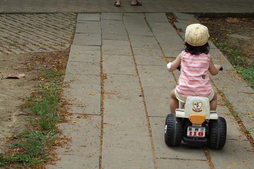

之前小愛都是用她的小短腿嚕著輪胎讓車走的  
有一天自己卻突然大膽的踏起油門前進(之前教過都像有聽沒有懂)  
而且似乎愛上了這種輕輕一踏車子就前進了的速度感  
常常沒事就自各去牽車 蹓車  
很快的小愛也學會操縱把手 轉彎 避開路障  
目前則在努力學習如何切換前進後退鍵  
真的覺得小愛挺大膽的 學習新事物的速度也挺快的   
真可封他為愛徹家的張大膽  
也許以後她會是家中唯一一個敢坐雲霄飛車的人吧  
  
[http://myvlog.im.tv/?id=1895380&mid=322793&album=0](http://myvlog.im.tv/?id=1895380&mid=322793&album=0)

端午假期在嘉義也讓阿公阿嬤見識到小姑娘的新本事  
阿公竟然也很"新師好棒賽"的扛著家中車齡10多年的老摩托車到嘉義公園  
讓寶貝孫女可以在"寬廣"的公園裡暢行無阻  
后~吸引無數路人目光  
雖然大夥都說 "看 那個女生好小好可愛"  
但我想應該也有不少人心裡暗自竊笑"看~寵小孩寵成這樣"  
  
  
  
兜係蔗哩阿公...  
兜係蔗哩任性的阿公  
  
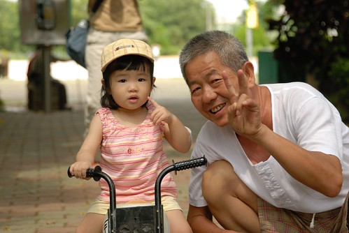  
  
小愛很認真的在公園裡忍受道路顛波 上坡下坡的  
而媽媽也得很認命的在一旁擔心 推車 扛車  
但是不想落後在前頭的阿徹跟爸爸太多時  只好耍賤招的跟阿公說"阿公 你扛車來的你要顧"  
然後自由投奔到徹爸跟阿徹那  
縱使媽媽如此無情 小姑娘還是認真的賣力的騎著她的車  
直到大老遠的看到爸爸跟哥哥開著四輪大汽車  
小姑娘咻的下了摩托車 頭也不回的往前衝  
原來人都是貪心的  大的還是讓人比較爽的  
  
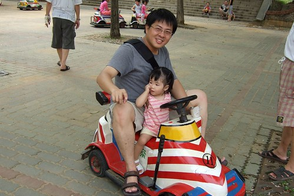  
  
雖然徹爸的忘情飛奔讓同車的小愛嚇的有點花容失色  
但張大膽真的不是叫假的  
騎了兩趟後小愛竟然哭鬧著不要離去 還要再坐  
只好在跟她約定"最後一次了"後  讓她再乘一次  
而被放點的哥哥不甘寂寞的騎著老爺小車追逐著我們  
  
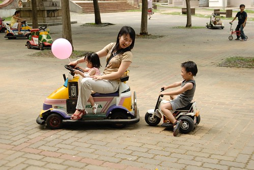  
  
在這種路上騎小車 應該會讓人的屁股顛的有點小痛吧  
  
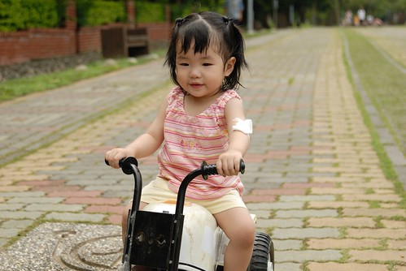  
  
越騎越上道 越老練的樣子  
  
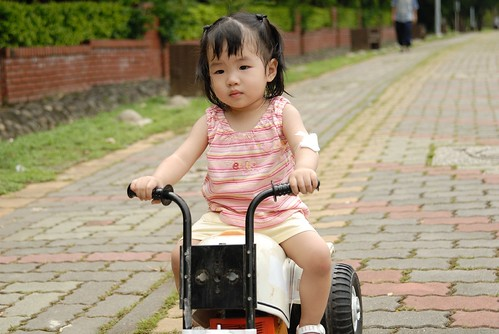  
  
阿公 下回可別再這麼 "呀ㄍㄟˊ"了  
  
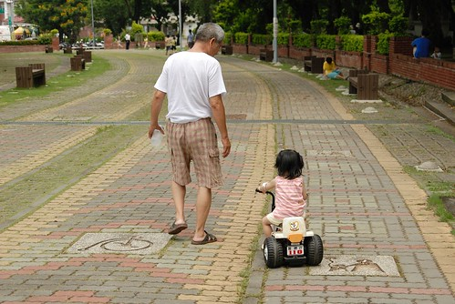  
  
阿徹大部分時間很認命的不會跟妹妹搶  
老實說他應該也明白載了他的老爺車實在走的很慢  
但阿徹哥哥有時很愛捉弄他妹妹  
  
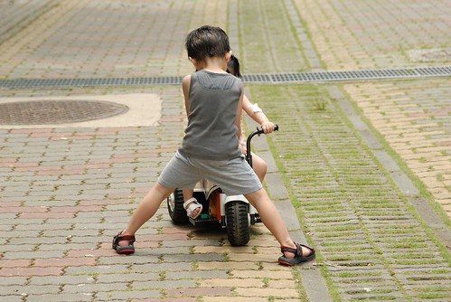  
  
姑娘對車的興趣好像還真的挺廣泛的  
不只蠻愛玩之前不太受哥哥青睞的小玩具汽車  
對能動的摩拓車 滑板車 腳踏車等興致更是高  
常常想到似的跑到家中陽台 到腳踏車上坐坐過乾癮  
這天爸爸帶著兄妹倆一起去公園 看到哥哥從家中騎著腳踏車出發  
小愛一路哭到公園(路程5-10分鐘) 直到看到溜滑梯  
後來也過乾癮乾騎車  
明年夏天小愛2歲多 也許這小腳踏車就可以過戶到小愛名下了  
換她用著短腿在那踏阿踏的了  
  
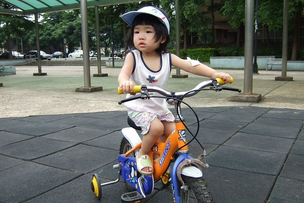  
  
小女生騎車的姿勢果然還挺秀氣的  
  
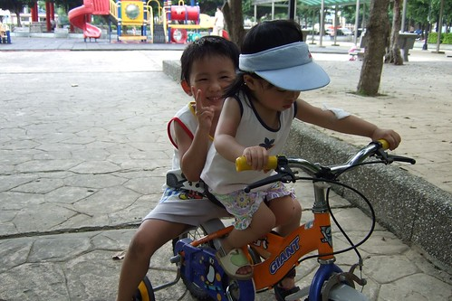  
  
假以時日 也許小愛真會成為一個飛車女  
(當日本賽車女郎也挺不錯啦)  
  
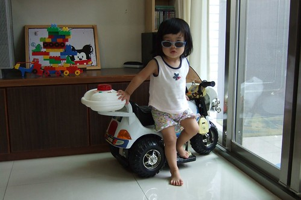
