我發現我真的比較少寫愛愛的事 可能就如我跟老師說的　阿徹哥哥調皮搗蛋所以很多事蹟可以寫 可是愛愛除了偶而愛生氣外　乖寶寶的個性實在讓人每次寫寶寶手冊時就很傷腦筋 總不能每次都寫　我們家的愛愛很乖　有乖乖寫作業　有做好該做的事之類的 不過相較於阿徹一點點慢慢釋放體內的能量　或許我們更該擔心愛愛日後有一天的突然火山爆發.. 從八月到現在愛愛上中班也已經有三個多月了 跟徹爸兩人每天每天望著愛愛感嘆著＂怎麼又長大啦　怎麼又不一樣啦＂ 真的 就如我之前看著阿徹的女同學上中班後的銳變　愛愛如我預期般的也正快速銳變著 徹爸常捏著愛愛的小鼻子或小臉頰說＂你越來越不可愛了＂ 是的　愛愛越來越不像baby那樣可愛了　但她卻越來越有自己的"味道"了...　 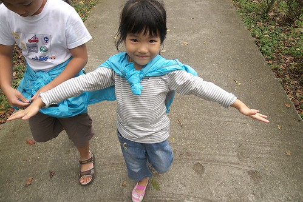　

這三個月來寶寶手冊上父母與導師的留言　就當作是愛愛這陣子的成長小紀錄吧～

升上中班後的愛愛的確感覺似乎又長大了… 心智有沒有變成熟目前還待觀察中 但自信 倔強 以及脾氣倒是增加很多 尤其自以為長大的自我感覺特良好 常讓人看的真是好氣又好笑 嗯完後學著自己擦屁股 "因為我已經長大啦" 每天回家後急著寫功課 "要不然Frefa會很兇 會罵人喔" 上學的衣服自己挑  澡要自己洗… 最近最常掛在嘴邊的一句話就是"我自己….我不是說我要自己…" 可唯獨吃飯這件事一點長進也沒有  情況時好時壞 胃口好時 乾淨俐落吃完後說自己好利害 胃口不好時 就像小貓一樣小嘴巴小胃口 一碗飯ㄊㄨˋ好久 神氣的模樣蕩然無存… 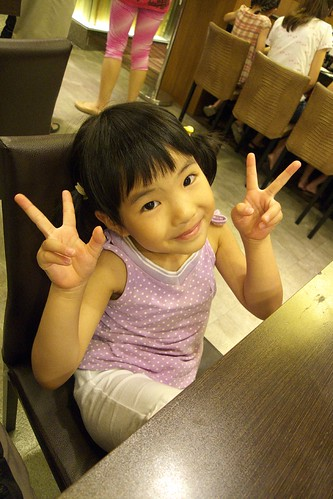

剛上咖啡熊的那兩週每天晚上在家裡暴衝 特High 原以為是學校亢奮情緒的延續 後從Freda口中得知原來是在校太ㄍ一ㄥ了 爸爸跟她說"你可不可以在學校正常點 在家裡也正常點" 且最近時時提醒她"要學著不要那麼愛生氣" 愛愛總算正常點 脾氣也收斂了點 希望一切真的可以朝正向前進中… 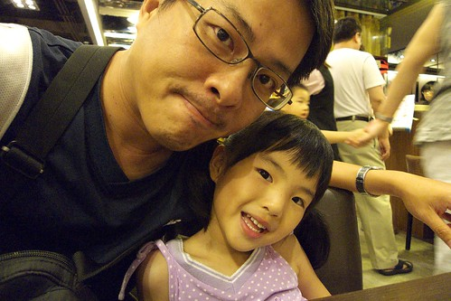

（導師Freda） 上英文課 中文課 甚至舞蹈課 Cherry都很認真 所以課本上的內容都可以很快理解 特別是舞蹈課 所有彩虹老師交代 叮嚀的小細節 例如停頓一下 腳尖尖等 Cherry都做的確實 即使手腳都已經在'皮皮剉'了 也可以看得出來她在忍耐 真的很棒~ 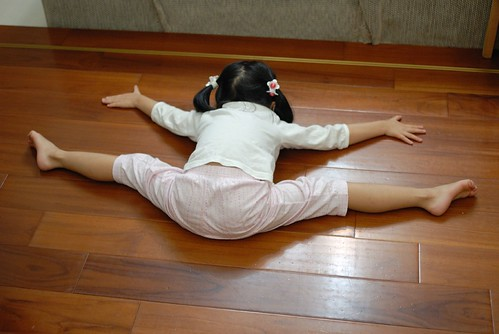

哈哈! 我們家愛愛的確是很愛面子 徹爸常說跟她媽媽一個樣 愛逞強 愛ㄍ一ㄥ… 不過她也蠻懂得見風轉舵 有台階下時趕緊讓自己下來 不會過度免強自己的… 相較於阿徹哥哥 愛愛的學習狀況真是自動也"認份"許多 不讓人太擔心 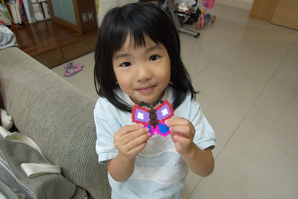

只是她的情緒管理最近被我們盯的緊 或許是進入中班後新環境 新的人事務 加上更多元活潑的教學 愛愛腦袋越顯靈活長進 講話也是越來越有條理 但有時卻"機伶"的過頭 或是太自以為是的"耍小聰明" 鬧小脾氣 因此常常被我們"噹"~~ 那天當著她的面請Freda多多注意她的"愛生氣"狀況後 姑娘回家的路上就一臉誠懇自信的跟我說"我從今天開始要不愛生氣了.." 我問她"Freda說你在學校都很乖 不會生氣阿" 愛愛說"對阿 因為乖乖會有好寶寶章" ㄟ…原來她不單只是愛面子也是"利益"導向阿 我跟她說 "真的阿 那以後生氣的話 我就寫在聯絡簿上告訴Freda 請她扣你的好寶寶" 愛愛臉愣了一下後對我傻笑… 呵呵~ 以後就麻煩Freda配合了~ 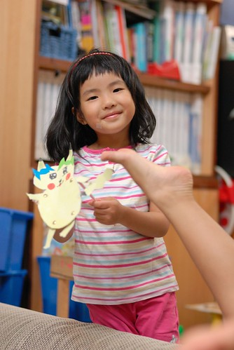

每個初認識愛愛的人都會說 愛愛真是個害羞文靜的女生 而若有機會再多認識些的話就絕對會驚嚇於她的大嗓門小精明 更別說是愛愛熟悉的人事物環境中了 很容易就顯見她那完全不同於外表的個性及表現 或許往好的方面想 愛愛應該真的習慣咖啡熊 身為咖啡熊一份子了 所以才敢如此在Freda面前裝大 代你"管教"那些需要照顧的小朋友!!! 我想咖啡熊的老師同學們會越來越辛苦 得去習慣這樣的管家婆… 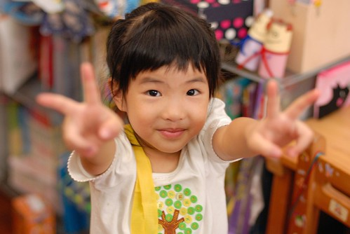

(Freda: ) 這一次的KMI Cherry操作的是穿線 Cherry雖進線的位置上下顛倒了 重新再穿一次 Cherry可是無怨言的默默地再來一次

我可以想像愛愛默默重來一次的模樣 她的心中一定沒有抱怨 沒有為什麼 因為錯了就是得重來… 在學習表現上覺得愛愛還挺逞強的 跟徹爸兩人常忍不住懷疑 女生都是這樣嗎? 自我要求比較高卻也比較認份嗎? 咖啡熊至今兩個月了 回家後還是會常拿出英文書本出來唸阿唸 或是興致高昂的唱著我們聽不懂的英文歌謠 星期五晚上若是有活動不能如平常一樣的回家後馬上寫功課 她也總心心念念著她的回家功課 問著"那我的功課怎麼辦" 然後自己想出一個可以寫功課的時間 而寫功課的時候總念著"Freda說要塗漂亮 要colorful…" 不過我跟徹爸最近最感欣慰的是 愛愛升上中班後的"生氣病"這一兩週改善很多 在家總是個笑咪咪的High咖 爸爸說果然打了五下屁股後 小惡魔都跑走了 希望這回小惡魔可以跑遠一點 甚至就迷路不要再回來找我們家愛愛了… 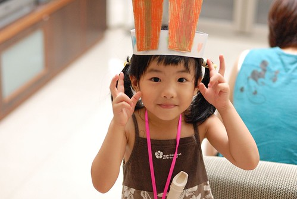

(Freda: ) Freda覺得Cherry是一位自我約束力很強的孩子 根據觀察 雖說上kmi前老師都會提醒要保持安靜 但孩子仍會忍不住地發表一下自己的想法 可Cherry都是默默地操作自己的教具 完成舉手 如此循環直到完成 不知若是把Kiwi換到和她同一桌 Cherry是否仍可如此ㄋ?( Freda心理的壞想法 哈哈) 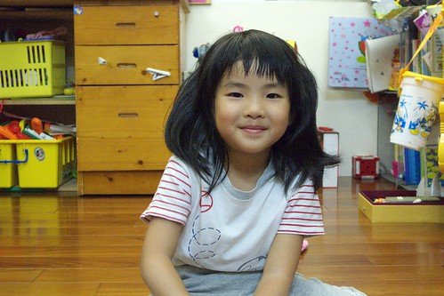

有關用左手吃飯這事 我們一直有注意到 只是愛愛自己似乎並不自覺 有時候用左手有時候用右手 並未固定都是用左手拿湯匙吃飯 應該是看心情的吧! 呵呵!! 我們是抱著順其自然的態度(雖然心裡其實很期待她是左撇子) 只是愛愛左手使用的頻率似乎還是有隨著年紀的增加而減少了… 哈! 派Kiwi坐愛愛旁邊測試她的約束力 只能說這招會有狠阿! 連我都很好奇結果會怎麼樣了 不過我對我們家愛愛有信心啦!! 經過這兩個多月在咖啡熊的日子 愛愛已漸漸從一開始的太過雀躍慢慢適應習慣then正常了 就像在家裡提到Kiwi的次數明顯減少很多嚕 問她在學校常跟哪些人玩 也能講出好幾個被她稱為好朋友的人名 只是阿..前幾天跟姑姑一起出去玩時 姑姑問她學校生活的事 愛愛自己主動提及她有三個好朋友 都是男生 尤其其中一個名字有顏色的 聽的姑姑都忍不住露出八卦的笑意! 身為媽媽的我只能說感情的事就順其自然吧! 哈哈!! 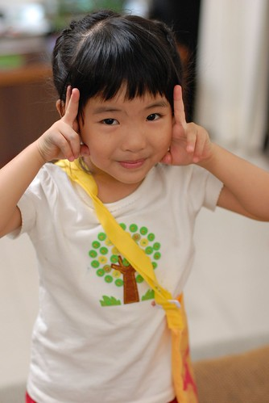

今天陪愛愛躺在床上休息時 愛愛說"我們來聊天吧" 我問聊什麼 愛愛想了想笑了笑說"我說我學校的事給你聽" 然後又講了她常問我的問題"你知道我們每天上幾次英文 是一天兩次還是有時候兩次" 我回答出了她的正確答案 她還笑說我怎麼知道 ㄟ..娘不是當假的 她說"我們班的Kimi很厲害喔 他英文講的很好喔" 我說 "是喔 他這麼利害 這麼會說英文阿" 愛愛說 "是阿 因為他回家都有練習" 我就說啦 "你很久沒在家複習英文啦..要多複習啦" 愛愛一臉自信的說"不用啦…我都已經會了阿!!"  最好你真的有你說的那麼利害啦! 不過愛愛真的很常在家稱讚班上唯一的小蜜蜂男生 說他哪棒 哪好 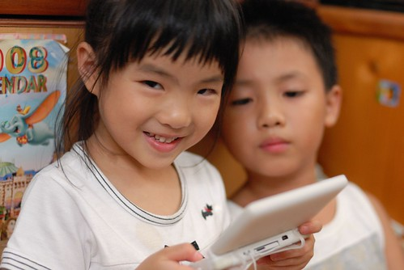

星期五那天愛愛看完醫生回家洗完澡後 便被我們督促早點上床睡覺休息 愛愛點頭說好 可是問著"可是我的功課還沒寫 還沒檢查 怎麼辦" 我說"放假還有兩天不急 今天先休息" 愛愛 喔的答應了 可是小臉還是一臉掛心樣 隔天早上早起的她及哥哥慣例在我們起床前於遊戲區忙自己的 結果等我起床?房門時就看到愛愛拿著她的書本跟我說"我寫好我的功課了" 嗯! 這小妮子還真是超級好學生阿  只是現在也才中班 會不會太早了阿!!! 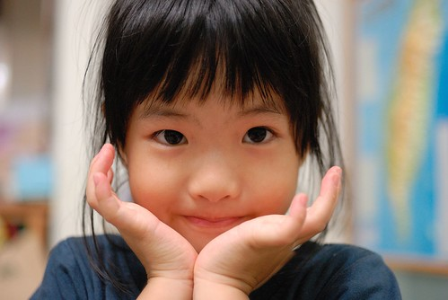

(Freda) 上英文課時 若是要她念的句子 她會 有把握的 她可以大聲的唸 若是沒有十足的信心 那大概只有左右的同學能聽到她的聲音 落差很大 實在不符合她給Freda大嗓門的印象阿 每一次玩玩具時 全班都可以清楚的聽見Cherry以清楚的指令 要其他人配合她的規則一起玩 聲音大到連Freda都知道怎麼玩了 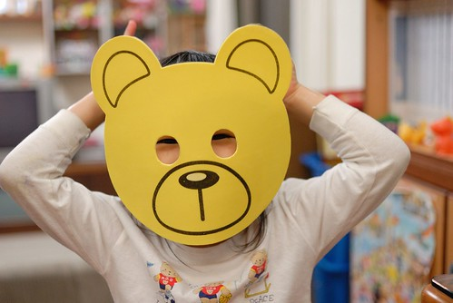

我可以想像愛愛信心十足大聲的樣子 也可以明瞭她沒有信心 唯唯諾諾的模樣 我想膽小謹慎也是愛愛"ㄍㄧㄥ"的一種表現吧 只希望沒有信心的時候不是太常發生 比例不是太高… 有一天愛愛在家隨著音樂跳起舞 搖擺起她的屁股 我跟愛愛說 "哇 你的屁股越搖越好看了ㄋ" 愛愛說"對阿 Freda還有Kitty媽咪也這樣說喔" 看來您們對於愛愛的"搖屁股"特訓真是漸漸顯露成效了 只是爸爸說 也不要太"放"啦  還是有一點ㄍㄧㄥ的好 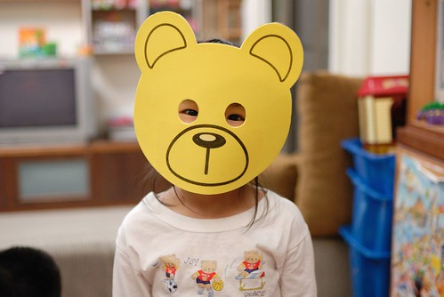

最近愛愛口中常講一堆我不認識 沒聽過的人名 一問之下似乎都是大蜜蜂的姐姐 她常今日說A是她的好朋友  明日說B是她的好朋友 換好朋友速度之快都讓我有點來不及跟著反應 只能往好的方面想 她的人際關係正快速地"擴展"著吧! 我想愛愛的糾察隊+雞婆的個性 有時候應該難免會引起些"爭議"的 希望她可以在這樣的摩合過程中 學習/修練的更加圓融 也麻煩Freda在需要的時候多費點心澆她冷水 噹她一下 別客氣! 要打要罵 請自取!! 感恩!!! 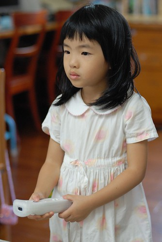

補充說明： 園長Kitty媽咪有天跟我說　她跟Freda說愛愛什麼都好　唯一不好就是太ㄍㄧㄥ 所以她們透過對愛愛的搖屁股訓練　希望她可以學著不要那麼ㄍㄧㄥ 因此吃飽飯後搖個屁股後才可以去做自己的事　啥要放行就先搖個屁股吧 剛開始時我還很好奇老師怎麼會有這樣的要求　以為是班上的＂活潑＂教學法 問愛愛＂全班小朋友都會搖屁股阿＂　愛愛說＂沒有阿　只有我＂ 我說　＂只有你　為什麼阿＂　愛愛一臉沒有什麼也無所謂的樣子說＂我也不知道＂ 後來聽了Kitty媽咪說明後　才明瞭原來這是愛愛的特訓阿！ ----------------------------------------------------------------------------------------------------------------------------- 剩下的照片就看圖說故事了： 阿嬤收攤時幫忙掃地的模樣　當然是玩的成分較大嚕 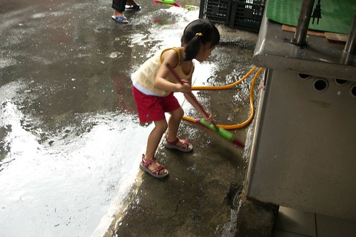

難得有機會可以親眼目睹阿嬤的碗棵是怎麼做的　而且還幫忙擺放碗 只是我在一旁有點膽戰心驚　很怕兄妹倆一不小心的碰撞就是滿地找碎片了 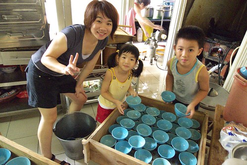

常跟著阿徹哥哥吹笛子　不過都是瞎吹　吹著自以為跟哥哥一樣的曲調 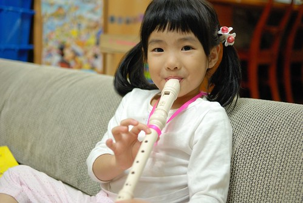

甚至還都拒絕哥哥的熱心教導　哥哥只好央求也不會的媽媽出手相教一下 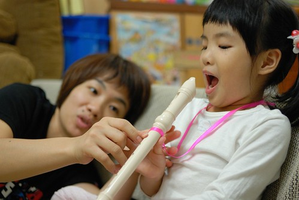

認真學改日才可以跟哥哥一起來個和諧大合奏阿 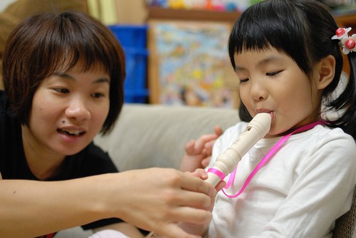

(攝於新莊青年公園踏青) 越來越常出現像這樣調皮搗蛋的嘴臉　看的人忍不住說＂你喔～＂ 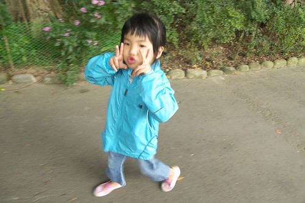

難得的盪鞦韆　阿徹哥哥還很好心的在後面當推手 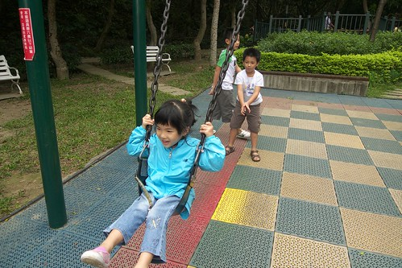

健行走的熱　要愛愛把脫下來的外套綁在身上 跟她說　綁在肩上就可以像小飛俠那樣飛飛飛喔（如第一張照片） 愛愛就好開心　好得意　然後露出這越來越有她味道的招牌笑容...（愛愛最近照相的招牌笑容） 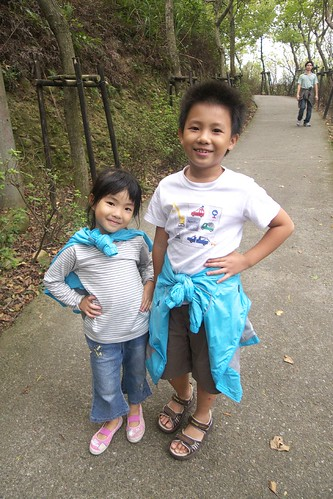 明明覺得愛愛這一年長高好多　可是站在阿徹身旁怎麼還是這麼矮小及嬌小阿! 沒關係! 有照自己的步調慢慢長大就好!!! 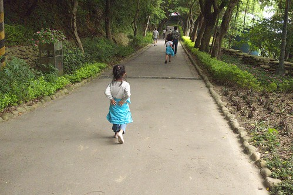
