我與徹爸二人常會說起 徹愛這二兄妹真是截然不同的孩子 個性不一樣 一個浪漫天真 一個明確務實 積極度不同 一個需要一再鞭促 一個卻是需要潑冷水 表現不同 一個只差一點就是老師口中的問題學生 另一個卻是只差一點就是模範學生 我們不太去比較 雖然偶而會說"可以學學哥哥(妹妹)..." 但衷心明白也欣慰兄妹倆有各自實在可愛的地方!

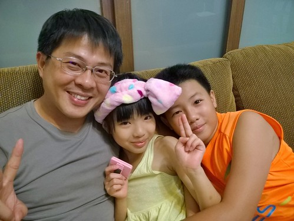

愛從小一直是個不讓人太操心的小孩 到了人家所謂跳檻很多的三年級後 依然如此 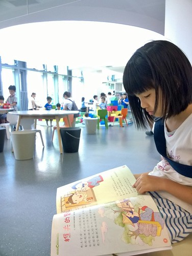 課業不用我們盯的會自己早早完成 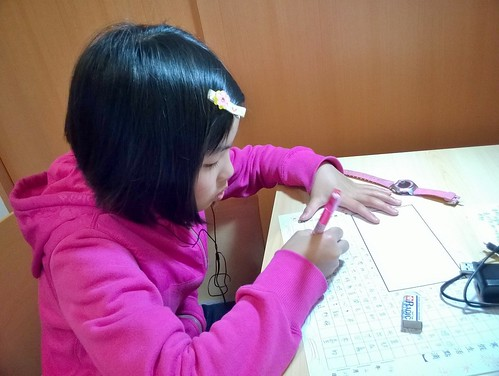 甚至我也不太看她的作業內容 往往只是簽該簽的名而已 這與我看徹哥作業時的諜對諜完全迥異 我常對兄妹說這就是媽媽對你們的因材施教 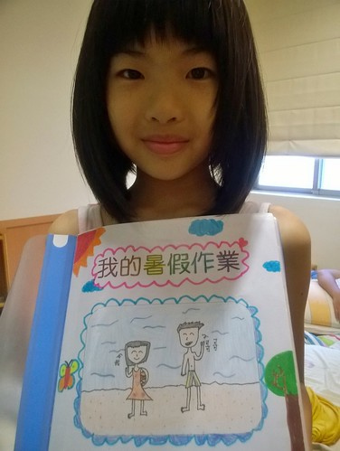 愛愛寫的作業 畫的圖永遠是乾乾淨淨 清清爽爽 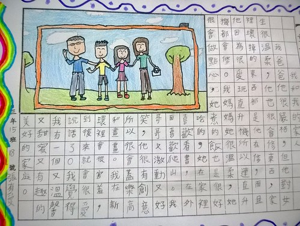 雖然每次寫作文總也唉唉叫 但比哥哥掌握寫作技巧 知道寫出重看的文句更甚千言萬語 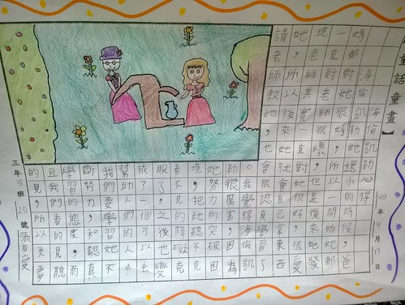 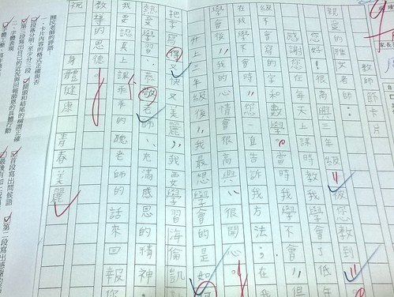 我說真不枉每次哥哥寫作文時 媽媽的引導與解說 豬沒肥 但起碼有胖到狗 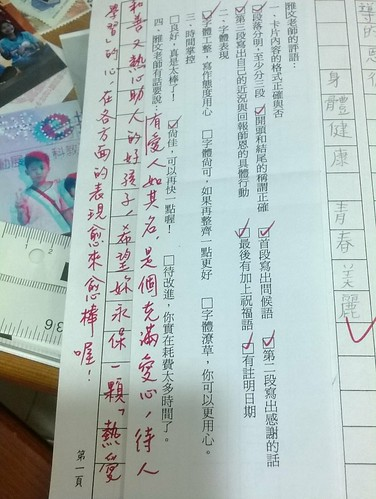 不過有時候會覺得愛愛有些過於認真(太ㄍㄧㄥ) 過於在乎在學校 老師面前的好形象 雖然這也是個讓自己做好學習,本份事的動力 但偶而難免有討好之嫌 這把尺如何拿捏 是我們最常對她的耳提面命 而話說下學期結束前突然長的帶狀袍診 讓我們不免虧她"小朋友 壓力很大喔!" 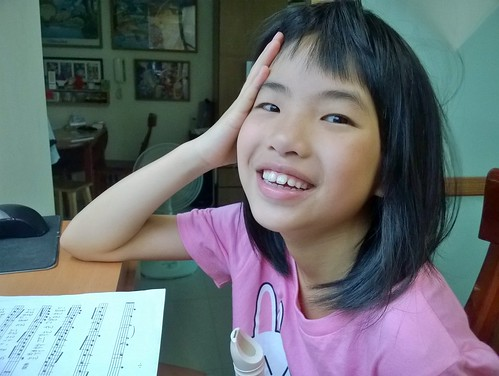 年初在日本神社 愛愛許願四年級考試可以考進前三名 我說怎麼沒許下學期  愛愛說唸書不是一下子就可以進步很多的 而愛愛真的一直在嘗試(體會)找出適合自己的方法(心得) 看著自己的成績從以前的還有一二科甲 中間的排名 進步到三年級下學期的全科優以及總算而且二次月考都在前十名內 她自己肯定是最高興的那個人 而且深刻明白一分耕耘一分收穫的道理 不過話說愛愛的確跟媽媽一樣比較善於考試 但知識的廣度卻遠不如徹爸與徹哥  我常說看阿徹 大家可能會覺得這個爸媽沒在教 幸好這樣的挫敗感可以從愛愛這獲得安慰與平衡 而我們所謂的"成績不是最重要"理念也在愛愛身上才具體顯見 (我們釘阿徹是因為他的態度 卻是跳到黃河也洗不清 不被明白) 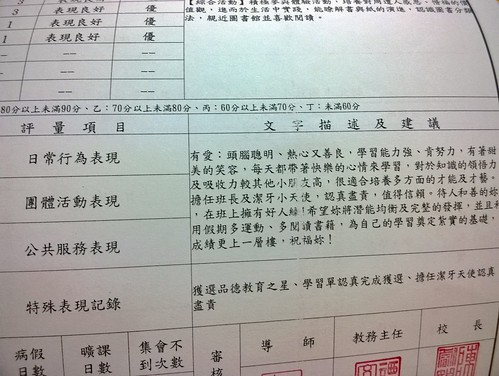 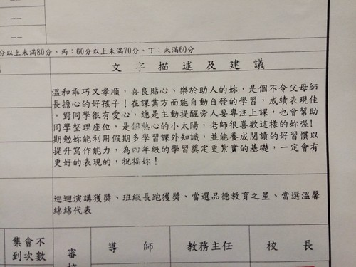 我們最是欣慰的是愛愛每天的知足開心以及帶給週遭人的溫暖 而且裡外如一(在校在家都一樣) 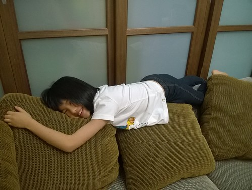 

以下就加快速度 看圖說故事 清掉這一年累積的照片(我好喜歡拍各式各樣的愛愛) 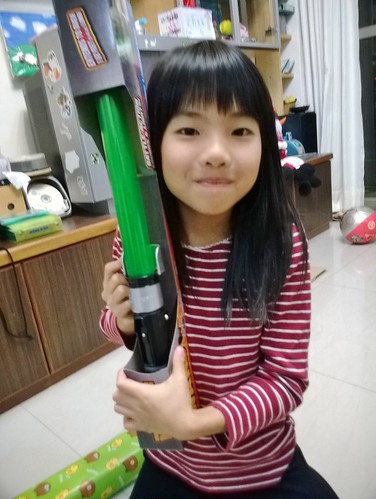 去年初愛愛與我ㄧ起約定留長髮 一起當馬尾妹迷死爸爸 留長頭髮的愛愛也越顯大女孩樣 當然也真是越來越愛漂亮 但對於漂亮 愛愛很有自己獨到的見解與定義 特別喜歡帶有一點帥的美麗 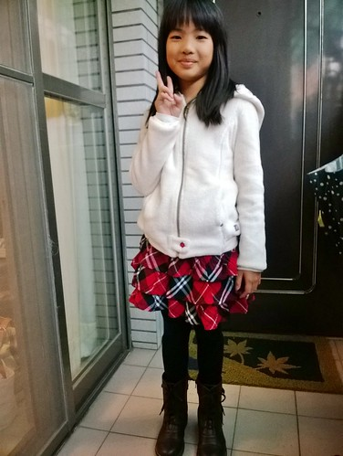 愛愛常會對她覺得厲害的人事發出讚嘆 "哇! 好帥喔" 舅公工作時把鉛筆架在耳上的樣子 很帥 烏克麗麗老師秀琴藝彈一首高難度曲子 很帥 媽媽煮飯的樣子也很帥 他立志要當個美麗又帥氣的女生 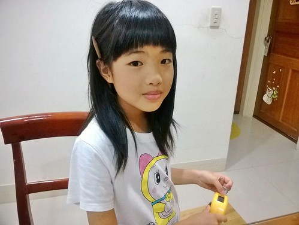 雖然自己喜歡滿意不得了長髮的美麗 但懶於花好多時間洗頭 吹頭的她 還是去年底生日前夕 毅然決然剪掉長髮  短髮的愛 其實更顯她的俏皮獨立樣 但剪完的第二天她便後悔了 且一直後悔到現在 這是從來沒有發生過的事(所以這些年才會頭髮一直長長短短) 只能說小女孩真的在長大了... 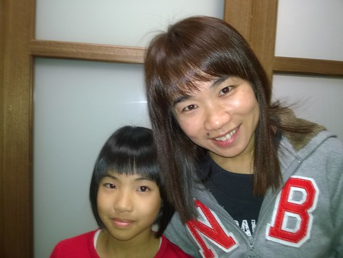 剪完就又開始留頭髮的她 總算這個暑假又可以綁起小馬尾 欣慰不已 但每每看著我的長尾巴總忍不住感嘆"早知道 我就..." 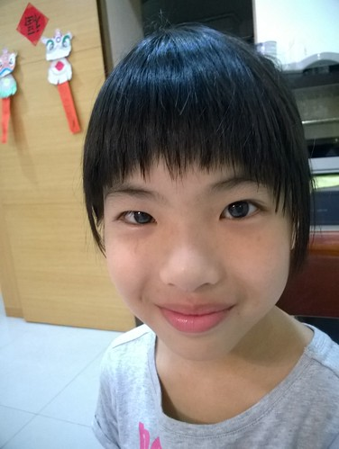 對女兒入迷很深的阿母 真的覺得愛愛各種長度的髮都很有特色 尤其特愛她自拍時 更顯圓的圓圓臉 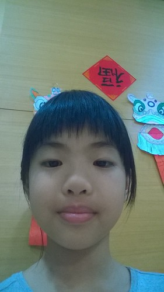 自拍是個很妙的行為 我想當下一定是喜歡自己現在的模樣的 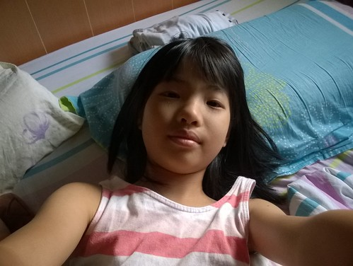 我常跟愛愛說你在學校是老師好幫手 在家也要是媽媽好幫手 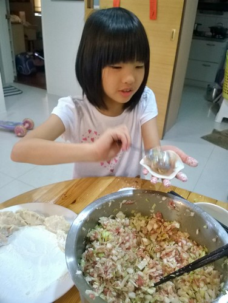 幸好愛愛還算是樂於學習做家事的 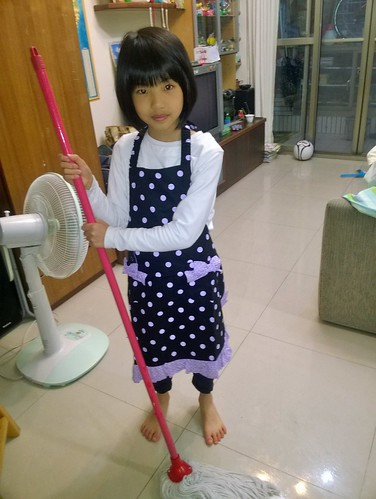 而給她買了專屬圍裙後  每回要到廚房幫大忙時總不忘先去穿上圍裙的認真模樣真的太好笑  愛愛與我們每一個人之間都有獨特的親密方式 與媽媽是一起做家事 與哥哥是辦家家酒與共睡 與徹爸則是互掏耳朵 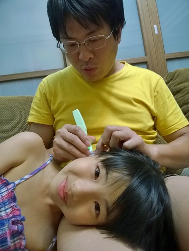 掏耳朵是是她們父女間最大的親密與賞賜 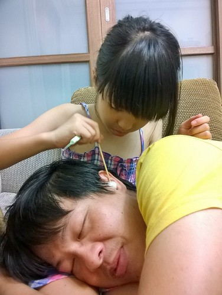

愛愛一直瘦瘦的 體重一直很緩慢的增加著 但其實她的胃口有一直有慢慢增加著 而且越來越不挑食 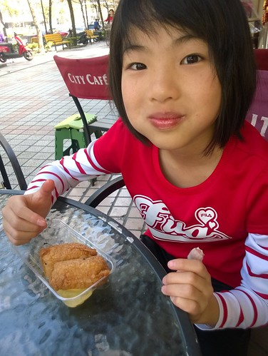 至於吃了後長不長肉 就隨緣吧~ (話說徹歌是四年級後開始肥 我們想愛愛應該也是有潛力的)  愛愛很喜歡吃陽春湯麵 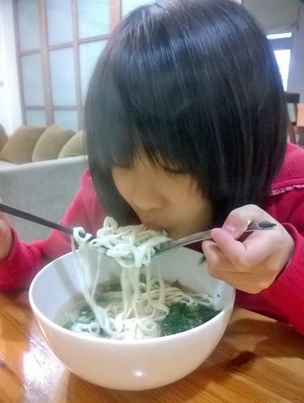 每次看他呼嚕呼嚕吃麵的模樣 都會想這麵有這麼好吃 也想來一碗試試 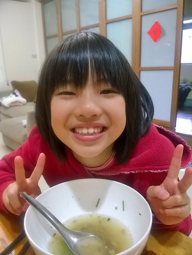 而除了麵之外 愛愛大勝我們全家的就只有吃冰淇淋還有甜食了 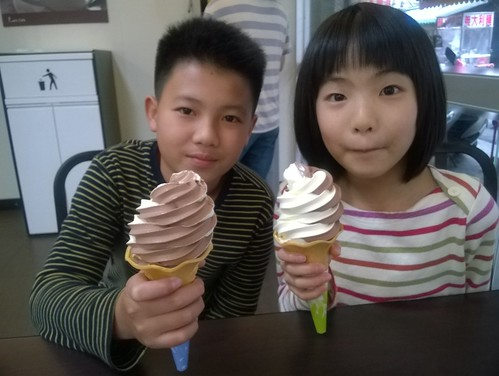 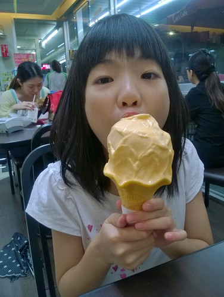

除了盡心盡力寫功課 當好學生外 愛愛在家的生活一點也不無聊 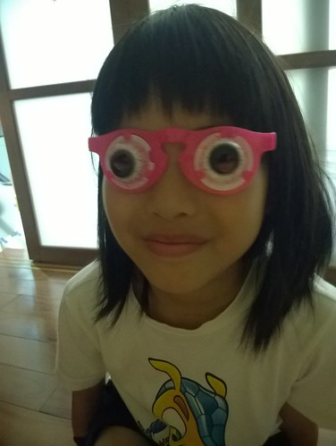 跟著我們一起玩大老二, wii, 飛鏢 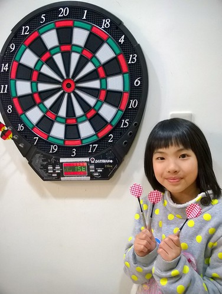 技術還越來越好 不小心就讓她奪冠了 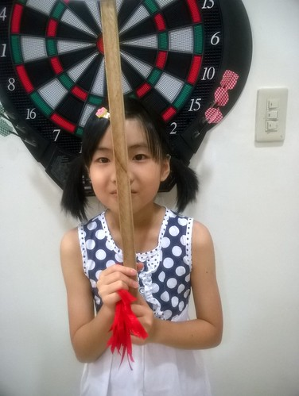 而最喜愛也是最大樂趣來源則是跟著徹哥玩有的沒的  徹哥鬼點子層出不窮... 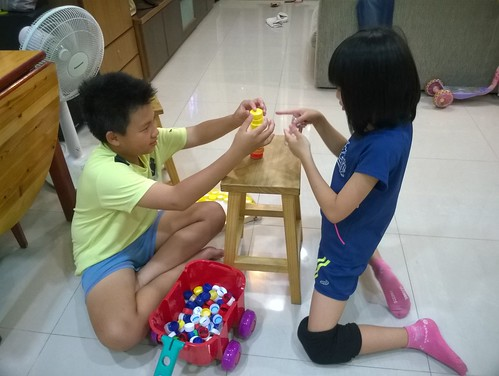 二人收集家裡喝的牛奶,飲料瓶蓋  暑假心血來潮還一一邊上號碼 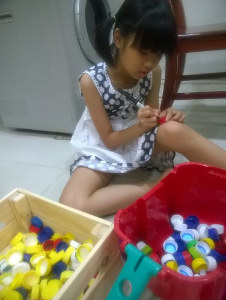 這幾個月二人又愛上家家酒 一起養了一雙兒女 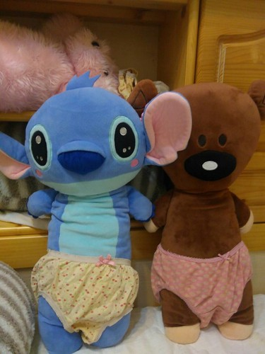 盡責的小媽媽還揹著小孩做家事 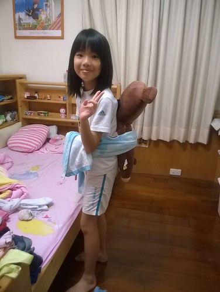 客廳街頭賣藝 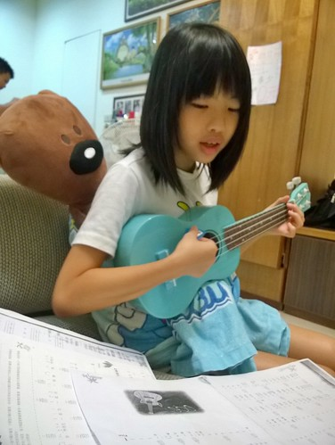 不只是遊戲 這幾個月愛愛興趣大發的練著烏克麗麗 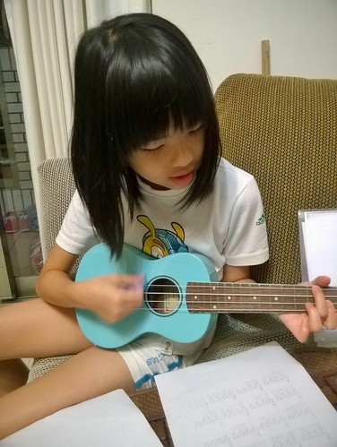 以往總被哥哥爸爸笑五音不全的她 隨著越多的自彈自唱練習 越來越落落大方且越唱越好 而這一切的練習 只因為看日劇中溫柔的女老師彈起電吉他帥呆 所以她想努力練烏克麗麗 讓自己也好帥 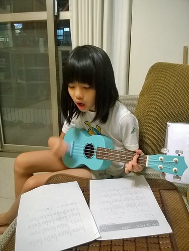 暑假的七月 愛愛參加了YMCA的活力營隊 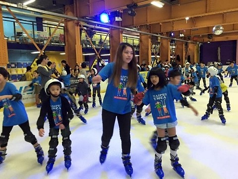 出乎我們意外的適應良好 且開始對於大姐姐般的輔導員與老師有崇拜感 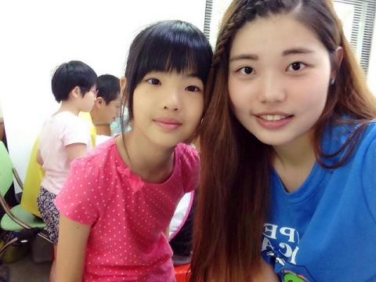 不同於學校的環境與人事物 正好滿足學習心旺盛的她 而且因此有著對於長大後的小小夢想而努力 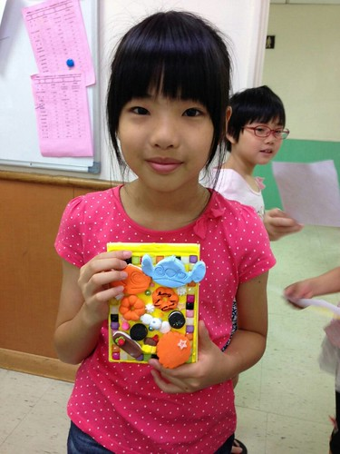 女孩子成熟的比男孩快許多 心思也細膩許多 看著每天總帶給我們許多開心與感動的女兒一天天不一樣著  我們除了感動還是只有開心! 我們家的愛 繼續努力接下來的四年級! GO~ 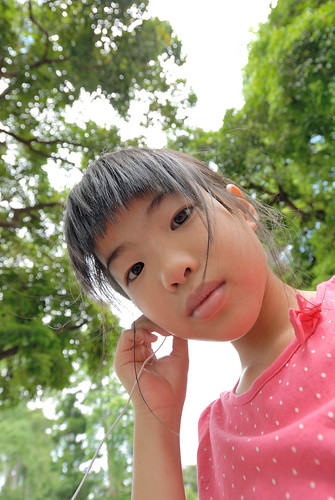
