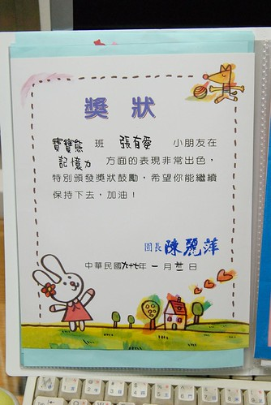
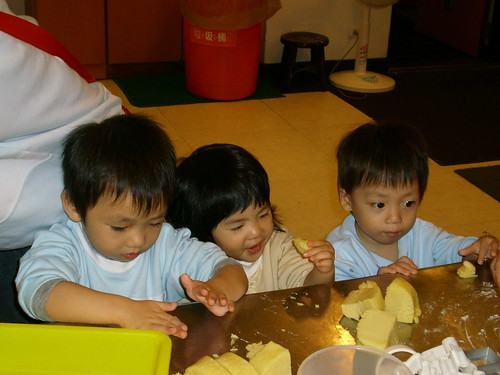

欠了好久的照片與日記 債還是該還一還...

小愛以1歲11個月之稚齡開始了他人生中的漫長上學之路  
除了大書包+小個子的組合看起來有點可憐外  
我想小愛是喜歡上學的 快樂上學的...  
起碼截至目前為止小愛還未曾早上嚷著不要上學的  
甚至賴床的時候跟她說 要去學校嚕 要去找嵂嵂嚕  
總是"刷"的就睜亮眼 翻身起床

雖然現在問她去學校都做什麼阿  
她還是一樣的回答"玩溜滑梯"  
我也相信上學時間的大半就是在吃東西 睡覺 玩中度過  
但是每天玩的開心就好

上學期末學校發回小愛的第一本作品集 相片本還有兩張獎狀  
獎勵事蹟是在"記憶力"方面有傑出表現  
咳咳~這"罪名"感覺有點硬ㄠ哩...

但不可否認小愛說話的辭彙與技巧正以顯著的遞增函數延伸著  
反駁徹爸的指控時生氣加無奈的說”我就有…”  
跟阿徹哥哥吵架時嘟著小嘴說”我明明就有…” “明明就是…”

雖然越來越恰但也越來越貼心  
生病的時候跟她說”你生病的時候爸爸媽媽要很辛苦的照顧你”  
小愛頓了一秒鐘後脫口而出”謝謝媽媽”  
指著身上的衣服鞋子跟我說”這是媽媽買給我的…謝謝媽咪”  
吃著水果也說”謝謝媽咪”  
穿完尿布也說”謝謝媽咪”  
哎呀~真是讓爸爸媽媽甜到心坎裏去了  
莫非這真的就是男女生的天生骨子不一樣???

從學校的flicker上抓了一些小愛的上學照片  
讓大家瞧瞧奶娃們平常在學校都在搞些什麼阿

~穿線~ 課程中很大的比例在訓練小手指

 

~畫線上色練習~ 就是鬼畫符啦  
 

~拼圖練習~  
 

~體能課~ 聽說總是形影不離的小愛跟嵂嵂連上體能課也都是有志一同的一起發呆  
 

~這也是體能課~ 瞧 倆人又在一起了  
 

~戶外教學~  
每個月都有一個或大或小 或遠或近的戶外教學真的很幸福  
去了好多爸爸媽媽沒去過的地方

 

~戶外教學郭源益糕餅博物館~ 小愛吃餅乾是很厲害 做餅乾的話應該會是玩黏土吧   
  

話說阿徹哥哥在學校真的很照顧妹妹  
每天4點半放學後在遊戲區時  
阿徹哥哥都會亦步亦趨的跟著妹妹去溜滑梯 球池  
深怕妹妹受傷了 被人欺負了  
連妹妹要上廁所時 還跟著去廁所服俟  
也許小愛可以這麼適應學校 要歸功於哥哥的陪伴與照顧吧

 

~戶外教學 北埔芎林童玩\*\*~ 吃糖葫蘆  
 

~小童玩~  
  
  
~發呆~ 呵呵  
  
 

~製作竹蜻蜓 ~ 當然應該是老師代勞的吧  
 

給他不認真喔 竟然還對鏡頭擺pose  
 

~看布袋偶~  
 

~嬰兒床~ 全校大概只有幼幼班的那幾個奶娃可以體驗這"搖苟"了  
 

看簡介看的很認真很專注哩 而且還沒拿反哩  
 

喂~ 老師 你們姐妹打擾到我的清幽了啦

不過礙於是嵂嵂的媽跟阿姨 也不好意思太反抗了...  

