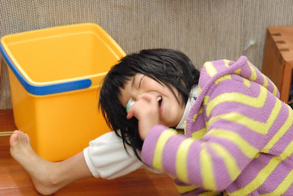

好不容易寫完阿徹的上學期紀錄 其實, 剩下的愛愛才最是令我難以下筆阿! 話說雖然愛愛上小學前我們便不擔心她的適應問題 但愛愛的表現卻好的有些超出我們的預期 尤其是成為老師的最佳小助手 同學們的最好小幫手這件事 當然很是欣慰徹家能養出這樣有貢獻性的小孩 但卻有些事情本末倒置的令我們有些無奈 總的來講 經過小學的洗禮, 愛愛真是又長大好多 成熟許多 而爸媽我們對她僅有的期望就是脾氣控制可以再好一些 上學可以再開心點!  

我曾經開玩笑跟愛愛說"你們老師應該真的很喜歡你 除了覺得你的字寫的不夠漂亮外" 沒想到愛愛回答我"對阿! 老師跟我說 我什麼都好 除了那個字還要多加油"  偏偏我們對小孩寫字的最大要求是認真 再來是速度 (其實有認真字就不醜到哪去 只是未必能美) 除非真是太離譜的字才會要求擦掉 否則都是全盤接受 甚至也不會太仔細看內容 愛愛很能理解我們的看法與要求 有時後也顯得很淡然的樣子 但其實她很在乎老師給的成績 尤其開始寫國字後作業的最高等第只有甲下 讓她百思不得其解 更不幸的是 哥哥的老師是佛心來著 常給甲上以資鼓勵哥哥寫字的認真 讓愛愛更是無奈的碎唸著"為什麼哥哥的字那麼醜也有甲上 我的字卻最好也只能甲下 不公平... " 一旁的我只能安慰著"妳們老師標準比較高 沒辦法" 我們真的沒辦法阿!!!  而除了寫字還離老師標準很遠外 其他課堂上的學習 愛愛都掌握的很好(話說我們的標準真的挺低啦) 甚至會小臭屁說"我的體育是我們班第二好 音樂第一好 美勞第二好..." (這點兄妹倆很像) 當然我們沒親眼見過也不知道愛愛說的是真是假 抑或誇大了幾分 只是因為這些好表現而能讓她自信又開心 我們樂觀其成 只是不可以自傲 所以我們常澆她的冷水...  愛愛的老師是真的很認真 也肯定花了很多時間在批改作業 教導孩子 只是那近乎吹毛求疵的態度與標準  有時真的很令我無言 尤其當看到愛愛寫國語作業的速度實在有夠慢  還很會一再的擦擦寫寫 以及母女倆對著理應沒有對錯與標準答案的作業 研究著老師為什麼會扣分時 真的! 我心裡很想大喊"你不要管妳們老師啦"  雖然我們本來就一直在灌輸"做好自己最重要"的態度  而話說老師對於我們這樣的家長或許也很無力吧! 這麼不認真! 這樣浪費好好一個小孩...  

雖然愛愛的學業成績在她們班上很普普 但愛愛卻是班上最能幹的小幫手 她常會說 今天我好忙喔..去哪裡..做什麼... 有一天我忍不住問她 妳到底要做哪些事阿 她說 早上要去輔導室跟志工媽媽確認請假同學名單 要幫XXX(班上有位應該是學習障礙還是什麼障礙的同學)看作業與檢查書包 要幫XXX去交資料  有班級圖書要帶同學送去別班 幫老師拿東西去辦公室 還有到垃圾 我驚訝的說 "啥! 連到垃圾也是妳阿 你真的太厲害了吧 可以做這麼多" 好笑的是 愛愛還很得意她們班上只有她能拿大掃把 當同學只拿著小掃把掃自己位置時 她還可以拿大掃把掃一些公共區域 而且愛愛很特別強調 老師只有讓她 她一個人可以拿大掃把喔! 我又忍不住問她 "那妳們班模範生ㄋ 她要做什麼" (其他同學不講 模範生理應不差) 愛愛一臉認真的說(我要強調 愛愛的表情真的認真又理所當然)"她要做班上的好榜樣阿" 原來~ 好榜樣也是工作的一種阿! 我真是開了眼界!!! 幸好愛愛後來跟模範生變成好朋友 還跟另一位好同學彷彿組了個女子三人團 不只多了一起遊戲 一起約定留長髮的伴 她們也都很樂意幫助愛愛的差事  總算愛愛的勤勞在期末有獲得老師的獎狀鼓勵 (獎狀對小學生來講真的很重要阿 是虛榮也是肯定) 愛愛又是一臉認真的告訴我"我的獎狀一次就蓋了群育跟德育 很少見的喔"  真的! 便宜了學校...  此外更搞笑的是 明明班上開學後一直都只有"班長"這個職位 而且還是按照號碼一個個輪流當的 愛愛卻在12月某天放學回家後開心的告訴我"我是副班長喔" 我問清楚 "還有選其他幹部嗎?班長ㄋ" 答案是只有副班長 班長還是輪流 唉呀呀~ 這個送官的用意 怎能不讓父母的我們多做聯想ㄋ.. 好吧! 一樣是愛愛願意又開心就好!!! 只是我們又會跟她說"不要只是會在學校當小天使! 我們寧可你在學校普通點 可是在家表現很棒" 因為愛愛這學期在家生氣 耍性子的頻率真的比以往高阿 這或許是她回家後的放鬆 也或許可能反映著她的壓力 但我們真的是比較喜歡一個情緒穩定 表現穩定 健康又開朗的孩子! 而愛愛雖然其實也很樂於這樣受老師倚重 但偶而總會有累的時候 苦悶的時候 尤其她的座位一直被安排在第一排 坐在那位XXX同學的旁邊 幫助他 指導他 有時候XXX同學調皮或是不理她說的話 又讓她很無力 即時我們明白也一直跟愛愛說 助人為快樂之本 施比受更有福 但老實講對於一個八歲的孩子 我不覺得她可以每天都能喜樂的施這些 我說"如果你真的覺得好累 希望換別人 媽媽可以跟老師說" 愛愛還是搖頭... 只是上學期總是說老師這麼嚴格是為我們好的愛愛 竟然在前陣子的有天寫作業時說"其實我喜歡上學 只是如果老師不要這麼嚴格 我會更喜歡的" 唉~ 阿母聽的心酸酸的... 不過愛愛接著說"希望我3年級也能被哥哥這樣的老師教" 認命又懷抱期望的愛愛 難怪這樣受我們一家子疼....

哇哈哈~ 果然我又字很多上身 以下就看圖說故事 簡單紀錄一些改變 上週找阿徹小時後騎車的照片時 我不只看阿徹的看的津津有味 愛愛的更是讓我感觸萬分 "女大十八變阿" 看著看著自己忍不住就撲嗤笑出... 真的好喜歡以前愛愛恬靜的模樣 完全想不到沒幾年射手座的個性就外顯無遺  相較於第一張照片 同樣在嘉義公園 同樣POSE 同樣裙裝 兩年前的模樣還這樣孩子氣 現在卻真的飄出些女人味了  雖然我跟徹爸常私下很不知羞恥的讚嘆著"女兒怎麼這麼漂亮"(尤其是那甜甜的模樣) 但兩人也不可否認 愛愛怎麼有時候看起來很呆 很豬... 哈哈!!! 髮型! 尤其準備留長髮的過度時期真的少了些女生味  幸好向來善變 頭髮長長短短的愛愛又決定留頭髮了 還會跟同學約定好哪天一起綁怎樣的髮型ㄋ  有關外表 愛說教的阿母又常說啦"外表不是最重要 但還是很重要 適當程度的愛漂亮是需要的" 不知不覺愛愛的審美觀跟阿母越來越像了 不只常會跟阿母說 你的哪個鞋子 哪各裙子還衣服一定要留給她以後穿 當阿母在百貨公司比劃著從沒買過的超女性衣服時 愛愛還會皺著眉頭說"這個不適合你啦 我覺得你家裡的衣服都比這個好看" 堅持不讓我買冬天的小短褲 因為她說"這種應該是像哥哥老師穿的 你太老了" 聽的我好哭笑不得阿...  愛愛很搞喂  除非生病的很厲害  否則在家一張小嘴永遠吱吱咂咂說個不停 讓人有時候得提醒"好啦! 安靜一下"  不過話說她的熱情多話也是我們一家子開心的泉源 而同時她的表情也很豐富 很多變 裝傻的模樣  認真的模樣  自信的模樣  耍賴的模樣  裝可憐的模樣  賊頭賊腦模樣  當然還有我們最喜歡的開懷大笑模樣  而上舞台表演時 幻化成蛇女竟也有窈窕的模樣了 (去年12月底的舞蹈班表演)  真的! 大膽愛的台風真的很穩健  除了笑容少了點...  曲子結束 鏡頭拉近一看   果然! 還是個娃!!  很棒喔 不知不覺跳了五年的舞  希望能夠跳到真的曼妙的年紀 

年初 愛愛有兩件事升級了 首先 愛愛總算第一次開口說她也想要自己的一台相機 跟哥哥一樣 於是徹爸把家裡第一台類單眼 但卻快10年沒用的機子慎重的交給了愛愛 希望她也能透過鏡頭看到不一樣的世界 表達出她的想法  另外一件就是隨著哥哥腳踏車從20吋升級24吋 愛愛也從16吋升級20吋嚕  阿母我忍不住也回憶起愛愛的腳踏車歷史 兩歲多一點點開始ㄊㄨˋ著小12吋輔助輪  腳都還搆不太到地 更別說常有狀況發生 撞牆了 哥哥秀秀且教導一番   (這張照片讓我看的特別有感覺阿)  升小班的夏天學會了腳踏車 真的好開心!  追隨哥哥的腳步 努力練習著  然後升大班前的春天升級16吋  爸爸精心改造的車子讓愛愛騎的順暢又威風(這台車打算轉賣 喜歡的可以私洽喔)  雖然比哥哥晚了些 但總算也在上一年級後沒多久通過我們家單車禮的第一關  板橋鶯歌40公里  一直以為16吋還很剛好 但其實也已經可以騎20吋嚕 為了全家的再次單車旅行 愛愛升級20吋了 更大的車 更快的速度 更像回事的模樣  我們蓄勢待發著  鶯歌 八里 動物園... 當然還有花東 等著愛愛來吧! 加油!! 小女生!!! 
