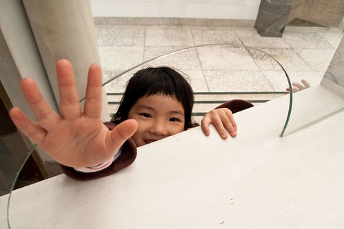
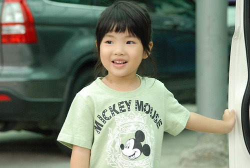

是低!  我們家的I-Ku(愛哭)在今天滿四歲  踏入五歲了 

回頭看了去年寫的生日紀錄  裡頭寫的那些事好像都前些日子才發生的  怎麼竟然已經是一年前的事了?! 裏頭寫的一些I-ku 症狀也都三不五時持續上演著  怎麼I-ku好像沒啥長進阿?! 不過時間真的過的這麼快(每年兩小的生日總會聽到媽媽這樣唉) 愛愛也確實有在長大 不論是心智或是外表 都一直在往"成熟"的正面方向邁進 

每天都想捏捏愛愛的小臉頰 親親她的小臉  也享受著每天睡覺前她的小嘴輕輕琢在我臉上的甜蜜 雖然每天都在跟你說 " 你好棒 好愛你" 今天爸爸媽媽還是想大聲的在 blog上說 "愛~有你真好 真的愛你~"

生 日 快 樂! 我們家的女孩~ 
