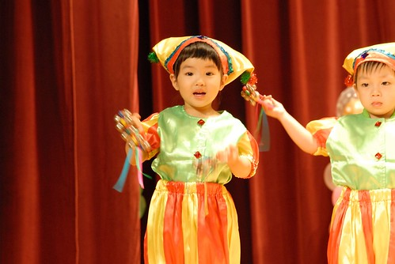
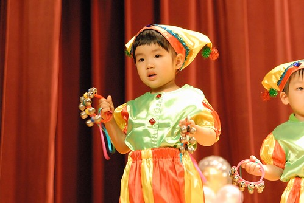
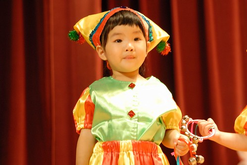
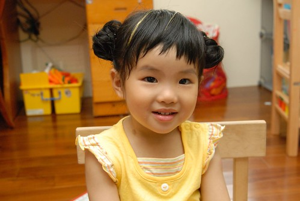
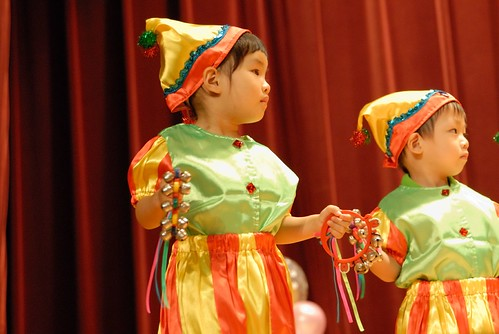
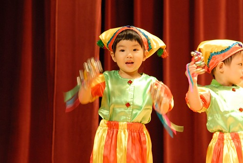
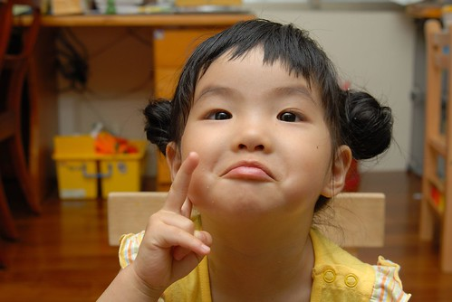

  
  
五月初當哥哥開始熱切的跟我們討論音樂發表會的事時  
我跟爸爸總會好奇的問小愛"你也要上台表演 你知道嗎???"  
小愛總只是害羞的笑著…  
讓我們搞不清 她到底懂不懂得表演是什麼東東  
總算到發表會的前一週每當我們說起表演時  
小愛便會舉起她的雙手彷若下雨般的滴落  
並且邊做邊解釋說著"要這樣ㄌ一ㄤ…ㄌ一ㄤ…"  
看到小愛這動作 爸媽就懂了…. 寶寶熊是吧! 鈴鐺是吧….呵呵  

  
  
雖然看小愛在家ㄌ一ㄤ的很開心 很自豪的樣子  
但還是會擔心小愛屆時上台時可能會驚嚇如呆雞  
或是更慘一點就在台上嚎啕大哭吧  
所以每次看到小愛在那ㄌ一ㄤ 我們就會跟她說"到時候上台也要這樣ㄌ一ㄤ 不要哭哭喔"  
雖然她都點點頭答應了我們 但小臉卻顯出一絲的疑惑  
我們想她可能真的還是不懂什麼叫上台吧  
還不知為何要懼 為何爸媽甚至Eileen這樣擔心緊張 千叮嚀萬交代  
  
  
  
表演當天要集合時 看到小愛硬牽著媽媽的手不願意去集合  
我跟爸爸忍不住開始冒冷汗 心想不會"挫賽"了吧  
雖然爸媽早有阿徹哥哥的前車之鑑 知道不該對寶寶熊的小小孩有非份的期待  
但實在很好奇有"大膽愛"稱號的小愛會有什麼樣的反應表現  
看到穿著如哥哥所說的小丑裝出現的小愛時 哈哈…那模樣真的有呆  
心裡忍不住暗笑"就繼續呆下去沒關係  不要哭就好"  
只是那頭套有點枉費了早上去剪頭髮時 阿姨精心幫小愛打理的俾女頭  
  
(小愛好幾天前便開始期待表演那天可以去讓阿姨綁美美的頭)  
  
  
  
雖然表演過程中 小愛有點愛東張西望  
有時甚至看著別人就呆掉了 忘記要ㄌ一ㄤ了  
  
  
  
但起碼沒有哭 果然比阿徹哥哥勇敢許多（小愛又多了一項可以取笑哥哥的事）  
甚至隱約中似乎看到她的小口隨著小星星音樂亨唱著  
或是如老師們告訴我的 小愛還會小搖屁股ㄋ  
  
  
  
我想對於兩歲半的小愛來講 這真的可以算是個美好的第一次經驗吧  
而小愛對於自己的表現可也得意了  
偶而就會說"我有表演ㄌ一ㄤ喔"  那表情真的有驕傲有開心….  
  

