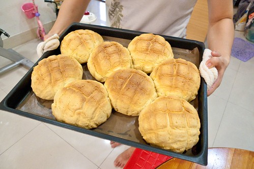
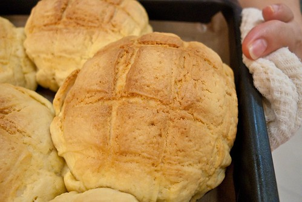
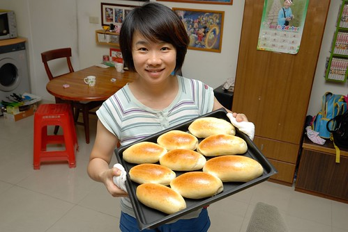

前陣子跟徹爸一起看的電影"愛的麵包魂" 最後女主角感動的吃著男主角做的美味波蘿麵包時 徹爸說"其實我最喜歡吃的麵包是波蘿" 然後問我會做嗎 夫妻這麼久 總算在鹽酥雞跟米血之外 我難得聽到徹爸說的真心話(有關食物) 畢竟在徹爸的"不過圖個溫飽"的吃飯理論下 我一直迷網與無奈許久(還有小傷心) 所以管他那個皮要用多少奶油多少糖 我總算也端出了一盤可以吸引愛人的麵包 這也是我的愛的麵包 啦啦啦~

  為了降低對於高熱量酥皮的罪惡感 我加大皮下的麵包主體份量 硬是比食譜的大上一半 最後進烤箱前 八個菠蘿便已把烤盤排滿滿 而出爐時 八個菠蘿更是擠爆小小的烤盤 這是在家做麵包最常犯的錯誤 因為總希望麵包大又滿 但這也是自己做麵包最大的樂趣 因為沒有老闆會賣這樣的麵包  就像徹爸說的"張嬤常會學做肉圓 蚵仔煎... 很奇怪吃起來都跟外面不一樣 但是我們覺得理所當然" 或許我的麵包也是這樣吧~ 因為媽媽總是會希望食材再豐富點 再營養點  份量再大一點...  雖然自己實在是"土師" 但一盤盤的麵包滿足了自己的胃 也滿足了我對於家的那顆心... (就不管吃的人的喜好跟感受啦! 畢竟才能真的有限 而波蘿的熱量真的高阿)

後記:話說每次問徹爸那個波蘿好吃嗎? 徹爸都回答"好吃! 但是很會掉皮" 我就努力的想"吃波蘿掉屑到底正不正常?  酥酥的皮不是就會這樣..." 或許下回還要再來改改皮的配方了(做過兩次試了兩種了) 後記:想獻寶很久的波蘿 想不到卻是在最近低潮到底的今天寫下 而更想不到的是寫完後 自己的心情竟然就仿若大雨之後的撥雲見日 開了~ 果然是愛的麵包阿! 起碼溫暖了自己!!!
