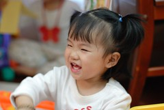

小愛最近很喜歡笑   
而且都會笑的眼睛瞇瞇 還露出他的上下排門牙  
笑的很像媬母那的另一個小姐姐  
媬母說帶出去時 很多人都以為她們是親姐妹 長的很像 神韻也很像   
連名字也像 張有愛 張嘉心 都是可愛的小甜心  
  
 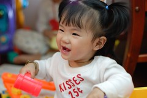  
  
不過外人最常看到的還是小愛靦腆的笑容  
阿公阿嬤常形容的"咪咪ㄚ笑"  與小愛身材很相襯的秀氣笑容  
  
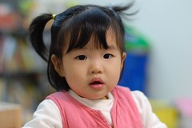  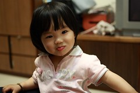

小女子也越來越愛 越懂得玩了  
沒事最愛掛個聽診器晃來晃去 還會幫媽媽量耳朵 聽心跳  
遊戲區裡的眾多書書玩具慢慢也像是小愛的玩具了 不再只是哥哥霸享  
玩玩具的專注力與自得其樂不容小看   
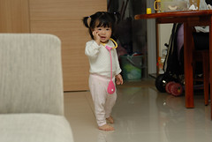  
  
投手舉足之間越來越顯見小女生的成熟  
只是過於自信而造成的疏忽 不小心跌倒碰撞也越來越常發生  
幸好小愛還算是個堅強的小女子 摸摸鼻子 眼淚擦擦繼續奮鬥  
不過最近發現大膽的小愛竟然會怕IKEA的絨毛小老鼠還有小塑膠昆蟲  
難得的面露懼色 小手拍著胸脯說怕怕  
  
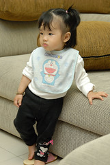  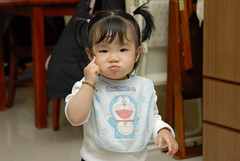  
  
雖然小愛個性隨和 恬靜 但有時卻也挺堅持的  
喝果汁時非得自己捧著8分滿的杯子自己吸(往書房的入口地板儼然成了小愛的第二用餐區)  
為了不讓螞蟻滿地爬 爸爸媽媽也只有小心翼翼的在一旁待命善後  
跟著媽媽坐公車去陳嬤家時(只有母女二人) 堅持的要自己坐  
就算已經打瞌睡 就也自己這麼用小手扶著窗檯睡著了  
  
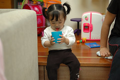   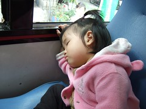  
  
還是很愛吃 水果 餅乾不斷  
餓著了還自己跑到餅乾桶央求乞討   
所以雖然身材嬌小但也是有點小肚南的(爸爸說小女生體態不太好喔)  
上週跟來訪的朋友去吃日式燒肉 小愛破紀錄的坐在餐椅上用餐兩小時  
自己吃了 海苔飯 高麗菜 貢丸 餅乾 地瓜 喝茶  
不需要媽媽一口口餵 不用擔心以後會餓著了(這是陳嬤第一次看到小愛自己吃飯時的反應)  
只是近來越來越愛玩 看到媽媽在餐桌準備晚餐時  
已經不會像以前那樣猴急的箭步想要上餐桌  
偶而還是需要一點威脅利誘恫赫  
  
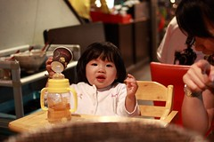  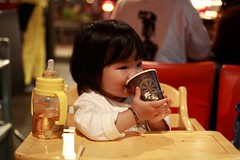  
  
這樣算是扮鬼臉嗎  小鬼靈精怪  
  
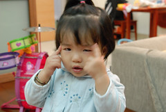  
  
小孩子當然不可能都是這麼乖巧 這麼美好的  
偶而耍起性子當然也是驚聲尖哭   
怎麼辦~當然就是讓她哭 哭到小愛自覺無趣摸摸鼻子裝若無事或是我們投降屈服  
也就是父母跟小孩的耐性毅力競賽啦  
某天哭的無法自拔 爸爸跟哥哥躲進浴室洗澡 剩下媽媽無情的坐在沙發上  
小愛從書房哭到沙發上 最後不知不覺的睡著了   
眼角還垂著幾滴眼淚 真是給她小小可憐  
她常看到阿徹哥哥哭的西哩嘩啦應該不會覺得爸爸媽媽太狠心 太偏心吧  
  
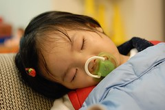    
  
炎熱的週末 爸爸心血來潮的給小愛榜上小馬尾  
這是爸爸第一次動手幫小愛榜頭髮  
雖然媽媽說這樣很像毆巴桑  
但是徹爸很得意自己的傑作 直誇小愛這樣好可愛 好漂亮  
ㄟ...漂亮的小歐巴桑嗎   
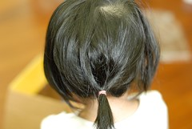
