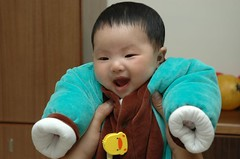
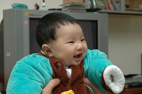
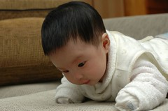

過完年後銷假上班了  
小愛也開始去保母家上學嚕  
打小愛出生前2-3月便開始留意找保母  
動員了以前同學的阿姨/媽媽還有樓下太太的管道打聽保母  
可是一直沒遇著懹我願意甘願託付的褓母家  
不是覺得沒有空間可以給小孩活動 太遠 要不就是feeling不對  
拖阿拖的 小愛滿月後只好透過媬姆協會介紹  
找到了現在的蔡媽媽 除了因為在一號出口所以下班後連接兩各小孩很方便  
且他家起碼保留了一個小小空間可以讓小孩活動  
而且曾經帶了10多各小孩的蔡媽媽家有很多放在矮櫃上的童書

剛去保姆家的頭幾天小愛可能因為不習慣的原因  
白天都睡睡醒醒的很容易被吵醒  
第三天蔡媽媽忍不住說  
她帶過這麼多小孩沒有一個像小愛這樣這麼容易醒來的  
而回家後的小愛可能因為回到熟悉的地方竟然有天7點就睡著了  
而且現在哄睡著後放到他的小床上睡覺  
除了剛開始偶而哎哎叫需要拍拍安撫一下  
夜晚除了喝奶外 幾乎都可以睡在他自己的床了  
且半夜喝奶的時間間隔最長也可以拉到7小時了  
所以爸爸這陣子抱小愛時 就一附好愛小愛的樣子  
妹妹完全一掃之前在爸爸心中"難搞"的形象

過年時很多抱過小愛的大人就說  
小愛很有人緣樣人見人好  
當時我跟徹爸都深深疑惑一臉豬頭樣的小愛哪吸引人ㄋ  
最近小愛會笑了甚至會咯咯咯的笑出聲而且很愛講話(去保姆家的第一天媬姆就也發現)  
我跟徹爸才開始正視大家對於小愛的讚美  
呵呵 越來越有信心小愛以後會是個人見人愛的小女孩了  
徹爸可以不用那麼辛苦賺小愛的嫁妝了

最近看著小愛會笑了  努力學抬頭挺胸的樣子  
真的覺得時間過的好快 小孩成長好快  
很快的小愛就會爬會走了  
真的越來越能體會老人家說的"被小孩追老了"的感受~  

