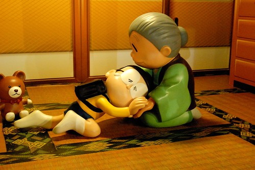

這週間徹愛的國小有期中考 兩天間兄妹倆的成績與心情如洗三溫暖般 一個先熱後冷 一個先冷後熱 雖然我努力實踐"成績不代表一切"的承諾 但老實講還真需要點冷靜與雅量來接受事實 畢竟成績不好反映著一定有什麼地方出了問題 扣除掉可能的認真不夠 天份不夠 還有大家都不知道為什麼的因素後 我也只能自嘲是媽媽牌安親班的不夠好! 不過出乎我意外的是 自己竟然可以很短時間內調適好且坦然接受這樣的結果 (高竿點應該是當下就能接受 可見自己還要多修行) 同時我也更加堅信每個孩子都有他自己的步伐 我們所能做的只是指引他 陪伴他... 這篇是個紀錄也同時是給自己 給徹愛家 加油打氣~ 

星期一 月考前一天晚上 阿徹同徹爸一起去公園慢跑三公里 原先父子倆各有些顧忌今晚適合練跑嗎 我跟徹爸說"反正你兒子在家也不會念書了" 同時也跟阿徹說"運動可以讓人的頭腦清醒喔" 於是父子倆開開心心且很有成就感的完成兩人的第一次練跑

星期二 月考的第一天 阿徹放學後一見到我就開心的說"我國語考95分喔" 鑒於全班 全家都知道阿徹的國語很爛 而且爛很久了 我跟阿徹一樣很驚喜他可以有這樣的分數 我忍不住還問了好幾次"真的嗎? 你沒聽錯嗎?" 我跟阿徹開心之後 轉頭看向另一隻手牽著的愛愛 沒想到愛愛一臉苦的跟我說"我好難過 我國語只有78" 啥咪!? 雖然我心裡這樣OS著 畢竟愛愛從開始學習國字後 語文表現真的優於哥哥太多 但我卻非常鎮定的跟愛愛說"沒關係啦! 你平常生字都學的很好 作業也很認真" 愛愛聽了沒說話 只是安安靜靜的走路回家 回家後 我主動給了愛愛一個大擁抱 沒想到趴在我肩上的愛愛哭的一發不可收拾 我說了各種安慰愛愛的話 沒想到阿徹說"為什麼妹妹考不好 你都沒生氣 沒處罰她阿" 我說"因為我知道妹妹平常的學習態度很OK 所以對於成績就不會要求 你的話(尤其是國語) 因為態度需要改進 所以我才會透過成績來壓你" 而徹爸則笑說愛愛是先下手為強 知道哭了就不會被罵 haha.. 同時 那天晚上阿徹又找爸爸去慢跑 因為他覺得前一天的慢跑讓他今天有好成績 所以他想如法再泡製一次 我笑說那你應該今天不要跑 這樣才能比較出跑與沒跑的結果有沒有差異 就像臨床試驗中 用藥組與沒用藥組的結果差異代表著藥的療效 頭腦簡單且不願承受風險的阿徹 依然開開心心的跟爸爸練跑去

星期三 月考的第二天早上 我們叮嚀著愛愛考試要平常心 就像寫作業那樣 同時心裡很是擔心愛愛會不會真的不擅考試阿 幸好 中午接到的是滿臉笑的愛愛 她高興的說"我數學考99分 全班只有一個人100分" "好棒阿~"這樣跟愛愛說的同時 我心裡鬆了一口氣 但轉個身 另一個小孩卻是泛紅著眼眶告訴我"我數學只有66分" 啥咪!? 今天的這個啥咪我真的有說出口 而且驚嚇度遠大於前一天的好幾倍 因為這學期我看阿徹數學作業時 還常誇講她數學解題的觀念越來越好 解題式子也列的邏輯有序 雖然粗心看錯數字 算錯數字的問題也很令人詬病 但怎樣都不應該是 那個顯得數學好像很不好的60幾分阿 問了阿徹問題出在哪 他說有幾題粗心 有些題目看不懂 他也不知道怎麼會這樣...

星期四 愛愛的國語跟阿徹的數學考卷發回(阿徹老師還特意在訂正前先影印一份原稿給我) 愛愛的國語考卷 好些分是因為國字或注音寫的不標準被扣分 以及不恰當造詞的大量失分 因為明白愛愛老師的原則 我們無話可說但也更沒把愛愛的成績放心上了 至於阿徹 在看考卷前我笑說"等下如果我生氣 記得提醒我不可以生氣" 果然~ 看到考卷後 心裡的怒火被小小激起  尤其老師在考卷上寫著"很驚嚇的分數" 唉~~ 阿母我也真的只能仰天長嘯 哈哈幾聲.... 仔細看了阿徹考卷 除了幾題億或兆的計算連我都要努力柪指頭才會算位數的題目就算了 這學期最讓我稱讚的應用題 竟然錯了大半題目 尤其很多都是平常作業算到讓我很信任的題型 我問阿徹 考試時在想什麼 因為這張考卷就很像阿徹心情不好時後寫的數學作業那樣 思緒不通 粗心不斷 阿徹說沒有 完全想不起 說不清那天到底怎麼了 看完考卷後 我說處罰他到學期末前不准看家裡的漫畫 我承認我當下真的有些生氣 不是前一天知道成績時的那樣欣然 而每天都要漫畫滋養的阿徹 得到這處罰當然是心情down到不行而擺臭臉(爸媽還一直警告 擺臭臉處罰加重)

後來兄妹倆去上舞蹈課 而我在準備晚餐的時候我一直在想 或許看到考卷後 我們難以接受的是如徹爸常說的"我們家什麼都可以不好 就是數學不能不好"的打擊 但我們平日不是常跟小孩說 "態度最重要 成績不代表一切" 尤其在媽媽牌安親班開班的這半年來更是落實這樣的教養理念 連"態度對 成績不好不會處罰"這樣的承諾都說出口了 同時 我也發自內心覺得這是老天爺的安排 讓徹愛 讓我們經歷這些的挫敗考驗 是提醒 也是省思與成長 而我們相信這些經歷一定可以讓我們家越來越"強壯"的! 所以晚餐上 我跟阿徹取消了不准看漫畫的處罰 取而代之的是請他就這次的數學事件做個小漫畫紀錄  算是對他自己  對老師 還有對我們的交代 我想這樣的善後方式或許更有意義些~~~

補充: 話說前陣子聯絡簿上貼了不知是校內還是校外的數學競賽報名通知 我完全沒當一回事 母子倆也從沒談過 就像都沒看過一樣 後來有一天看到老師在聯絡簿上的留言"沒報名數學競賽好可惜喔"  我跟徹爸的下巴看的都快掉下來 因為阿徹的數學學習的確不怎麼需要擔心 但真的稱不上優 尤其粗心問題又不小 我們很是好奇老師是怎麼判定的 阿徹說"可能老師覺得我的觀念很清楚" 我冷冷的告訴阿徹"就算觀念怎麼清楚 算錯就是錯!" 真的! 成敗論英雄 這是現實也是事實!!! 再後來發生了阿徹66分事件(以後就稱這為66事件吧) 徹爸私下笑說"阿徹這是故意給老師的打槍嗎" 哈哈哈~ 阿母我依然只能仰天長嘯兩聲 哈哈!!
