徹爸這兩天整理著照片才發現一堆照片還擱著 年底來不及清 那趁開年喜洋洋來個送舊2013與2014的迎新吧!

跟愛愛相同歲數的聖誕樹 每年12月的第一個週末準時上工  雖然聖誕樹依然不變的小 但裝點的小吊飾卻一年一年的增加著 就如我們與徹愛的回憶一年年的累積中 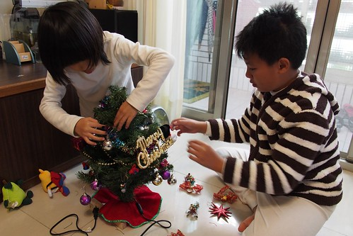 聖誕樹上工後的每天 放學回到家的兄妹倆做的第一件事就是按小雪人的小手 然後跟著雪人搖頭擺臀 大聲唱著 Merry Christmas 每天的30秒 一個月持續下來便是小人的歡樂濃濃聖誕月!

除此之外 更令小人雀躍的是每年一次的買禮物執行 聖誕節前的週六 徹爸領軍帶著兄妹倆先是去百貨公司買妹妹禮物  然後再去西門町買哥哥的禮物 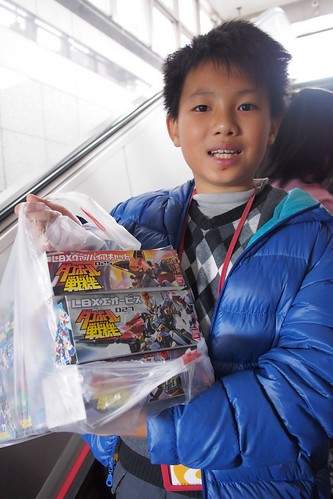 加上全花光自己的零用錢 徹哥不手軟的扛了三隻LBX回家 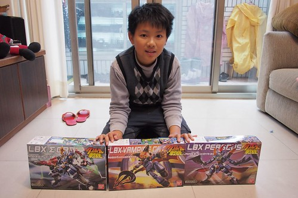 而妹妹則是買到大優惠的學校LOGO freiends 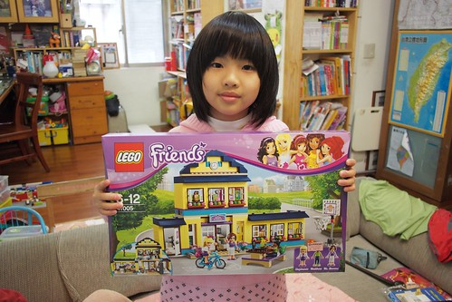 那個下午 兄妹倆開心到最高點 只是這樣排排擺出來 真的敗家的有點嚇人哩 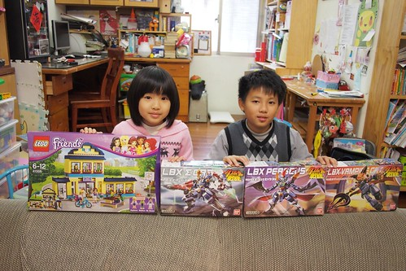 再看入睡前 床頭上床邊上的琳瑯滿目.... 嘖嘖~ 會不會睡覺也在笑阿?! 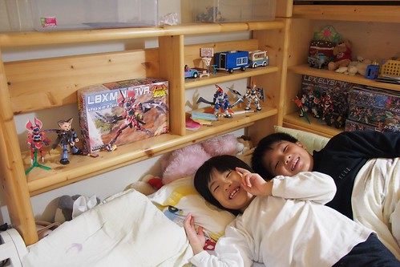 佈置完聖誕樹 買好聖誕禮物 小人的聖誕節就算是完整了 也因此聖誕夜理所當然的一如平常夜晚 但來張全家福平安一下 ! 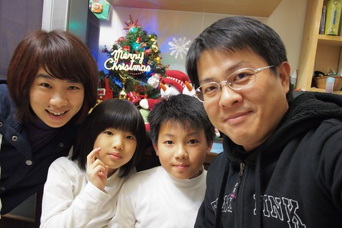 相隔一個禮拜的跨年夜 本來也是一如平常 但因為有了同事臨時順道幫忙買的豬排拉麵蛋糕 2013的最後一晚被小小點綴的delicious  原來驚喜真的可以用錢買到! 哈哈!! 雖然被同事笑說 務實的我竟也會跟團 但媽媽偶而也是會想給小孩子小小驚喜與開心的啦~  吃完蛋糕 徹愛如平常時間上床睡覺 而我跟老爺也一樣的窩在沙發看完日劇後睡覺去 睡飽飽迎接好天氣的2014第一天~  繼民國一百年的元旦升旗跟健行後 不愛熱鬧的徹家再次參加元旦健行  (最近徹哥很喜歡勾媽媽的手 感覺小甜蜜) 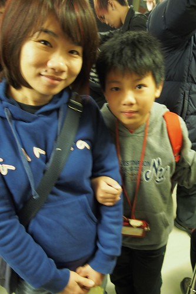 這天 天氣真的很好! 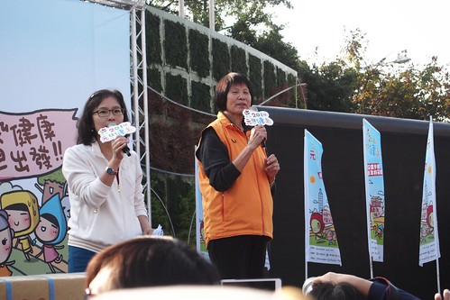 好天氣出門曬太陽  跟著人群湊熱鬧挺不賴  久違的大太陽 讓太陽下啃著飯糰的我們在一開年就覺得溫暖  而除了大太陽 今天陪伴我們的還有同事帶來的一雙狗女兒  常嚷著要養狗的阿徹 剛好有機會當半日狗主人  體驗原來養狗跟養小孩一樣不是件簡單的事!  健行從圓山站出發 經過美術館  新生公園 到大佳河濱公園 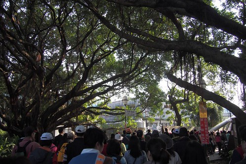 把整個花博園區走過一圈  長長的人龍慢慢走  而每個人臉上都有曬著太陽的幸福笑容 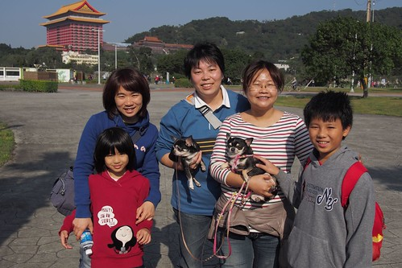 大藍天下 當然要多拍幾張 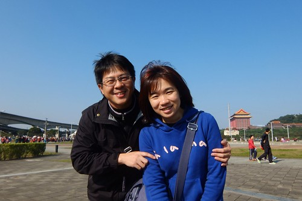 話說一 我們家的徹哥真的越來越大漢了阿!  話說二 我們家的愛妹也越來越女孩樣啦!  好啦! 開年第一天就讓媽媽感嘆一下 時間納ㄟ過這捏緊???!!!   花博已是三年前的事 三年三年這樣過真是快! 下個三年後 我們的徹哥應該就比我大隻 而愛妹不知道還會不會願意親他老爸... 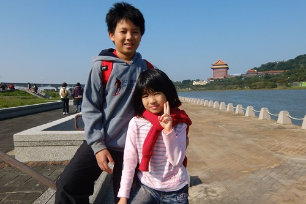 9點出發 11點回到圓山站  結束我們開年第一件事 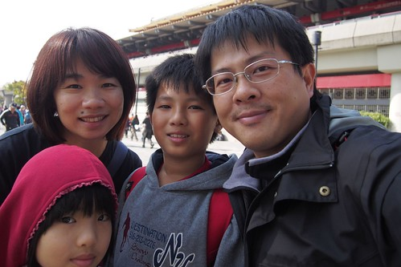 成功! 擊掌!! 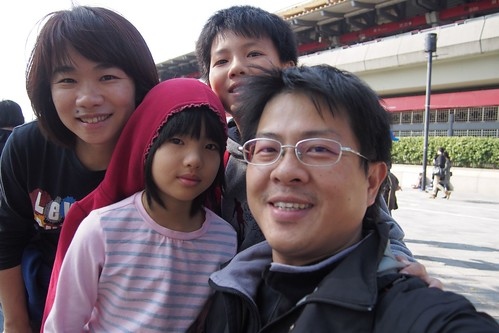 只是那個剛鬧彆扭 紅完眼的小姑娘也未免太帥了  更厲害的是 還就這麼戴著小紅帽回家了 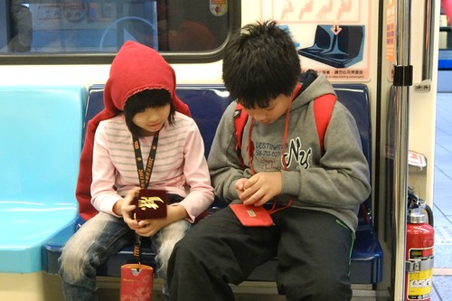 很妙的兄妹倆  馬年要一馬當先 馬到成功阿~ 

那天晚上一家子去吃涮涮鍋時 為了讓總是吃的太專心的一家子吃慢點 徹爸提議各自說說新年新希望 從年紀小的開始 妹妹說  希望老師不要那麼兇!   這當中包含對現在老師的無奈與對即將三年級新老師的期望 哥哥說  希望LBX大降價! 挖嘞~果然一直是個天真純蠢的小孩阿 爸爸說  希望給我好多錢............... 阿嘞~感覺來鬧的... 媽媽說(是滴!媽媽最老) 希望當老闆娘!!!!!!!!!!!! 既然大家這麼不客氣 那我也不客氣了... 但真的! 一家子可以每天每年這樣平安開心在一起就是徹家最大的幸福與希望阿! 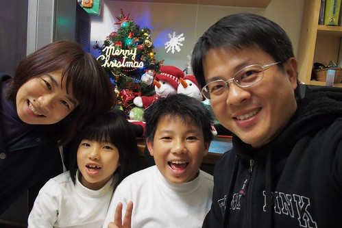 送走2013 迎接2014  我們要一生一世喔~
