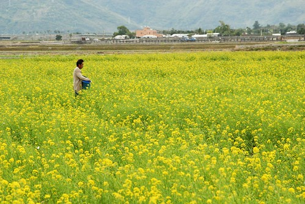
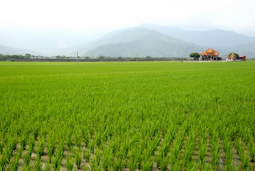

看到徹伯有關有機稻米的疑問 我忍不住想多寫些自己的想法 如果是徹家BLOG忠實讀者的人一定知道徹家很喜歡去花東 尤其超愛南花蓮與關山池上那一片片連綿的稻田 愛到我想收藏每一幕的春耕 夏耘 秋收與冬藏… 我很難忘記坐在池上萬安稻米原鄉館  看著一望無際的田 一口口咀嚼著萬安米的那種滿足與感動… 其實不過就是稻米 就是米飯 我們從小吃到大而且還每天吃的東西! 

南島秧滿田送來的那天 接到宅配人員的電話後 我高興的忍不住跟同事分享開心 同事A說”我發現只有池上的米吃起來跟日本米沒差” 然後敘說著他們將COSTCO買的日本米與台灣西部,花蓮米等經過一番實驗後 “証實”只有池上的米吃起來跟日本米難以分辨 嗯~ 果然是知識份子中的精英 不只生活要求高也很有研究的精神 同事B這時後很靦腆的說”我覺得只有去日本玩 在那吃的米好吃” 唉~對於這個我每次看他吃東西都覺得東西可憐的妹妹(話說當媽的實在很難接受人食之無味的樣子) 心裡忍不住替我們台灣米抱屈…

吃東西就跟養小孩一樣 每個媽媽都有自己的一套看法與實踐法 而怎麼選 怎麼買怎麼做也都沒有絕對的對與錯 好與壞 能力好的 非要滿足期待的 或有不得不的堅持的 那就努力去實踐 但”量力而為”是我們認為很重要的準則與”底線” 因為如果這些立意良善的好 得讓自己在過程中承受超出負荷的壓力 那一切都是枉然 更況很多事情都是環環相扣的 就如家庭,學校與社會是教育裡分不開的三環 而一個人的健康也不會只單單靠健康的食物便建立

可能因為從小家裡就是做生意的關係(是菜市場裡賣水果 賣豬肉 賣麵這種摸得到東西的小生意) 我一直相信所謂的”一分錢一分貨” 一份好的東西 或許是外觀的好 或許是本質的好 一定是多付出些心力才能獲得的 所以有機食物的價格勢必某種程度因為有機肥比農肥貴1-200倍以及要通過有機認證的龐大費用而高昂 而自然農法的作物 則因為農夫為了與天與蟲害作戰所需的勞心力付出 其價格更是農人用每一滴汗水所換來的… 農夫一直都是辛苦的 如果可以他們也絕對不喜歡用會傷害他們身體的農藥 可是當消費者一味的追逐”便宜” 當菜蟲一再的掌握 操控著菜價 為了生活 他們當然只好用著可以大量生產 可以風險較低的方法生產著… 很高興這一兩年自己透過一個連一個的FB資訊 接觸也了解更多有關這方面的事 看到有越來越多的人在各個領域/面象 讓各地農產品走出自己的風格 自己的品牌  把台灣的好東西推廣給大家  是很令人感動與欣慰的… 因為這些札札實實的影響著我們的生活 我們的下一代…

今天上課演講者講述健保藥價政策相關議題 當中有幾話 很適用於現今的任何自由市場 很值得深思 “價格”取決於”價值” “價格”與”品質”間的平衡 大部分採用自然農法或有機的食材 先不論健康面問題 其口感或是味道的深層感是真的會比一般農法的好很多 所以我會買有機商店的香菇 因為真的又厚又香 會買一顆快10元的蛋(沒有有機蛋喔) 因為打到碗裡就可以感受到蛋黃的彈性與新鮮 也會買比台糖的砂糖要貴2-3倍價錢的原色細冰糖做蛋糕 因為用粗糖讓蛋糕好吃 負擔又少 但是我很少買有機菜 因為菜市場有幾攤自種自賣的菜攤 而且我可以透過購買當季食材以及適當的清洗浸泡來減少農藥的傷害 我更是不買有機商店裡販賣的各種健康食品 因為我一直相信均衡的飲食 正常的生活作息 適當的運動習慣更甚於這些…

前陣子在稻米料理課吃過青松家的秈稻十號米 我驚為天人 因此寫信去問了有關認穀的事  而收到青松用心的回信我更是超級的感心 只是當我仔細的計算所需的支出而最後做出不訂購的決定時 心裡對於青松更是超級的愧疚與抱歉 因為在他如此繁忙的農務中還得撥出時間回信給我 而我卻是這樣回報他… 原本我曾想賴皮的就不回信 當作我是個沒有進一步消息的奧客 但我心揪的很難過 所以我還是寫了封信跟他道歉 而且還老實的跟他說明我的考量 而沒想到的是青松又回了一封更長的信給我: “真的很高興收到您的回信 其實  您真的不需要放在心上 儘管對農民而言 實際購買的支持很重要 但是 對青松來說 理念上的肯定更難能可貴！ 只要您對我們的想法跟做法有興趣 隨時歡迎您到田邊來走走 或是參加穀東穀友們的聚會 種田不但是青松維生的方式 更是青松藉以結交朋友跟宣傳理念的方法！ 最近  在我們住的深溝村附近 多了幾位無農藥或自然耕作的小農夥伴 她們栽培稻作的方式或許各有不同 但誠懇用心卻是一致 或許她們沒有冷藏設備可長期保持鮮度 但是在夏末收成直到冬日之間 品質上應無太大差異 我想 如果您願意支持我們在水源地帶的農田 進行這般對環境友善的小農耕作的話 或許也可以試著與她們連絡看看 我想在價格上面 應該能減輕一些您的負擔...” 並且與我分享了一篇他在歸農初期寫的文章 (2006.02  "這麼貴的米…徘徊在都市與田庄之間" 有興趣的可以google看看  就不方便貼文/引用了) 看到台灣因著這些人而漸漸興起的農業文化革命 我樂觀的相信台灣絕對會越來越好 而這些好絕對不是鴻海 不是HTC這些科技業所能帶來的…. 
