我一直覺得我們家是住在城市裡的鄉巴佬 我跟徹爸除了每天上班時的通勤於台北市外(還有剪頭髮) 為了其他事進城的次數少之又少 所以我沒去過永康街 不知道貴婦百貨公司在哪 就連信義區也N多年沒去過 更別說網路上大家傳的沸沸揚揚的各式美食或小舖 這回趁著過年後的補班日 難得我們一家子進城嬉遊 逛國際書展 帶愛愛第一次近距離看101 元宵節燈展... 雖然我們一直嚮往著鄉下生活 但還是得說除了天氣外 台北還真是個好城市!

我們家到世貿的次數五根手指頭數都數的完 而這是我們第一次逛國際書展 逛書展開開眼界 也療慰我們這幾個月來少了天才書局這個好鄰居的遺憾 可是書展除了書多外 完全沒有任何可以沉浸書香的氛圍 熱鬧的倒是比較像是個大拜拜 (玟姿阿姨這是老闆努力要照給你看的幾米)  

雖然一樣是人多 兒童館相較之下起碼還有著閱讀的品質 只是得忍受業務員門不斷迎面而來的"媽媽 這個很適合小孩子 這個對小孩子很好..." 幸好我的定力夠到很屌 阿徹們也知道媽媽的原則 我們單純的逛與看 看到喜羊羊 阿徹流著口水的聲音說"我好想都買回家阿" 媽媽說"家裡的已經很多了 還買~~~" 荼腦的書籍真的不要太多阿! 不過在天下出版社 買到了阿徹有興趣但一直沒找著的美勞書籍 阿徹滿意的不得了 其實書展裡真的很走馬看花 也擁擠的讓人頭暈目眩 但看到這原子筆促銷活動 我們竟然駐足觀賞良久且還呵呵大笑 雖然總共也才花了兩個小時 逛了兩個館 但起碼我們來書展開過眼界 湊過熱鬧了 [ 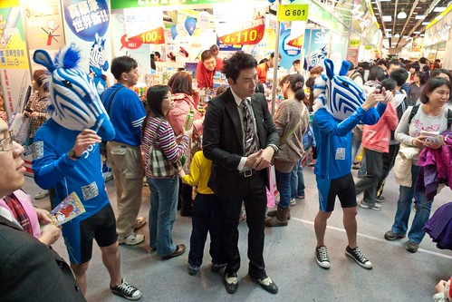](http://www.flickr.com/photos/33703965@N00/6952354631/ "20120204_P1090432")期間 從一館移動到三館的路上經過101  這是我們難得的近距離"觀賞"101 問愛愛"很高吧?" 愛愛很不以為然的搖搖頭說"新巨蛋比較高" 完全不是我們原先預期的驚喜或是讚嘆反映 果然很有愛愛的風格  我們進入101 買了M叔叔的蛋捲冰淇淋 坐在101外頭廣場吃冰看人 [ 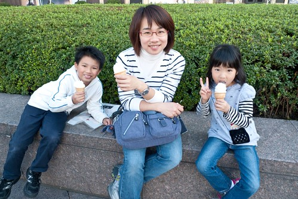](http://www.flickr.com/photos/33703965@N00/6808668074/ "20120204_P1090419")雖然冰淇淋等級只有M 但醉翁之意不在酒.. 我們一家子還是吃的很開心 (比噁心的父子倆) [ 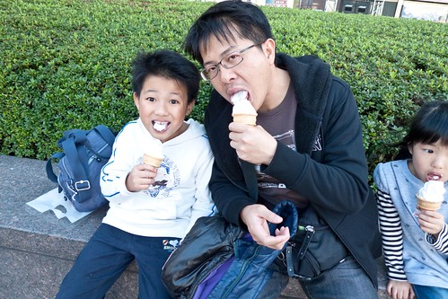](http://www.flickr.com/photos/33703965@N00/6808662020/ "20120204_P1090421")(比可愛的父女倆) [ 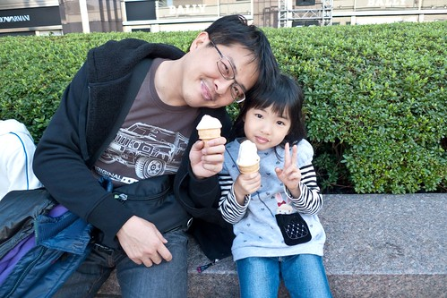](http://www.flickr.com/photos/33703965@N00/6954769017/ "20120204_P1090423")101下的蛋捲冰淇淋是我們家的101回憶! [ 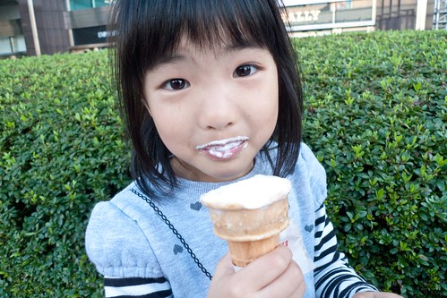](http://www.flickr.com/photos/33703965@N00/6808656892/ "20120204_P1090424")不過話說101真的長的有點奇怪 呵呵~  逛完書展後 我們順道去看台北元宵燈節 五點 天還沒黑 燈還沒亮 看燈會的人潮卻也不少了  雖然101近看實在不怎麼樣 但真是超明顯的地標 我們照相時總忍不住把101一起入鏡 超級的觀光客 [ 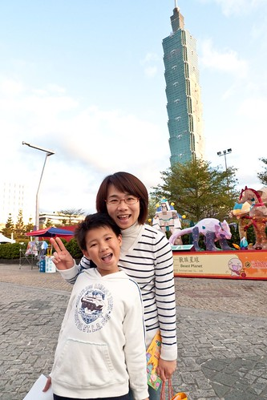](http://www.flickr.com/photos/33703965@N00/6952334407/ "20120204_P1090440")我們像是在逛公園般的觀賞著市府前的花燈區 阿徹很喜歡這系列的五路財神 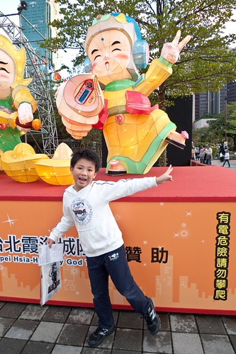 阿徹希望他也能有自己的筆電  希望他有好多錢 話說前陣子阿徹跟我說他現在的夢想有三個(之前都只有一個) 除了忍者外 還希望自己變成是大富翁 是科學家... 看的出來他是個很貪心又很異想天開的小孩子  園區裡還有一系列卡通故事版花燈 徹愛每個都喜歡的不得了 一個一個的照相留念 小鹿斑比小仙子  小猴子 (愛OS: 哥哥你不用裝就很像頑皮的小猴子了啦) 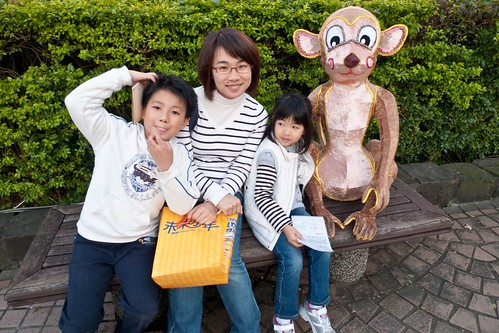 台灣黑熊  愛麗絲夢遊仙境  而愛心相框當然一定來一張的嚕  愛麗絲?! 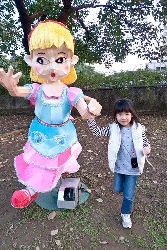 巫婆說"可愛的小朋友 你在看什麼阿?" [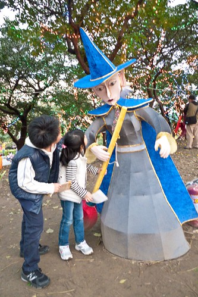](http://www.flickr.com/photos/33703965@N00/6952282069/ "20120204_P1090466") 小美人魚?! 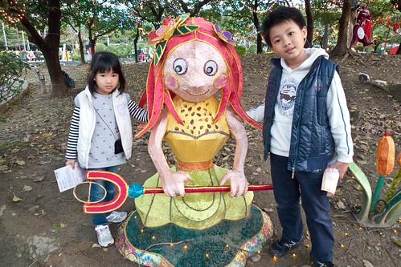 噴火龍 這時候花燈開始一一的亮了起來  其實這區的花燈白天看就夠有一番趣味了  術精靈  愛愛不懂占卜是什麼 倒是像拜拜似的 很認真的許了願望 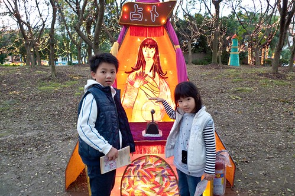 團團圓圓  樹上可愛的小蝙蝠 真的不得不佩服做這些花燈人的巧手與創意期間徹愛也完成六個燈會章的蓋印 雖然沒法換得小禮物了 但一群小朋友還是蓋的很認真很開心 [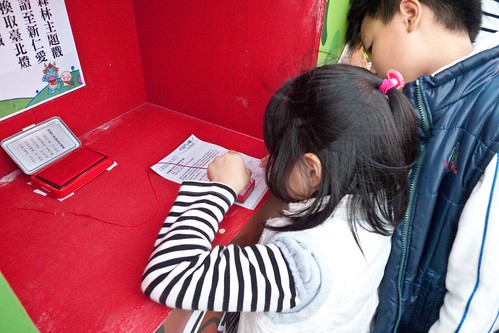](http://www.flickr.com/photos/33703965@N00/6806188284/ "20120204_P1090454") 阿徹說燈會真是太好看啦  不過 主燈所在的國父紀念館區還沒逛到ㄋ 去燈會美食街買些點心 四個人坐在街頭嗑飽後繼續再戰!  只是沒想到天黑後 才是燈會活動熱鬧的開始 國父紀念館廣場 人山人海阿 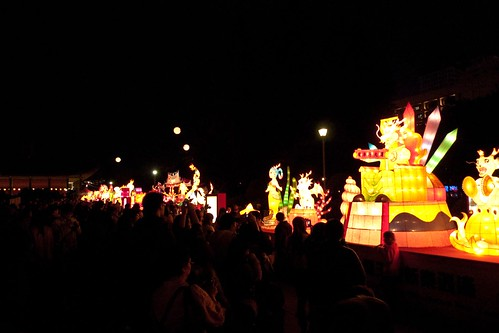 雖然這的主題花燈都很"大" 但反倒不怎麼吸引我們  而且人潮多到沒法好好看花燈 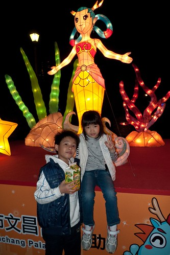 我們索性找個地方坐下來等著主燈秀 看著101外牆上的圖形變化還挺有趣的 101真的就好像一個放送 健康 平安 幸福的大禮物盒那時候我傻傻的以為每半點就有一次主燈秀 結果沒想到是一小時後的七點才開始 沒耐性又懼怕人潮的我們於是決定打到回府了  離去前 跟主燈照個到佌一遊照 只是不管怎麼拍 都看不太出主燈的龍樣哩 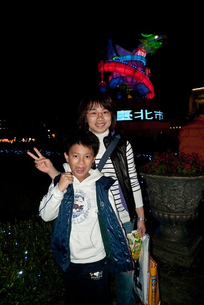 徹爸不死心的拍了好多張 還換了幾各角度... 好吧! 結論是這龍就長這樣... 離開主燈 沒想到接下來才是我們今日的最大挑戰 那個人潮  而且還是與我們反方向的人潮還真是多到誇張 阿徹說"怎麼這麼多人" 我說"跨年應該比這還要多" 原本今年初看完電視上101煙火 信誓旦旦說今年要去跨年看煙火的阿徹立刻搖搖頭說"那我不要去跨年了" 果然人潮恐懼症是會遺傳的 亦或者這也算是種家庭教育! 那天回到板橋 順道買了桶早答應徹愛的肯德基炸雞回家當晚餐 穿著舒服的衣褲 不計形象的抖著腳啃著雞肉  果然還是在家裡最舒服 最自在阿~

順道紀錄一下我們的城市生活另一章 過完年收到兩廳院電子報 看到之前花博看過的舞鈴劇團有新演出 二話不說的就定了二月底四張第二貴的票 徹爸幫我去拿票時 看到票價忍不住咋舌 我笑說"藝術是無價的" 不過真是很想再見舞鈴的表演 而且我相信舞鈴的表演值得好的位置的欣賞 228連假前的週五晚上 我們開演前5分鐘才抵達 抵達後發現人還頂多的耶 不像新聞上說的那樣冷清阿 (表演日前兩天 徹爸問我到底是要去看什麼 我為了讓他知道這是人家說的定目劇 我上網估才發現原來這陣子舞鈴的新聞炒的有點熱) 結果原來是美青姐也來看戲啦!  我說"哇哈哈~ 總算我也親眼見過美青姐了" 不得不說 酷酷嫂真的很有魅力 给他讚! 而因為美青姐 我那晚的情緒更是亢奮了 徹愛則依然因為舞鈴精彩且精湛表演看的目不轉睛 猛呼"太好看了" 尤其小有扯鈴技巧的阿徹更是讚歎加敬佩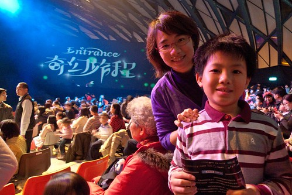 其實這是一各完全沒有言語的舞蹈表演 某些意境轉換還真是看不太懂(只能怪自己藝術修養太差) 但還是看的起雞皮疙瘩 忍不住的一再拍手叫好! 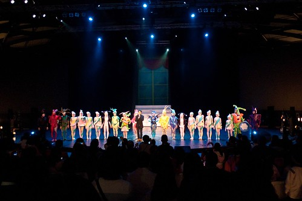 很棒的表演! 值得大家的支持!! 很高興我們參與了其中的一場...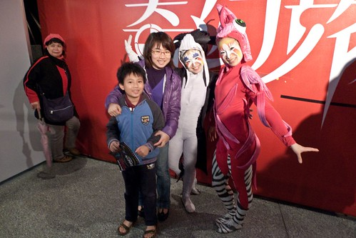 從舞蝶館往圓山站的天橋上 我們全家自拍一張留念 就如阿徹說的"今天晚上真是太特別 太美好了!" (因為難得週五晚上不是在趕功課 而是看了這麼好看的表演)
