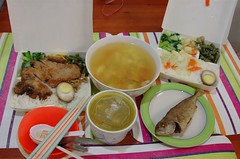

趕了好幾週的工作總算暫時可以喘口氣了  
這兩週雖然還是一樣的快9點才帶阿徹出門上學  
下午5點便趕回家接小孩  
但卻沒啥時間上網閒晃蕩寫日記了(哈 很委屈的樣子)  
還破天荒的帶了幾次工作回家做  
所以那些平常用不知是酸還是羨慕口氣跟我說"這麼爽的工作"的人  
請別再笑我在這裡"養老"啦  
我偶而還是小有工作壓力的...

其實搞成這樣也怨不得別人  
自己不放心把跑出來的資料交給別人整理撰文就算了  
還發揮寫論文時的龜毛性格  
后~真的只能說自己 活該死好  
(不小心常擺臭臉色給同事看 在此小小懺悔一下)

上班的日子裡 自己就像陀螺轉ㄚ轉~  
每天匆忙的趕在5點離開辦公室  
然後提著大袋小包的書包奶袋水果趕捷運(還提過幾次小玉喔)  
回到家喝杯水稍微喘一下後  
便又出門以捷運站為中心的繞3/4圈去接兩個小孩  
常常得花40-50分鐘 才能滿載而歸  
(前揹妹妹 後揹阿徹書包 右掛小愛雜物包 左拿兩盒便當 偶而在加掛個雨傘)  
然後拖著步伐爬上四樓  
偶而還得讓在前頭蹦蹦跳跳阿徹回身下樓牽著我走到家門口  
哈!其實也不是真沒力氣  
只是覺得阿徹現在很棒 只要我有揹妹妹一定認命的自己走路走樓梯  
偶而稍微稱讚一下 更是high到一股作氣衝到四樓  
然後問我"怎麼這麼慢阿~"  
我說"媽媽沒力氣啦~"  
他便會很好心的再下半層樓拉著我的手往上走  
每每看到他這貼心的模樣 就覺得辛苦是值得的  
(本來要說"就一點都不覺得累了" 但想想這話太"假"了啦 因為真的就很累ㄇㄟ)

一天一家人都回到家後 彷彿才是一天生活重心的開始  
回到家後的阿徹開始建設他的家(對我來說當然是破壞)  
而在爸爸回到家前 妹妹幾乎都是被打發的也就是"麥靠兜後"  
偶而我累的眼皮快撐不住時便會耍心機的"建議"阿徹到房裡玩遊戲  
然後把妹妹放在大床上看著哥哥東忙西玩  
自己趁機打個盹 瞇個幾分鐘  
有天阿徹要我陪他玩時  
我說"媽媽快沒電了 要充電一下 要不然會像火車一樣走不動還有ㄍㄧㄍㄧ的聲音"  
他竟然就也同意的說"好"然後自己玩

待我充完電就得來解決母子倆的肚子嚕  
還沒搬到板橋前 吃膩外食時還會下下廚  
現在每天要搞這兩個一大一小  
加上住家附近就有一家好吃不油不膩的便當店  
我家瓦斯爐只有偶而拿來煮海鮮粥煮湯還有煮開水

  
吃晚餐算是一天中最難應付的一件事了  
因為永遠不知道今晚這兩個小子又有啥狀況發生  
常常得一邊張羅妹妹吃牙餅或搖推車  
一邊自己扒飯 一邊督促(餵)阿徹吃飯  
很怪 聽說阿徹在學校吃飯特讚不用老師擔心  
但回家也不知是耍賴還是耍嬌常吃沒幾口就討餵  
曾經為了堅持他自己吃飯這事  搞的每天吃飯就是大人兇小孩哭  
後來我還是投降的選擇 "賣靠兜後"  
我知道很糟糕  
但也只能安慰自己"他行的啦 他只是在撒嬌 所以沒啥嚴重的啦"

吃飽飯後  
阿徹更是加緊油門 火力全開的玩嚕  
常常爸爸回家時家裡已是戰火進行的如火如荼 滿地玩具  
等爸爸吃飽飯加入戰局 戰火升到最高點~  
玩到爸媽沒力 阿徹爽了願意洗澡了 戰火方歇

通常洗完澡 就讓阿徹玩些靜態的遊戲並收拾他造成的殘局  
然後講幾本故事正式開始睡覺的程序  
很奇怪 妹妹這期間都在做什麼ㄚ  
也許在地上或是床上看著哥哥大戰(已經會偷偷想拿哥哥的東西了)  
也許被從戰火脫身的爸爸或媽媽抱著逗弄

等到阿徹10點左右睡著了  
這個家才總算寧靜了~  
但我的一天可還沒結束ㄋ...  
還有洗衣服 洗奶瓶 吃水果 擠奶 晾衣服等一堆瑣事等著我  
常常半夜12點站在陽台晾衣服時想著"這樣的日子還要熬多久ㄚ"

有時常想生活不就是希望每天能有些時間運動  
有些時間看自己想看的書  
有些時間陪自己的小孩盡情玩耍  
這麼簡單的要求怎麼執行起來卻是這麼的困難重重  
不過自己算是幸運幸福的  
起碼可以利用上班午休時間一週上個兩次有氧課  
可以利用上下班坐捷運的時間看本有興趣的小說  
每天準時5點下班回家陪小孩成長  
徹爸曾經用既哀怨又羨慕的口氣跟我說 "你的生活真多采多姿"  
聽到真想從他頭上扁下去 "你老婆每天累的跟狗一樣 還多采多姿勒"  
不過說真的  我真的是隻幸福的狗啦~
