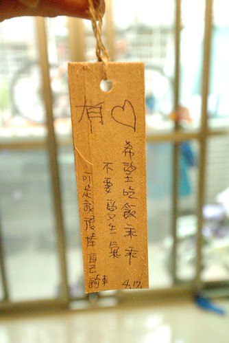
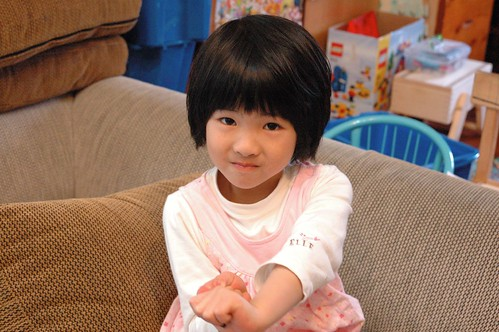
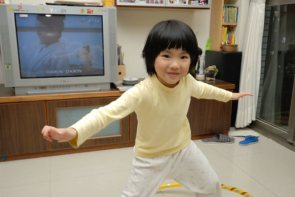
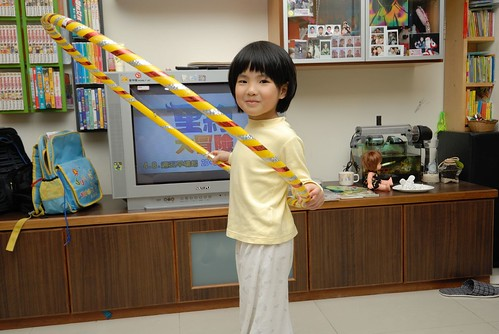
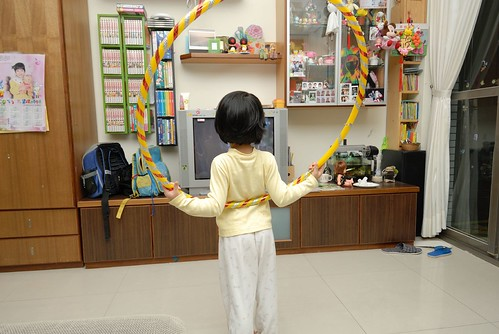
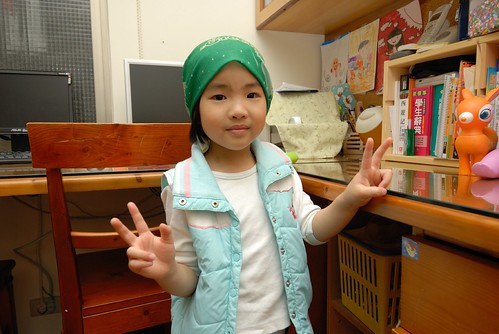
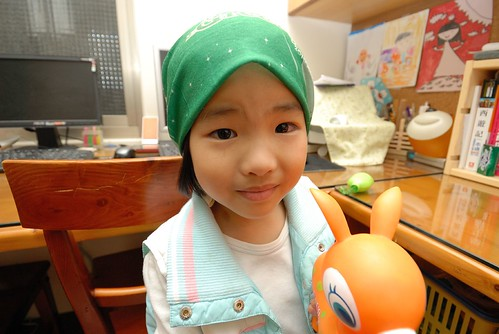
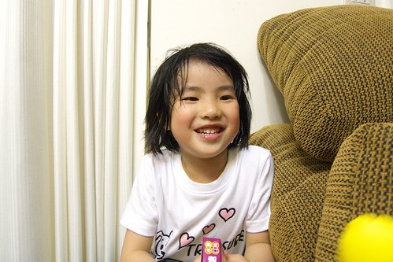
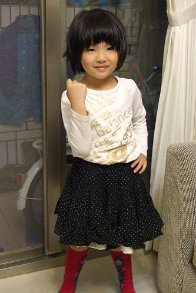
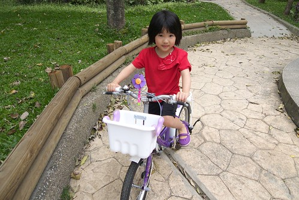

愛愛總說"我會寫自己的名字喔!" 真的! 她真的會寫自己的名字 只不過那個筆劃很多的"愛"都用愛心圖案代替了 這是她上中班後 我教她寫自己名字的方法 而她竟然就真以為自己會寫名字而且還很洋洋得意ㄋ 池上飯包故事館寫的許願卡上  愛愛在我幫她寫下心願後也寫下了她自己的名字...  

為什麼愛愛的名字叫做"愛"? 話說是因為我生阿徹那陣子 看了部台灣電視劇 裡面的女主角叫"天愛" 喜歡劇中女孩那可愛又有點含蓄的模樣 也喜歡大家喊那女孩名字的那份感覺 從此我幻想著以後生女兒的話也要叫做"愛" 後來真的生了個女兒了 於是我家就也有個愛了 阿嬤拿去給人合筆劃 算命的說"三個字都是土 不好哩" 堅持的我們提議那請示家裡菩薩的意見 所幸菩薩有保佑 有擲到杯 於是我們真的給女兒取了個已經取很久的名字... 從愛愛小時後到現在 每次去新的診所或哪填資料時 常會有小姐忍不住說好特別的名字或是好像韓劇的名字阿! 真是歹勢 我不看韓劇的啦! 不過我們是真的很喜歡愛愛的這個名字!! 甚至就像有本童書'我的名字Chrysanthemum'上的情節 ' 她愛那名字的聲音 她媽媽叫她醒來 她愛那名字的聲音 她爸爸叫她吃飯...她愛那名字的聲音' 'Chrysanthemum愛她的名字寫下來的樣子 用墨水寫在信封上........... Chrysanthemum認為她的名字是絕對的完美....' 只不過目前都是我跟徹爸兩人對於這名字的迷戀與自我陶醉 希望有一天愛愛也真能如我們一樣的 這樣深深喜歡她的名字!!  

許願卡上寫了現階段生活中 愛愛最需要學習的三件事 1. 希望吃飯乖乖 其實愛愛的半小時吃飯時間還在我能接受的合理時間範圍內 只是常一開始吃的慢慢慢 到後頭只好吃的趕趕趕 然後因為超時而被處罰不能吃點心或罰坐 而另方面愛愛的食量雖然不大 但也算正常的量 甚至每次吃完正餐 肚子都已圓滾滾時 還能彷若還有一個胃的大口吃點心跟水果 只是吃的都不長肉 像這回的16kg魔咒又已經徘徊數個月 每次量體重都很令人洩氣 所以我們還是希望能夠漸漸多ㄍ一ㄥ點愛愛的食量 好多長點肉阿!  不過愛愛的身高倒是一直有持續在長高中  同年齡中不算高但也絕對不算矮 只是因為瘦瘦的 所以讓人感覺一整個的迷你 不過小歸小 愛愛看起來也不會像是營養不良或是不愛吃飯的樣子 纖細的骨架外 可也是有一圈的肉保護著的 甚至還算小小有肌肉ㄋ  可能受哥哥喜歡'活動'的影響 愛愛也很愛跟著哥哥一起學呼拉圈 扯鈴 跳繩 騎腳踏車... 我們也常會跟她說'所以要多吃點飯 這樣才更有力氣去運動喔'  每個看著blog裡的愛愛長大的叔叔阿姨 看到愛愛本人後幾乎都會說'本人感覺好小喔 ' 哈! 大家都被照片給騙了 尤其那透過鏡頭又更顯圓的圓臉讓叔叔阿姨都以為愛愛很大一隻阿  徹爸常開玩笑說'我真的不喜歡圓臉的女生 只有一個人除外...' 那一個人 講的就是他的心肝寶貝愛啦!  常捧著愛愛的臉說'你怎麼這麼可愛阿' 呵呵! 反正我們就是'自己小孩最可愛'的典型示範啦  不過愛愛的臉真的很圓喔 而且很容易一不小心睡不好或吃太多或笑太多就變成豬頭臉了  許願卡的第二件事是不要愛生氣 話說五歲的小女生 個性很簡單但脾氣還是會有那麼一點點的難搞(果真是狗都嫌的五歲)... 加上愛愛的語言邏輯跟表達能力很好 所以偶而顯得'伶牙利嘴' 甚至有點恰北北去了 因此我跟徹爸會特別噹愛愛的脾氣 就希望她能是個有想法但又溫柔的女生阿 (同時具備這兩點 以後哪個男生敢辜負愛愛  我跟徹爸絕對砍了他)  而許願卡的第三件事就是騎腳踏車 愛愛目前還是持續熱情且累積上路的經驗 期待她假以時日也能像哥哥那樣耐操耐凍!!  前陣子愛愛很愛問'我什麼時候上大班阿'  我都說'這個夏天就升大班嚕' 可能因為我常跟她說上大班後就可以怎樣... 所以愛愛很是期待升上大班後的日子 最近夏天真的到了 愛愛更是興奮'OH! 我快要變大班了 還有幾天變大班阿?' 看著她那日亦成熟但永遠是我們心肝寶貝的小臉 我心裡os著 '時間可不可以過的慢一點阿....'
