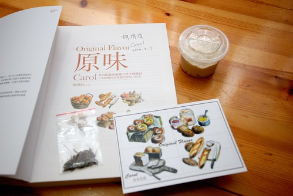
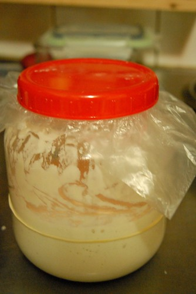
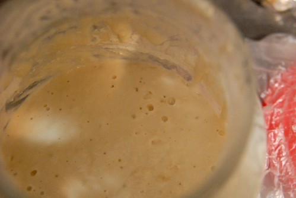
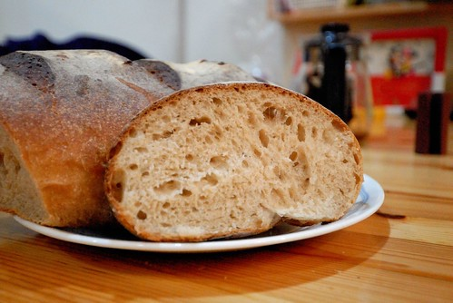
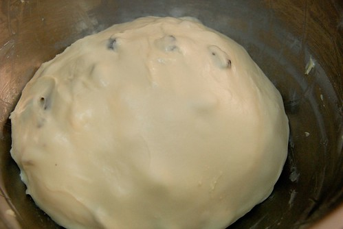
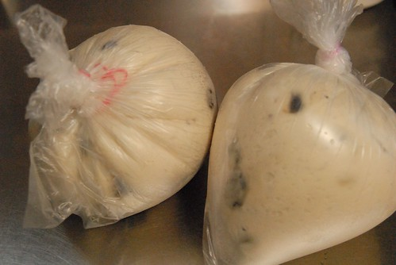
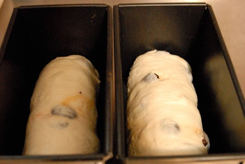
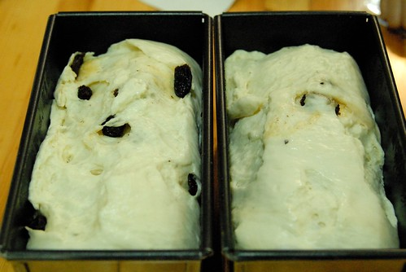
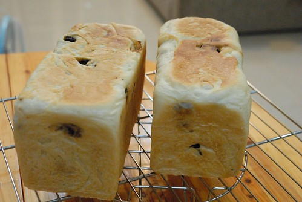
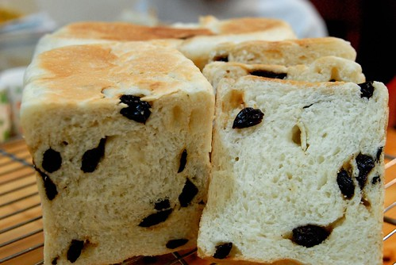

最近我多了一個寶寶 一個一樣讓我歡喜讓我憂的寶寶 不過這個寶寶不是從我肚子出來的 是從我最喜歡的carol老師那領養來的青梅寶寶 有了這寶寶  我也可以開始享受"純天然"麵包帶來的成就與驚喜 只是寶寶真的都折騰人  不只讓人早晚惦記著餵養 還時刻擔心活力是否足夠 而最後麵包的成敗更是考驗養主我對於她的了解與掌握! 徹爸笑說"真是涯給 沒事找事做"  哈哈~ 沒法再生老三玩 養個這樣寶寶刺激一下生活也是很不錯的 不過真的就像每一樣手作 只要開始動手 體驗出個中滋味 心裡就會益發踏實與豐盈! 感恩! 我的酵母寶寶帶給我們全家這樣天然又美味的麵包!! 希望也能像carol老師的寶寶那樣生生不息下去!!!

carol老師前陣子又出了本新書 雖然手上的麵包書已夠應付我日常所做 但老師的書甫一上架 我還是忍不住就買了 後來在老師的格子上看到第一場剛好就在板橋誠品辦的新書簽名會將會分享她那養了三年多的青梅寶寶 哇! 那對我很遙不可及  每次想到就覺得很搞缸的天然酵母竟可以這樣無勞而獲得 真是有種天掉下來禮物的開心與期待阿! 於是3/1號星期五晚上 我在經歷一週爆腦的開會工作週後 挺著站到快斷掉的腰 親眼看到老師優雅又有效率的揉麵糰示範  且領到老師的簽名與酵母寶寶 手中拿著的小小一碗天然酵母 我的養母生活就此展此!  照著老師當天的叮囑以及上網反覆看老師寫的相關文章   我開始早晚餵養寶寶 想不到 真的這麼神奇~ 寶寶一暝大好幾吋阿~ 幾乎成倍速成長的體積 讓徹爸看的驚呼"好像異形阿"  還說會不會有一天酵母一發不可收拾淹沒家裡 ㄟ.... 這樣很汙衊無辜的酵母寶寶哩....  雖然養酵母就如老師說的那樣簡單 早晚餵養即可 但開始當養母後 真的是....書上說的都很簡單! 擔心餵養的濃稠 擔心酵母壞掉死掉 擔心酵母活力不好.... 我常三不五時就拿出罐子瞧一瞧 而每一次開蓋時也總大力聞聞是否有代表酵母活力的酒味 雖然常會被嗆但這樣心裡才踏實 因為代表我的寶寶還健康的活著阿  養了一週後 總算在克服諸多自己惱自己的問題後 (有些問題真的很間單 可是剛當養母就是很呆 幸好留言問了老師後 老師的回答點通自己的任督二脈 ) 我烤出我的第一個純天然酵母麵包!!!  雖然因為沒想到麵包長這麼大而讓上層有點烤焦 但切開後 看到散佈著一個個大小不一氣孔的麵包 我內心激動不已阿~ 這是天然酵母麵包沒錯阿!!! 我們心懷感激且珍惜的吃著這得來不易的天然麵包 口口都是青梅寶寶的果香與甜味!

再養了一週後(中間沒時間做麵包把酵母放到冰箱休眠幾天) 第二次挑戰葡萄乾吐司(莫名覺得葡萄乾跟青梅酵母一定很速配) 照著老師書上寫的配方 以及自己試情況添加液體(這是做天然酵母麵包最大的挑戰 因為每個人的(甚至每一次)酵母個性都不一樣 是很需要累積經驗與磨練的地方) 想不到竟打出自已從沒見過的如此柔軟與光澤的麵糰  我心裡再次好激動阿!  第一次發酵完後 因為時間不夠便依照簽書會上老師教的方式把麵糰包好冰在冰箱 隔日再繼續接下來的程序 第二天把麵糰從冰箱裡拿出 看到好像快要擠破袋子的麵糰 自己又忍不住呵呵兩聲 寶寶真的好有活力阿  接著剩下的整形工作 把麵糰安穩的放到吐司模裡做最後的長大  沒想到麵糰順利的發到9分滿 可是表皮都破掉啦!  酵母寶寶的"氣"旺的很出乎想像與掌控阿!!  表皮破的太醜 只好把模子蓋上蓋子進爐烤 幸好烤出來後的外表雖然差強人意 但起碼還可以稱上是吐司  等吐司放涼 當然要切片看麵包體內的模樣 果然還是個好寶寶  簽書會上carol老師說 她的青梅寶寶已經養了三年多而且活力一直非常好 覺得自己很幸運的可以分享到老師這可作為傳家寶的青梅寶寶 而經過這幾週的餵養以及動手作麵包 真的益發體會到做天然酵母的樂趣所在 雖然做麵包的時機不若以前用速發酵母做麵包那樣方便 且可能也沒比較好吃 但我喜歡一口咬下天然酵母麵包後 嘴裡嚐到的那一點點酸 一點點甜 也很高興一家子 尤其是阿徹跟我一樣期待與喜歡每次的天然酵母麵包!!!
