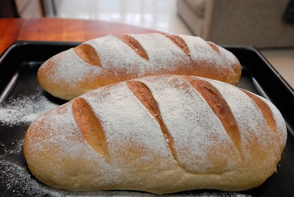
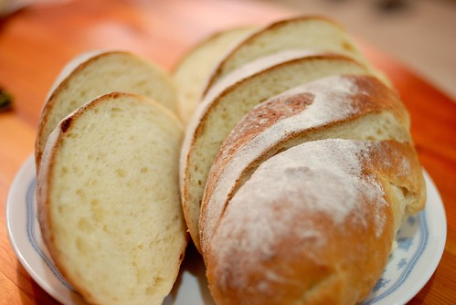

上週日的聖誕節 在嘉義曬到了好久沒曬到的太陽... 我說"在台北 人都快要發霉了 能這樣曬太陽真好"   阿徹點頭大喊"對阿!" 北迴23度半以南與以北的天氣真的差太多了... 幾波的寒流下來 愛愛已經受不了的問我"冬天什麼時後才會走阿?" 我說"好像才剛來沒很久說" 我也好懷念前陣子的秋天阿! 不只舒適宜人也是做麵包的好天氣阿!

話說3年多前上完救國團的麵包課程後  我買了一台立地式的攪拌缸回家 決定要買之前 徹爸說"我一輩子吃麵包花的錢 可能都還沒買這台機器來多" 手揉過兩次麵包 每次揉完都得貼藥布的我說"如果沒有機器幫助 家裡烤箱大概很難再飄出麵包香了" 於是我買了我生平最大的一樣"玩具"回家 而且因為老師有交代立地型的攪拌缸打出來的麵糰才夠勁 做出來的麵包才又軟又Q 所以我這初學者憑著一股衝勁與傻勁真的就買了一台立地式的攪拌缸回家 雖然買的是最小型的 但快20公斤的一台機器擺在廚房裡還是挺嚇人的 更別說每次使用時 那好像可以把手絞斷的氣勢 總讓徹爸神經緊張的一再提醒徹愛離這機器遠一點 有機器的頭一年裡 平均一兩週便會做一次吐司   兩片白吐司加上一杯拿鐵咖啡是我喜歡的簡單早餐 但除了我之外的一家子對這吐司的喜好卻好像很普普 中間 機器不知不覺被停機了一年的時間  原因也許是忙 是懶 更或許是沒有動勁吧 直到今年春天重新再讓烤箱飄香後 攪拌缸才又重見天日 偶而幫我打著各式各樣的麵糰

做麵包的程序其實很簡單 就是備料 -> 打(揉)麵糰 -> 第一次發酵  -> 滾圓 -> 整型 -> 第二次發酵 -> 進烤箱 但所需的過程時間卻很長 從小餐包的3小時到吐司的5小時不等 雖然步驟間的等候時間可以去做其他的事情 但心總是懸在廚房裡的麵糰 天氣熱時 擔心麵糰會不會長太快  一不小心就長過頭 天氣冷時 則擔心麵糰長不大 刻意營造溫暖的發酵環境外 還得時時留意提供溫度的熱水是否冷掉了 只有秋天時的26度上下  一整個做麵包的最佳溫度  麵包可以放著隨便長 而且還都漂亮的不得了 越多的手作練習 越來越能體會當初老師所說"麵包是活的" 濕度不同 溫度不同 甚至同一包麵粉在不同天的含水量便也不同.. 這麼多的不同都是影響最後麵包的重要因素 而一切只能依賴自己越來越多經驗累積的手去把量  今年的秋天因為週六常整天在家的原因  是攪拌缸開用來最密集做麵包的日子 而且除了自己越來越喜歡做麵包的過程與最後成果帶來的踏實味道外 很高興 家裡其他人也好像越來越喜歡我的媽媽牌麵包 徹爸也可以簡單的幾片麵包當早餐 甚至享受著下午來片麵包當點心的滿足感 阿徹則是全盤接受我端上桌的任何東西當做早餐  沒說過不喜歡的話但喜歡的時候會讓我知道 讓我開心...  這兩張照片是我麵糰開打以來 徹爸反應最熱烈的"米麵包' 加入煮的軟呼呼的米飯一起打的麵糰真的好保濕 好Q 好好吃 麵包甚至還帶有米飯的鍋巴香 一口接一口 越嚼越香 越是停不下來!!!
