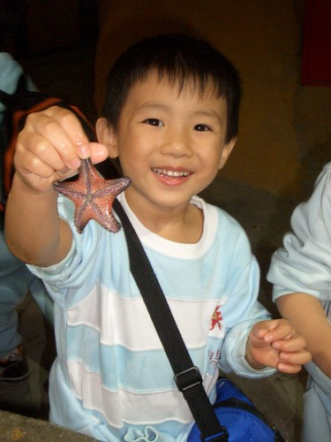
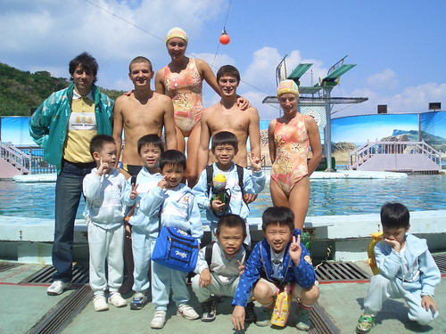
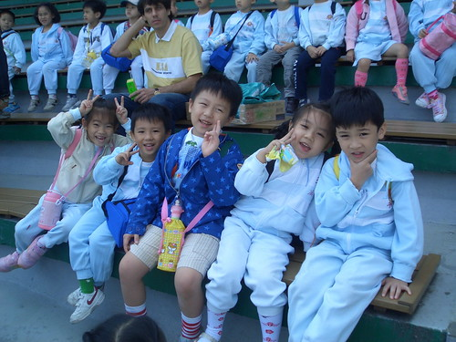
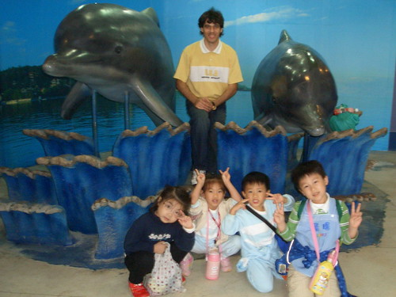
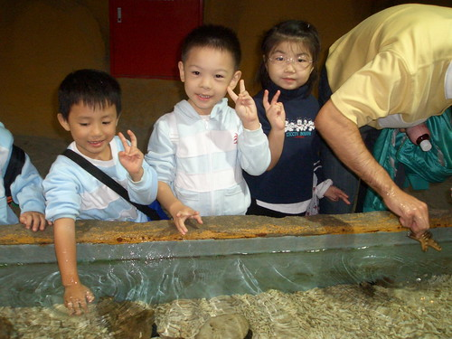

(原本燒呼呼的照片 被我放到都快冷掉了....)  
上上週五(10/19) 阿徹又有戶外教學了  
這回是"大"戶外教學的秋遊  一群小兒拉拔到野柳海洋世界  
看著介紹單上的 海豚表演 海獅表演 水族館.... 看的沒去過的媽媽也好想跟去  
問阿徹"我可不可以跟你們一起去ㄚ"  
阿徹說"可以ㄚ...你們可以開車跟在我們遊覽車的後面阿"  
聽的讓人覺得 莫非爸媽是他的拖油瓶  
  

這應該是傳說中讓小孩們看的嘖嘖稱奇的高空跳水表演人員  
  
  
  
這應該正準備看海獅還是海豚表演吧  
  
  
  
這...這...模擬實境的水族館嗎?  
(半年前遠從荷蘭來幫Tony哥哥的Martin 越來越shiny了  
 聽說他對台灣的氣候環境很過敏  嚴重到得去住院  
 受他哥影響也很愛阿徹 常常很高興的跟我分享他對Henry的喜悅之情  
 然後媽媽得絞盡腦汁的用還是很破的英文回應他 再不行就是ㄣㄟㄚ啦)  
  
  
  
我跟徹爸很訝異阿徹怎麼這麼勇敢 敢摸海星了  
結果阿徹自己告訴我 那海星是假的  
ㄟ...可是徹爸還是覺得這海星是真的 徹爸說每個海星不都看起來假假的  
所以我懷疑那會不會是阿徹的自我催眠法ㄚ  
  
  
  
月初才去動物園 隔半個月又去野柳玩  
然後上週又接到11月的故事屋+大安森林公園的戶外教學通知單  
這...這....未免太爽啦....
