下週間是徹愛這學期的期中考  週五看聯絡簿時忍不住又叨唸兄妹倆得複習一下功課 兄妹倆為了不讓看電視的福利被剝奪 於是很有決心的很快就安排好週末的複習國語計畫 而果不出我們意外 天兵阿徹果然在週六又考聽寫考到"臉色很難看" 媽媽只好又耍狠的撇手"放水流"  隨阿徹自己造化去 但沒想到最後愛愛伸出援手 周日幫哥哥考完最後一課的聽寫 那時我跟徹爸忙著自己手上的事 聽著遊戲區傳來的妹妹念題目聲 心裡真是好笑又會心 尤其考完後 愛愛還特別說明哥哥有讓她看過罰寫 完成任務了 這對兄妹的"生命共同體"真是結合的越來越強了!!!

媽媽牌安親班的三月份戶外教學來到離家只有兩站捷運站的府中動畫故事館 經過這建築物外好多次也好奇很久 總算今日我們三人先行來這一探究竟 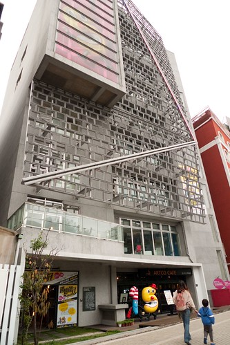 進館前 先跟府中15代言人打聲招呼 一哥跟五弟 徹愛有志一同的最喜歡那執導演筒的笑咪咪一哥  然後我們來到3-5樓的展覽廳  觀賞至三月地底的特展"動漫之間" 三樓主題為: 動漫之森 從無到有的創作歷程 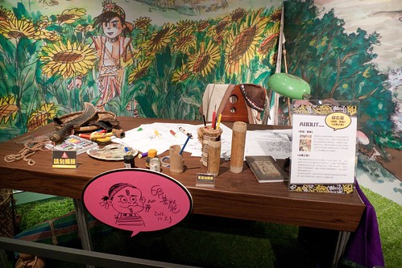 邀請曾於安古蘭或龐畢度參展的藝術家、與新生代動漫創作藝術家將於本區展出，給予每一位藝術家展區「靈感誕生之源」的命題使其自由發揮，透過工作環境再 現、動畫／漫畫作品場景或物件的情境營造，建構出如同闖進藝術家腦內的魔幻氛圍，讓參觀者恍若進入一個由動漫元素構成的奇幻森林 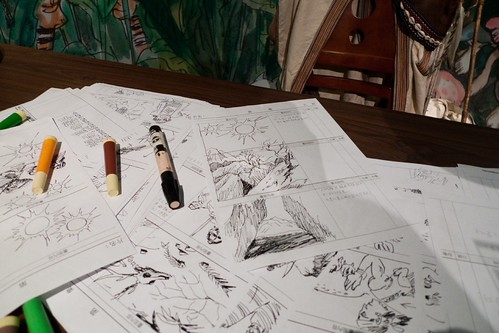 一張張展示的作者創作原稿 讓向來喜歡看漫畫 看動畫的阿徹很是驚奇與佩服  每一個創作者的動畫小短片則讓兄妹倆看的目不轉睛 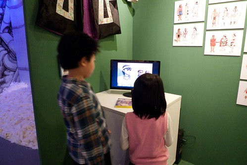 此外入口工作人員熱情告知的10個紀念章集章活動 也讓兄妹倆忙的不亦樂乎  而各個漫畫作品場景的再現 則讓人穿梭在不同的戲劇現場 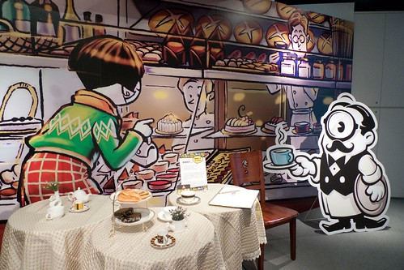 

 甚至大玩起角色扮演遊戲 

  是小而美的展覽 而且真的很有趣  樓梯間的牆壁上貼有訪客留言畫板 兄妹倆也在這留下他們的到此一遊 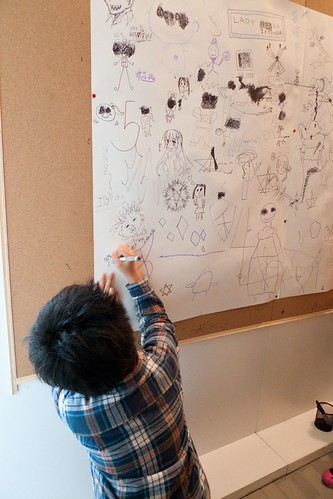 這是阿徹的"彎彎" 那一頭爆沖的髮型還真像他自己 而那個很亂的字 放在這反到突出他的藝術性 哈!  我得自首 今天的戶外教學是媽媽想偷偷在阿徹的心田裡灑下一些種子 希望向來自豪自己最大優點是創意的阿徹真的可以一直那麼有些什麼的畫些什麼下去... 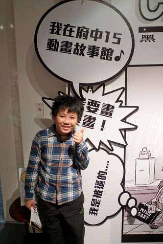 特展的另外兩個主題分別是 "動漫之音" 從靜到動的轉換歷程 (滾石唱片公司企畫之「音樂愛情故事」系列MV影片作為主軸，展示傑利小子與滾石合作之MV動畫製作過程) "動漫之光"從文本到形式的跨越 其實就是動畫影片的呈現嚕 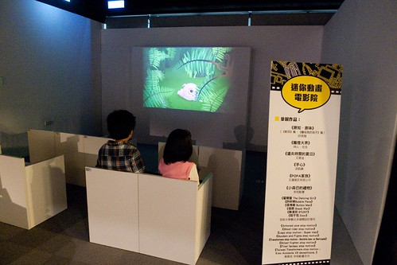 當我們母子三人坐在這迷你的電影院裡 觀賞著簡單但令人會心一笑的動畫 我真的覺得這樣的週三下午幸福的有些奢侈 感謝天  

除了正在展示的特展外 故事館內還有許多舒服的小空間  一個靠枕 一本雜誌 就能讓人消磨一整個下午 (我們當然沒有) 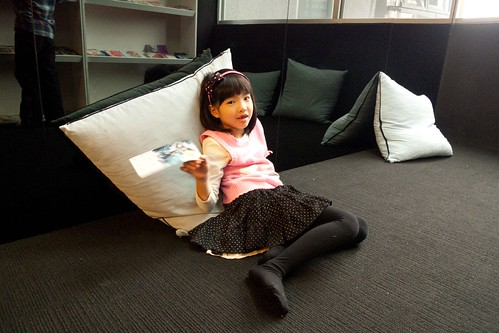 我們今日另一個任務是 初探號稱第一的動畫影音圖書館  挑高與極具設計感的空間   果然很有藝術與人文氣息阿  館內除了有書籍閱讀區 資料檢索區外 還提供有眾多動畫影音光碟可供館內借閱觀賞 我們挑了一部非主流的動畫影片(兄妹各持己見 不讓步 於是只能看阿母挑的冷門片) 拿證件跟櫃檯辦理登記 便可使用視聽包廂觀賞(3人以上可使用包廂) 拿著工作人員給我們的"行頭"  母子三人開心的去看電影... 我有種年輕時上MTV的FU  包廂唯一缺點就是沒有門 得大辣辣接受外面人的窺見 但除此之外 真的很舒服哩 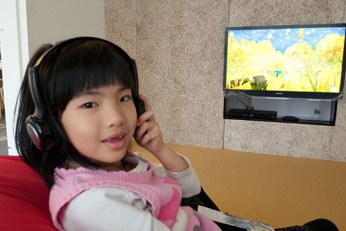 寬敞的空間 舒服的軟骨頭 以及每個人專用的耳機 讓我們很像花大錢的大爺!  兄妹倆第一次可以這樣恣意 放縱的躺著看電視 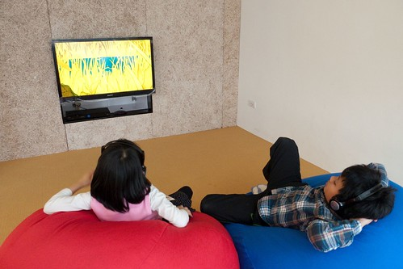 看累了 再隨意變化任何更自在的姿勢(話說也是外面沒啥人 才讓兄妹倆這樣自在)  雖然影片不若兄妹倆平常看的電視電影動畫那樣精彩 但小品的風格還是看的很開心 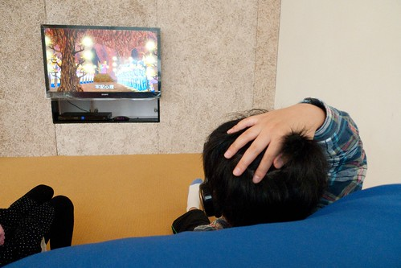 就這樣我們在包廂裡觀賞完1小時多些的影片後回家 難得週間可以這樣放縱看影片的兄妹倆開心又滿意的不得了 也難怪回家的路上兩人便又打算起 下次什麼時後要再去 呵呵~ 這樣的公眾福利真的要善加多利用阿! 今日戶外教學 再次成功! YABE!
