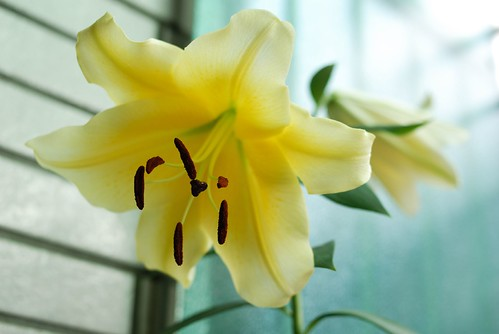
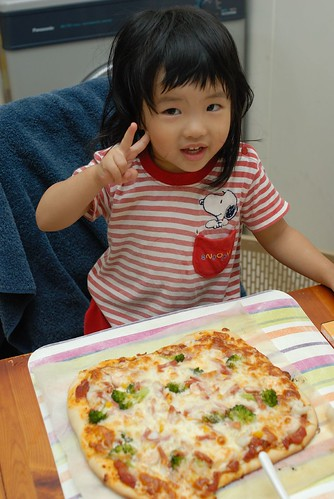
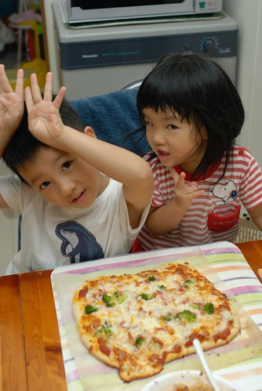

人越大..喔不...應該說人越老 生活越需要樂趣  
尤其是不用再像學生那樣整日苦哈哈唸書 (其實學生的日子最幸福了)  
甚至婚也結了 小孩也漸漸長大不再操的爸媽兩眼黑輪  
日子很容易就這麼一成不變 平淡無奇 了無樂趣  
平凡...也沒有什麼不好... 起碼對徹家來說很安於其中  
只是阿...正常上下班  照顧小孩之餘  
可以的話...生活還是想要(也該)多一些興趣與樂趣的  
  
其實我與徹爸最愛幻想的事是以後"上山下海"登百岳及朔溪  
每每看到相關的照片或報導 我們總是盤算著等小孩國中國小了我們也要來去  
那是我們很深很美的期待與夢想...(雖然有點擔心屆時已經沒有那體力了)  
只是...夢想依舊還很遙遠...所以還是先努力找現在的樂子吧~~  
  
徹爸繼之前努力鑽研種花草後   
現在新的樂子是養一缸魚一窩水草  
果然如很多前人所言  看著水裡的魚游阿游是種樂趣與享受...  
  
  
  

其實這缸魚是阿徹肖想很久的獎勵之一  
只是他的最大樂趣好像在於跟徹爸去店裡買魚缸買水草  
  
  
  
經過兩三週的適應期 魚兒草兒總算慢慢適應我家這一缸 ..  
看著徹爸被折騰好一陣子  
再次證明興趣的培養是需要金錢與時間的(當然滿滿的愛意與信念也是很重要的啦)  
  
  
  
數月前徹爸植下的百合種子最近開花了  
花 超乎我們想像的大 大的有點噁心了說...  
  
  
  
從綠島小貓空帶回來的朱堇也長大開花了  
總算可以給田爸爸一個交代了  
這樣下回才好意思再跟田爸爸要 哈哈!!  
  
  
  
那徹媽這陣子培養的興趣是什麼ㄋ???  
我這輩子壓根沒想過 沒寄望過的"揉麵團"  
雖然還在新手上路階段 但是我有勤奮的練習習作喔  
在這種天氣 沒有冷氣 沒有風扇的廚房裡...  
除了上課去學的中點外 (等到可以詔告天下時再一併po上來讓大伙流口水)  
也上網看了許多人氣很夯以食譜為主的blog  
這年頭原來不只可以照網路養小孩竟也可以端出一道道好菜阿..  
  
看了眾家秘方嘗試了自己在家做pizza  
心情滿是期待卻又戒慎恐懼... 真的! 我說的一點都不假   
面對著失敗的東西 倒掉也不是但吃又痛苦的那種心情很滴血哩  
不過即便如此 面對著徹家的第一P  我還是很豪邁的放了滿滿的東西...  
  
(哈哈~不會桿圓的 但起碼桿了個漂亮的長方形 )  
  
  
  
看著烤箱裡pizza的芝士(寫的夠中吧)漸漸溶化 ㄅㄡㄅㄡ跳  
四個人哇哇大叫 心情更是期待了...  
  
  
  
pizza出爐嚕~~阿徹小愛搶著留下這見證的一張  
  
  
  
有幫忙"舖"的pizza感覺更好吃吧   
阿徹嘴巴呼嚕呼嚕的直把熱騰騰的pizza一口一口往嘴裡送  
  
  
  
有自製pizza醬 玉米 火腿 蝦子 花枝 還有本來要放義大利麵的青花菜  
本來制止阿徹放青花菜這怪東西的 但他說這樣很好阿  
果然吃起來就像徹爸說的沒有味道 但起碼沒有破壞味道  
基於營養的價值 我想以後青花菜會常出現在我家的pizza上的  
  
  
  
好吃嗎???  
真的覺得挺不賴的說!!! 徹爸說吃起來就跟pizza店賣的pizza一樣哩  
其實我覺得更好吃說...哈哈  
  
  
  
應該有不少人知道最近的我有著一個不能公開的秘密  
有關那個秘密其實有點不順遂 不如當初自己的預期  
幸好藉由揉麵團抒發了不少情緒...  
面對著工作與家庭的輕重抉擇時 我想我真的寧可多拿些工作的時間來揉麵團  
其實這樣的結果自己並不太意外  
只是沒想到大環境真的就是這樣  有點sad...  
所以等揉麵團揉個階段後 我會再認命去做我該做的事的  
  
生活就是這樣...所以找樂子比較重要....
