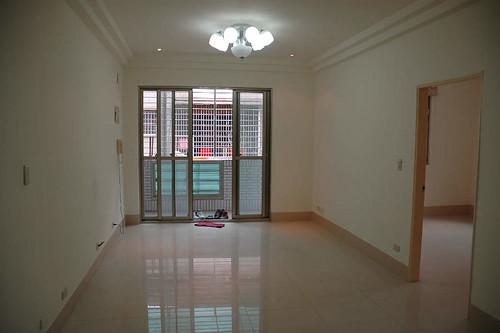
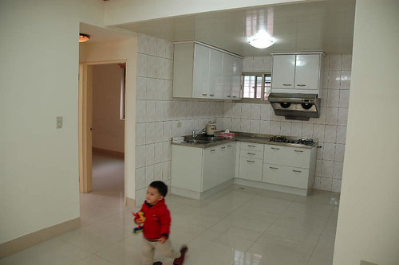
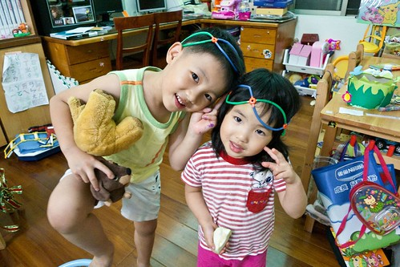
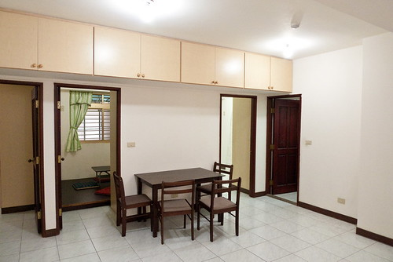
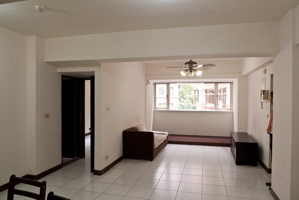
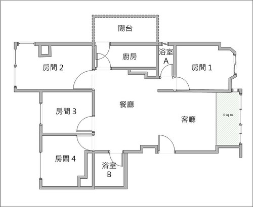

上一篇媽媽的想寫什麼的沒有寫什麼不小心的讓宜芬阿姨看出媽媽最近似乎有怎麼了... 收到宜芬阿姨的關心信件還真是不好意思哩... 其實日子也沒什麼大不同  一如以往的忙碌工作 忙碌過愛徹家的生活 只是有小學生的日子忙碌了些  得早起費心準備早晚餐 得盯功課  得應付每天聯絡簿上寫的大小事 只是公司裡出了一堆很出乎意外的鳥事 加上兩個報告說巧不巧的撞在一起 只是看房子看的太開心 不小心的遇到緣分  然後忙著轉換為換屋族  又突然的變成了投資客...

其實日子一直都在繞著愛徹這個家打轉 努力在業界中生存 多賺點錢 累積更多實現愛徹家夢想的資本 努力養成小學生的好習慣  讓學習成為自然而然的一件事 努力想要打造另一個更符合愛徹家需求的溫暖天地 循著老天的意 順著我們的羈絆  每個時間點做著我們該做的事與決定 我絕對相信我們是幸福的 有所懼 有所不畏 憑著我們的信念我們的雙手做著我們所決定的事 所以雖然有點忙 偶而有點煩 但大半的時候我們還是笑的出來 笑的開心的 謝謝老天爺 謝謝宜芬阿姨 謝謝所有眾家親友的關心祝福~ (本來是要寫小品的 結果一寫又變成字好多太太 拉哩拉雜的又交代了一大堆...)

我跟徹爸畢業沒多久就結婚生阿徹 那時候兩人常窮到得在發薪日前去找可以領百元的ATM好把戶頭裡僅剩的幾百元領出 從不敢想買房子這件事 一來沒有頭期款 二來實在不敢想像有房貸壓力的日子 直到6年前受了一個當時投資法拍屋同事的影響 他說  人一生一定都會換幾次房子的 與其把一堆堆的錢送給房東 何不就能力範圍內去買一間可以負擔的房子 這樣幾年後也才有資本再去換更好的房子 想想也對 然後我跟徹爸不知道哪生來的勇氣(跟哪生來的錢)就這樣在板橋買了現在住的亮亮屋

其實找房子真的就像找老婆一樣 需要緣分 那時候我們看過新莊的房子 林口的房子 可最後還是選擇了美賢極力推薦的板橋 上網看了一堆仲介公司的網站 也透過某家仲介公司看了兩間房子 有一天打了通電話去信義房屋問某個在網路上看到的案子 接電話的仲介(後來我們都稱他為陳老大 其實他比我們還年輕)聽了我的需求說明後 介紹給我們另一個他覺得會更適合我們的房子 於是我們約了一個下雨天的晚上看房子(永遠記得那一夜阿) 然後我們花了三趟看過這房子下雨天的 晚上的 白天的樣子後我們便決定了就是他.. 決定的原因不是因為他在明星學區(當初壓根沒想過/問過) 也不是因為他離捷運站才200公尺 純粹因為喜歡他的空 他的格局 他的採光 他的通風 那種感覺就像愛情中的一見鍾情一樣...

大半輩子住在新莊的長輩很難理解花一樣的錢爲什麼不在新莊買有車位的新房子 而是跑到人生地不熟 又沒親友可以依靠的板橋 買那快30年又老又小的公寓 呵呵~ 因為那個勸我買房的同事說 地段很重要地 這樣以後才能增值才能脫手阿 所以啥都沒有只有傻勁的我們就這麼幹下去了....

(那時候的阿徹還這麼小 才2歲多...) 

四年多下來房子裏多了一個小孩 也多了許許多多的玩具童書雜物與陳年垃圾...

很多第一次來我們家作客的朋友一進門後都會忍不住的"哇"一聲 "你家好大喔" 我們總是笑著回答說"你現在眼睛看到的就是我們家的全部阿 我們家就這麼丁點大而已" 有的客人會說"就有兩個小孩的家庭來講 你們家算是很整齊有序的" 呵呵~ 可見我們家的垃圾藏的真是好阿 那一堆儲藏空間還真沒白做了(不過阿母每天勤於收垃圾也是事實)

其實讓我們最最自豪的卻是 當初我們礙於經費礙於個人喜好而自己畫圖 請木工小舅聯手打造的小窩 讓在這個家出生的小愛 從6個多月會爬起 快1歲會走路時 家裏完全不需任何的塑膠地墊也不用時時刻刻擔心著她的安危 讓她恣意的在這個家橫行爬走 安全長大(雖然難免還是會有跌倒 扣傷事件的發生) 所以我們最喜歡聽到對這家的形容是 真是一個適合小孩子的家阿 雖然不美 不時尚 不有型 但這是一個我們一家四口都喜歡的小窩!

其實當初一開始就預期這個家是個過渡期 所以才會打掉一間房改為開放式的書房兼遊戲區 只是沒想到才4年多 便又蠢蠢欲動的看起房子 一來因為幾年下來每個月4千元的車位費用實在越繳越心疼 再者阿徹小愛漸漸長大 分房各自擁有私密小房間是遲早的事 甚者看著新埔 江子翠日益上漲的房價 越看越是擔心日後更沒能力下手 於是我們抱著隨緣的心  長期抗戰的準備  開始尋覓 期待 愛徹家的下一個"緣分"

考量了小愛以後的學區 我們的經濟能力 對於大環境的偏好設定 最後我們還是鎖定了在我們現在住的房子的這一區塊 跟徹爸趁著上班空檔上網搜尋了好多房子 看上眼的打去問卻往往得到"已經賣掉"的回應 到最後我都忍不住大叫"上網看房子還真祇是看爽的而已" 總算有一次有個仲介很盡責的問我"你是在哪個網站看到這房子的 理應都下架了" 哇~ 打了這麼多電話 總算有一個有良心有責任的仲介意識到這問題了(上網看房子還真祇是看爽的) 我忍不住多請教了他一些房子的問題  然後留下資料請他有適合(指名社區)案件時通知我們一下 (仲介說 好案件通常都是被仲介第一時間通知看房的客戶買走的 這是房子難買的主要原因)

結果沒想到過沒多久 他通知我們那個社區有房子即將釋出 雖然總價實在超出我們預期與可以負擔的許多 但我們還是抱著看看的心情去看看 或許就像女人逛街衣服別亂試 鞋子別亂穿 包包別亂揹  一旦上了身 喜歡上了可是椎心刺骨折磨人阿 就這樣看了幾趟 跟徹爸精算/辯論好多回後 我們下手決定斡旋了 而最後因為其他仲介的攪局 意外的讓我們在我們可以接受價錢的上限買到了 一切的轉圜與結果都在一個下雨天的下午(10/5)  完完全全+大大出乎我與徹爸意外的發生了 徹爸說當他在買賣契約上簽下他的名字時他的手忍不住抖了起來 而我們兩人在完成這項交易開車回家的路上 忍不住的一直念著"真的就這樣買了 " 然後接下來的一周我跟徹爸講到房子還是都笑不太出來 只有沉重的心情 但買都買了 還是得緊鑼密鼓的開始準備房子貸款 裝修等事宜 甚至以前賣我們亮亮屋的仲介也積極的開始準備要賣我們亮亮屋的事宜 (因為一直有與他連絡請教 所以他很清楚狀況)

雖然不捨亮亮屋 但我們一直告訴自己亮亮屋已經完成他的階段任務 緣分到該是換屋了 也期望能幫他找到下一個喜歡他善用他的新主人 徹爸甚至說 沒有小孩的不賣 不喜歡這遊戲間的不賣 列出一堆像是嫁女兒的條件 其實本來是打算等到12月過後 新房子整修完畢也搬家過去後再處理亮亮屋的 可是禁不起仲介的拜託 我們還是讓他先帶了一組客人來看房子 而我們還很盡責的好好介紹了一番 看的夫妻應該真的有喜歡吧 當天就請仲介來電說想再帶家人來看 這一搞逼的徹爸又更加多愁善感了...

隔天回家後徹爸慎重的告訴我他的決定(雖然也算是徵詢啦) 徹爸說 他覺得他好像在賣女兒 對亮亮屋充滿著很深的愧疚感 所以他想出了一個解決辦法 就是省下新房子的裝修費+拿亮亮屋再去轉貸 然後新房子租人的房租負擔亮亮屋的房貸 我們依舊負擔新房貸 唯一的差別就在於我們繼續住舊房子 然後得承受更大的經濟壓力 縮衣節食 徹爸問 這樣會不會太委屈我 我說可以讓我敖個25年後擁有兩間房子我當然願意(我是愛錢婆的哩) 於是就這樣我們變成了投資客 要開始當起包租公包租婆了...

好啦~ 寫了這麼多字 總算講到重點啦  就是我們的新女兒要出租啦 江子翠華廈2樓  4房雙廳 室內28坪 房間都不大 但是客廳餐廳算大視野很好 很徹家風格的格局 也是比較適合小家庭的格局 生活機能很不錯 離捷運站走路5分鐘左右 摩斯漢堡 星巴客咖啡 達美樂 太平天國泰國菜 台北縣文化中心也都在5分鐘路程可以到的範圍內 重點是靜巷中 感覺還挺不錯的 意者歡迎相約看屋  房租可以再談或私底下先偷偷問我們嘿

(房子的後半段: 餐廳+3間連著的房間) 

(房子的前半段: 客廳+如果自己住打算打掉當書房/遊戲區的房間) 

格局圖.... 

大約位置...\[googlemaps https://maps.google.com.tw/maps?f=q&source=s\_q&hl=zh-TW&geocode=&q=%E5%8F%B0%E5%8C%97%E7%B8%A3%E6%9D%BF%E6%A9%8B%E5%B8%82%E8%8E%8A%E6%95%AC%E8%B7%AF25%E5%B7%B74%E5%BC%84&sll=25.026453,121.473969&sspn=0.003349,0.004823&ie=UTF8&brcurrent=3,0x346802a89b3ec1db:0xb869014628c4b89b,0&hq=&hnear=220%E5%8F%B0%E5%8C%97%E7%B8%A3%E6%9D%BF%E6%A9%8B%E5%B8%82%E8%8E%8A%E6%95%AC%E8%B7%AF25%E5%B7%B74%E5%BC%84&ll=25.027478,121.473899&spn=0.009333,0.013733&z=16&output=embed&w=640&h=480\]

房東先生房東太太就是下面這兩位 為人不會太機車也不太計較 希望大家多多幫忙 幫忙介紹好房客給我們 好房東給大家的親朋好友 投資客不好當 加上小孩都還小 拜託拜託嚕~

